# AI Agent Architecture Review: EDA Tool Copilot System (v2)

> **Classification**: Vendor-Neutral Architectural Deep-Dive  
> **Date**: 2025–2026  
> **Scope**: Multi-agent AI assistant embedded in a commercial EDA platform  
> **Audience**: Software architects, AI/ML engineers, engineering leadership  
> **Format**: Conversational Q&A walkthrough followed by formal analysis and migration proposal

---

## Table of Contents

**Part I — Understanding the System (Q&A Walkthrough)**

1. [What Does This System Do?](#1-what-does-this-system-do)
2. [How Does a Query Flow Through the System?](#2-how-does-a-query-flow-through-the-system)
3. [What Is the Tool Execution Loop?](#3-what-is-the-tool-execution-loop)
4. [How Are Agents Created?](#4-how-are-agents-created)
5. [How Does the System Call the LLM?](#5-how-does-the-system-call-the-llm)
6. [What Are REST and ReAct?](#6-what-are-rest-and-react)
7. [What LLM Backends Are Supported?](#7-what-llm-backends-are-supported)
8. [How Is MCP Used in This System?](#8-how-is-mcp-used-in-this-system)
9. [Do Internal MCP Calls Involve the LLM?](#9-do-internal-mcp-calls-involve-the-llm)
10. [Is There Tool Result Verification?](#10-is-there-tool-result-verification)
11. [Why Was It Built This Way?](#11-why-was-it-built-this-way)
12. [Is the Python Service Out-of-Process?](#12-is-the-python-service-out-of-process)
13. [How Would the Proposed Architecture Flow?](#13-how-would-the-proposed-architecture-flow)
14. [What Does "C++ MCP Server" Actually Mean?](#14-what-does-c-mcp-server-actually-mean)
15. [Can the Python Service Be Packaged in Docker?](#15-can-the-python-service-be-packaged-in-docker)
16. [What About Data Security for Semiconductor Companies?](#16-what-about-data-security-for-semiconductor-companies)
17. [Does the Docker Container Handle All Persistence?](#17-does-the-docker-container-handle-all-persistence)
18. [How Would the Vendor Ship This to Customers?](#18-how-would-the-vendor-ship-this-to-customers)

**Part II — Formal Architecture Review**

19. [Architecture Overview](#19-architecture-overview)
20. [Agent Hierarchy and Coordination](#20-agent-hierarchy-and-coordination)
21. [Query Routing System](#21-query-routing-system)
22. [Tool Execution Loop (Detailed)](#22-tool-execution-loop-detailed)
23. [Multi-Agent Orchestration](#23-multi-agent-orchestration)
24. [End-to-End Query Flow Examples](#24-end-to-end-query-flow-examples)

**Part III — Assessment and Proposal**

25. [Architectural Shortcomings](#25-architectural-shortcomings)
26. [Framework Comparison](#26-framework-comparison)
27. [Proposed Architecture: Graph-Based Orchestration](#27-proposed-architecture-graph-based-orchestration)
28. [Migration Strategy](#28-migration-strategy)
29. [Conclusion](#29-conclusion)

---

# Part I — Understanding the System (Q&A Walkthrough)

This section walks through the architecture as a series of questions and answers, building understanding from the ground up. Each answer includes diagrams and explains concepts in plain language before diving into specifics.

---

## 1. What Does This System Do?

This is an **AI copilot** embedded inside a commercial Electronic Design Automation (EDA) tool — the kind of software that semiconductor engineers use to design chips. The copilot sits in a chat panel inside the tool's GUI and helps engineers by:

- Answering questions about the tool ("How do I create a via?")
- Executing commands on their behalf ("Add a DC analysis to my testbench")
- Performing complex multi-step tasks ("Set up a full simulation environment")
- Searching documentation and APIs
- Running scripting commands in the tool's built-in interpreter

The architecture consists of two main modules:

| Module | Description |
|--------|-------------|
| **Core Module** | The foundational AI copilot framework: agent base classes, tool infrastructure, query routing, memory, context management, and the GUI assistant panel |
| **Domain Agents Module** | Pluggable domain-specialist agents (layout, schematic, testbench, simulation, electrically-aware design, etc.) that register into the core module's agent registry |

The entire system is written primarily in **C++ with Qt** for the GUI, with a small Python microservice for LLM communication. The C++ codebase is approximately **15,000+ lines** of agent logic alone.

---

## 2. How Does a Query Flow Through the System?

When an engineer types a question in the chat panel, here's what happens step by step:

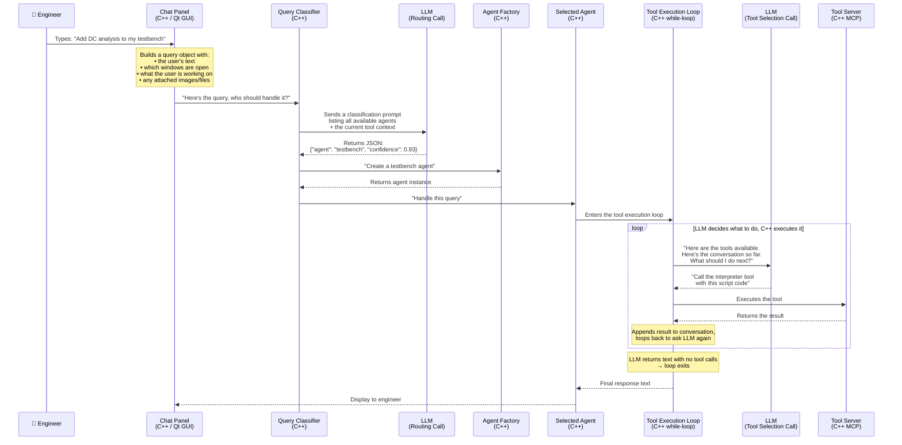

**The key insight**: The LLM is called multiple times during a single query:
1. **Once for routing** — "Which agent should handle this?"
2. **Multiple times in the tool loop** — "What tool should I call next?" (repeated until the LLM says "I'm done")

All of this orchestration happens in C++. The LLM is called over HTTP, and tools are executed locally in the same C++ process.

---

## 3. What Is the Tool Execution Loop?

The tool execution loop is the **heart of the system** — a ~400-line C++ `while`-loop that implements the **ReAct pattern** (Reason + Act). Here's how it works in plain language:

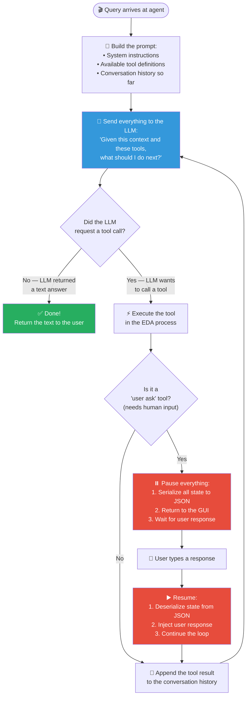

### What makes this loop special (and problematic):

**The good**: It works. The LLM can chain multiple tool calls together — search for an API, write a script, execute it, check the result, fix errors, and retry — all within a single conversation turn.

**The bad**: It's all hand-written C++. The pause/resume mechanism requires **manually serializing every piece of state** (message history, pending tool calls, iteration counter, partial results) into JSON. If a developer adds a new state variable and forgets to update the serialization code, the resume will silently break.

**What modern frameworks give you**: In LangGraph, this entire 400-line loop is replaced by about 10 lines of Python that call `create_react_agent()`. The pause/resume is a single `interrupt()` call. State persistence is automatic.

---

## 4. How Are Agents Created?

This is important to understand: **agents in this system are C++ objects, not Python/LangChain agents**. They are instances of C++ classes that follow an inheritance hierarchy.

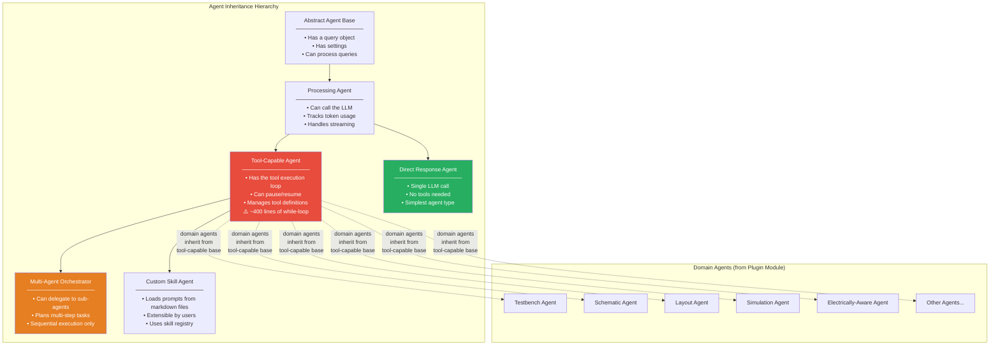

### How agent creation works at runtime:

1. The **Query Classifier** decides which agent type is needed (e.g., "testbench")
2. The **Agent Factory** creates an instance of the corresponding C++ class
3. The agent is configured with:
   - A system prompt (its personality and instructions)
   - Access to the tool server (which tools it can use)
   - Domain-specific context (what's happening in the EDA tool right now)
4. The agent's `processQuery()` method is called
5. If it's a tool-capable agent, it enters the tool execution loop

**Key point**: These are not "agents" in the LangChain sense (where an agent is a prompt + LLM + tools configured in Python). These are **heavyweight C++ objects** with deep inheritance, manual state management, and compiled-in behavior.

---

## 5. How Does the System Call the LLM?

There is **no Python in the middle** for most LLM calls. The C++ code calls the LLM directly over HTTP.

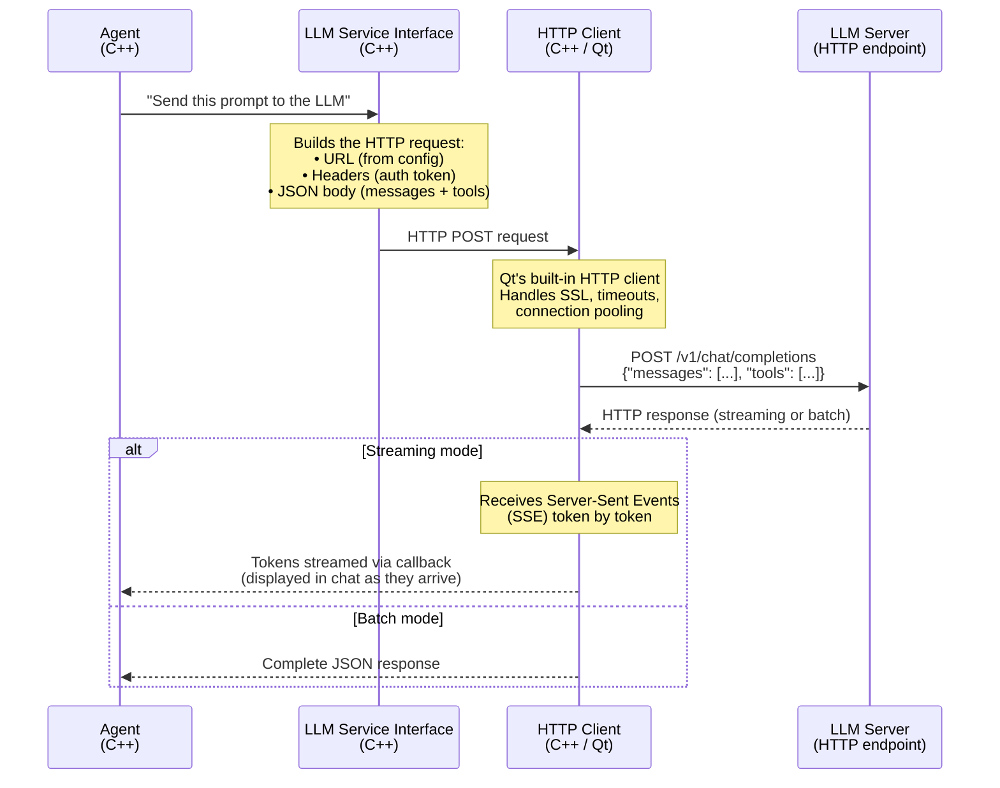

### Why is this surprising?

Many AI copilot systems use Python as an intermediary (LangChain, LlamaIndex, etc.). This system **bypasses Python entirely** for the core LLM interaction. The C++ code:

1. Constructs the JSON body (OpenAI-format messages + tool definitions)
2. Sends an HTTP POST directly to the LLM endpoint
3. Parses the streaming response (Server-Sent Events) token by token
4. Extracts tool calls from the response JSON

The agent waits for the LLM response using Qt's **local event loop** mechanism — it spins a temporary event loop that keeps the GUI responsive while blocking the agent's execution until the HTTP response arrives.

### What about the Python service?

The Python microservice (`agentic_service`) exists and **does** have LangChain/LangGraph imported, but for the main agent flow, it's barely used. The C++ code talks directly to the LLM. The Python service is mainly used for:
- A few specialized agentic workflows
- As an MCP tool server (exposing Python-side tools)
- As a potential future orchestration layer (which is what the migration proposes)

---

## 6. What Are REST and ReAct?

These are two foundational concepts used throughout the system:

### REST (Representational State Transfer)

REST is the standard way computers talk to each other over HTTP. When this system calls the LLM, it makes a **REST API call**:

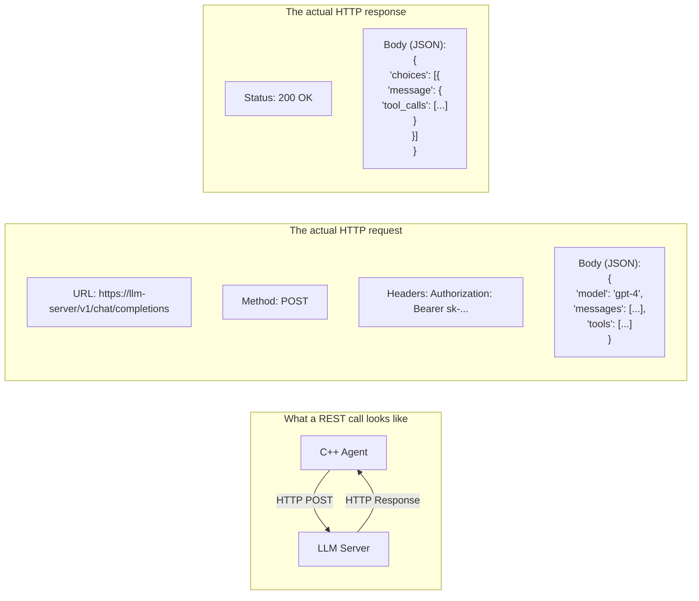

Every LLM provider (OpenAI, vLLM, NVIDIA NIM) uses this same REST pattern. The URL and authentication details change, but the JSON format is standardized (OpenAI's format has become the de facto standard).

### ReAct (Reason + Act)

ReAct is the pattern the tool execution loop implements. The idea is simple:

```
While not done:
    1. REASON: Ask the LLM "Given what you know, what should you do next?"
    2. ACT: Execute whatever tool the LLM chose
    3. OBSERVE: Feed the tool's result back to the LLM
    4. Repeat
```

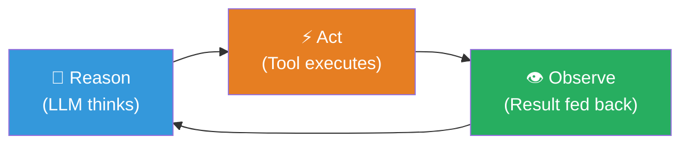

In this system, the ReAct loop is implemented as a C++ `while`-loop. In modern frameworks like LangGraph, it's a built-in primitive called `create_react_agent()`.

---

## 7. What LLM Backends Are Supported?

The system supports **five different LLM backend types**, all accessed via REST HTTP calls from C++:

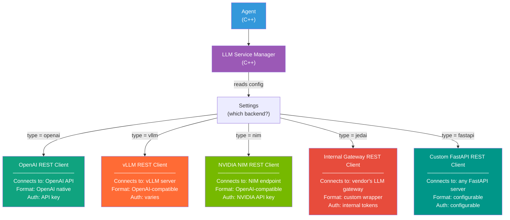

### How the backend is selected:

A configuration setting (stored in the EDA tool's preferences) specifies which backend type to use. The **LLM Service Manager** reads this setting and creates the appropriate REST client. All five clients implement the same interface — the agent code doesn't know or care which backend is being used.

### What's behind each backend:

| Backend Type | What It Connects To | Who Uses It |
|---|---|---|
| **OpenAI** | OpenAI's cloud API (GPT-4, etc.) | Cloud-connected deployments |
| **vLLM** | Self-hosted open-source LLM server | On-premise deployments with custom models |
| **NVIDIA NIM** | NVIDIA's optimized inference microservice | GPU-accelerated on-premise |
| **Internal Gateway** | The vendor's internal LLM routing gateway | Vendor's internal use, load balancing |
| **Custom FastAPI** | Any server following a custom protocol | Experimental or third-party integrations |

**Key point**: All of these are just HTTP servers that accept a JSON request and return a JSON response. The C++ code constructs the HTTP request, sends it, and parses the response. There's no magic — it's the same pattern your web browser uses to load a webpage, just with JSON instead of HTML.

---

## 8. How Is MCP Used in This System?

MCP (Model Context Protocol) is used in **three distinct ways** in this system, which can be confusing. Let's break them down:

```mermaid
graph TB
    subgraph "Way 1: C++ MCP Server — Exposing Tools to External Clients"
        direction LR
        MCPSrv["MCP Server<br/>(C++, embedded in EDA process)<br/>Listens on port 8080"]
        ExtClient["External Client<br/>(Python, VS Code, etc.)"]
        ExtClient -->|"MCP protocol<br/>over HTTP"| MCPSrv
        MCPSrv -->|"Executes tools<br/>in the EDA process"| EDATools1["Interpreter, Search,<br/>Context Queries"]
    end

    subgraph "Way 2: Internal Tool Registry — C++ Function Calls (NOT network)"
        direction LR
        AgentInt["Agent<br/>(C++)"]
        ToolRegistry["Tool Registry<br/>(C++ MCP data structures)"]
        ToolFn["C++ Function<br/>(direct call)"]
        AgentInt -->|"callTool('interpreter', ...)<br/>This is a direct C++<br/>function pointer call!"| ToolRegistry
        ToolRegistry -->|"invokes"| ToolFn
    end

    subgraph "Way 3: C++ MCP Client — Calling External MCP Servers"
        direction LR
        MCPClient["MCP Client<br/>(C++)"]
        PySrv["Python Agentic Service<br/>(FastMCP server)"]
        UserSrv["User-Configured<br/>External MCP Servers"]
        MCPClient -->|"MCP protocol"| PySrv
        MCPClient -->|"MCP protocol"| UserSrv
    end

    style MCPSrv fill:#2ecc71,color:#fff
    style ToolRegistry fill:#3498db,color:#fff
    style MCPClient fill:#e67e22,color:#fff
```

### Way 1: C++ MCP Server

The EDA tool embeds an HTTP server that speaks the MCP protocol. It listens on a port (typically 8080) and exposes all registered tools to external clients. Any MCP-compatible client — a Python script, VS Code extension, or the proposed LangGraph orchestrator — can connect and call tools.

**This is the bridge that makes the proposed migration possible.** The C++ tools are already externally accessible.

### Way 2: Internal Tool Registry

This is the most confusing part. Internally, tools are registered using MCP data structures (tool names, JSON schemas for parameters, etc.), but **when an agent calls a tool during the tool execution loop, no network is involved**. The "MCP Protocol Manager" in C++ looks up the tool by name, finds the corresponding C++ function pointer, and calls it directly. It's a local function call — no HTTP, no sockets, no serialization beyond what the function itself needs.

The MCP data structures are used purely as a **convenient schema format** for describing tools to the LLM (which needs to know tool names and parameters).

### Way 3: C++ MCP Client

The system can also act as an MCP client, connecting to external MCP servers. This is used for:
- Connecting to the Python agentic service (which exposes Python-side tools via FastMCP)
- Connecting to user-configured external MCP servers (e.g., a company's internal documentation server)

### Tool Visibility

Each registered tool has a **visibility** setting:

| Visibility | Meaning |
|---|---|
| **Internal Only** | Only agents inside the C++ process can use it |
| **External Only** | Only exposed via the MCP server to external clients |
| **Internal and External** | Available to both internal agents and external clients |

This controls which tools show up when an external client connects versus which tools the LLM sees during the tool execution loop.

---

## 9. Do Internal MCP Calls Involve the LLM?

**No.** This is a common point of confusion.

When an agent in the tool execution loop calls a tool like `interpreter` or `contextual_search`, here's what actually happens:

```mermaid
sequenceDiagram
    participant LLM as LLM Server<br/>(remote)
    participant Loop as Tool Execution Loop<br/>(C++)
    participant Registry as Tool Registry<br/>(C++ in-memory)
    participant Interpreter as Interpreter Function<br/>(C++ in-process)

    Note over LLM,Loop: Step 1: LLM DECIDES which tool to call
    Loop->>LLM: "Here are the tools. What next?"
    LLM-->>Loop: "Call interpreter('create_testbench()')"

    Note over Loop,Interpreter: Step 2: C++ EXECUTES the tool (no LLM involved)
    Loop->>Registry: callTool("interpreter", {"code": "create_testbench()"})
    Note over Registry: Looks up "interpreter" in a hash map<br/>Finds a C++ function pointer<br/>Calls it directly — NO NETWORK
    Registry->>Interpreter: Direct C++ function call
    Interpreter-->>Registry: Result: "Testbench created successfully"
    Registry-->>Loop: Tool result

    Note over Loop: Step 3: Result goes back to LLM in the NEXT iteration
    Loop->>LLM: "The tool returned: 'Testbench created successfully'. What next?"
```

The LLM's only role is **deciding** which tool to call and with what parameters. The actual execution is pure C++ — local, fast, no network involved. The LLM sees the result only when the loop sends it back in the next iteration.

---

## 10. Is There Tool Result Verification?

**No — and this is a significant architectural gap.**

After a tool executes, its result is appended to the conversation history and sent back to the LLM in the next iteration. There is no intermediate step that checks:
- Did the tool succeed or fail?
- Does the result make sense?
- Should we try a different approach?

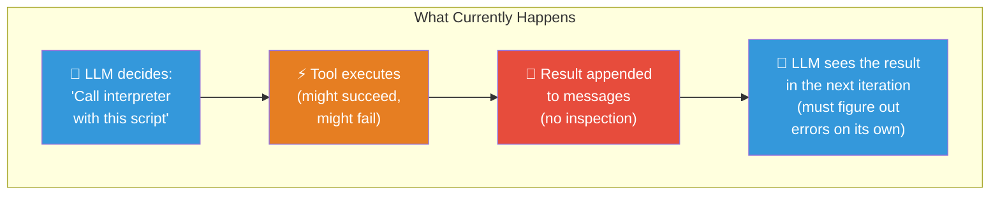

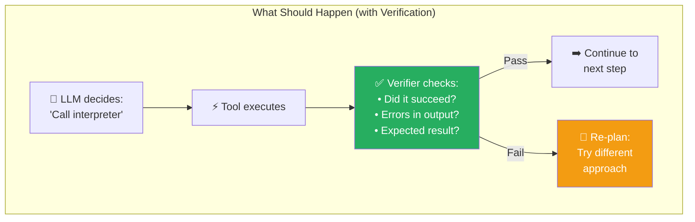

In the current system, if the interpreter returns a script error, the LLM must figure out the fix purely from the error text in the next iteration. There's no structured retry-with-different-approach mechanism, no backtracking to a previous state, and no limit on how many times the LLM might loop trying to fix the same error.

In LangGraph, adding a verifier is trivial — it's just another node in the graph with a conditional edge that routes to either "continue" or "re-plan."

---

## 11. Why Was It Built This Way?

The system evolved over several years, and the design decisions make sense in their historical context:

### Historical and Pragmatic Reasons

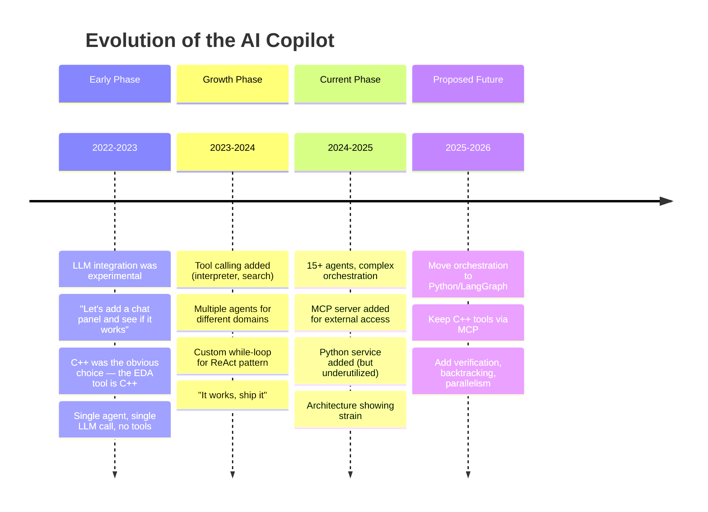

### Why C++ for orchestration?

1. **The EDA tool is C++** — the team are C++ experts. Writing the agent logic in C++ was the path of least resistance.
2. **Tight integration needed** — agents need to access the scripting interpreter (which runs on the GUI's main thread), the design database, and live tool state. All of these are C++ APIs.
3. **LangGraph didn't exist yet** — when the system was first built, LangGraph was either not available or too immature.
4. **It worked** — for simple queries and single-agent interactions, the hand-rolled approach is perfectly adequate.

### Why it's becoming a problem now:

5. **Complexity has grown** — with 15+ agents, multi-agent orchestration, pause/resume, and user interaction, the C++ code is straining under patterns that frameworks handle natively.
6. **Modern frameworks matured** — LangGraph now provides everything the team hand-built in C++ (ReAct loops, state persistence, human-in-the-loop, backtracking), with better reliability and far less code.
7. **New features are expensive** — adding parallel execution, verification, or observability to the C++ code would take months. In LangGraph, they're configuration options.

---

## 12. Is the Python Service Out-of-Process?

**Yes.** The Python agentic service runs as a **separate process** from the EDA tool. They communicate via HTTP/MCP over sockets.

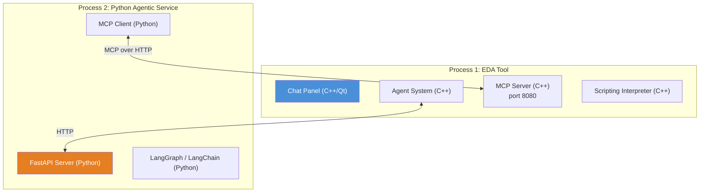

### Does IPC overhead matter?

**No — it's negligible compared to LLM latency.**

| Operation | Typical Latency |
|---|---|
| LLM API call (the slow part) | **500ms – 5,000ms** |
| IPC between C++ and Python (MCP over HTTP on localhost) | **1 – 10ms** |
| Tool execution (interpreter, search) | **10 – 100ms** |

The LLM call dominates total latency by 100x or more. Adding a few milliseconds of IPC for each tool call is unnoticeable. This is why moving orchestration to Python is practical — the network hop to the LLM dwarfs any local IPC overhead.

---

## 13. How Would the Proposed Architecture Flow?

In the proposed architecture, orchestration moves from C++ to Python/LangGraph. Here's how the same "add DC analysis" query would flow:

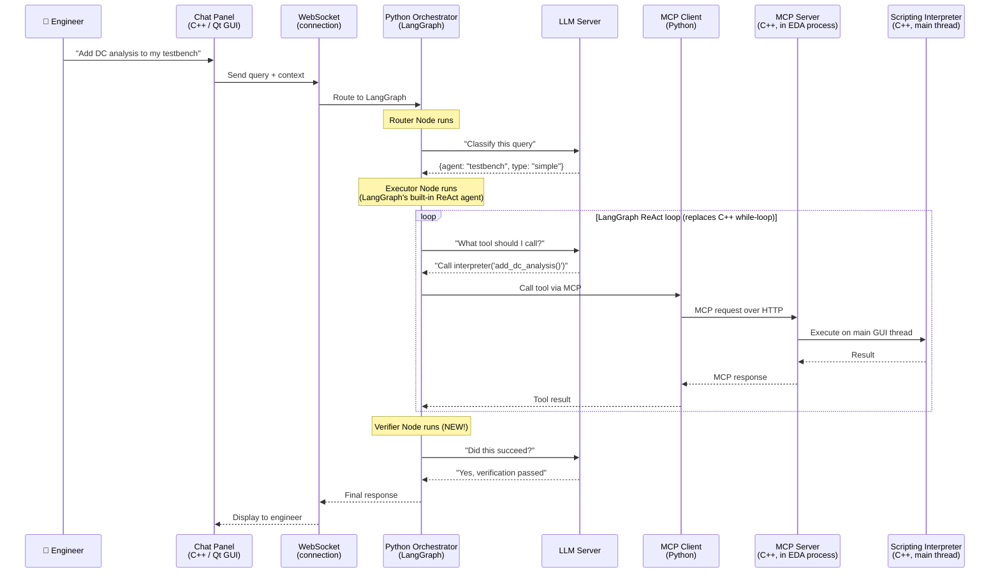

### What changed:
- **The tool execution loop** moved from C++ to Python (LangGraph's built-in ReAct agent)
- **A verifier node** was added (doesn't exist in the current system)
- **State persistence** is automatic (LangGraph checkpointer, not manual JSON serialization)
- **The C++ tools are unchanged** — they're called via MCP, same as before

### What stayed the same:
- The Chat Panel is still C++/Qt
- The scripting interpreter still runs on the main GUI thread
- The MCP server still exposes tools the same way
- The LLM is still called over HTTP

---

## 14. What Does "C++ MCP Server" Actually Mean?

When we say there's a "C++ MCP server" in the EDA process, we mean there's an **embedded HTTP server library** compiled into the EDA tool's binary. When the tool starts up, it starts listening on a port (e.g., 8080).

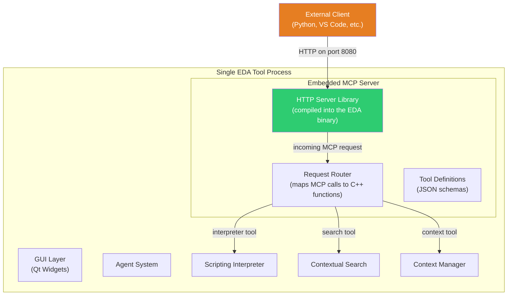

There is **no separate server process**. The HTTP server runs inside the EDA tool process itself, as a background thread. When an MCP request arrives:

1. The HTTP server receives it on a background I/O thread
2. It parses the MCP protocol message
3. It routes to the appropriate C++ function
4. If the tool needs the main GUI thread (like the interpreter), it uses Qt's cross-thread dispatch mechanism to safely execute on the correct thread
5. The result is sent back as an MCP response

This is a common pattern in desktop applications — embedding a small HTTP server for inter-process communication. The EDA tool becomes both a **GUI application** and an **HTTP server** in one process.

---

## 15. Can the Python Service Be Packaged in Docker?

**Yes — and this is the ideal deployment model for the proposed architecture.**

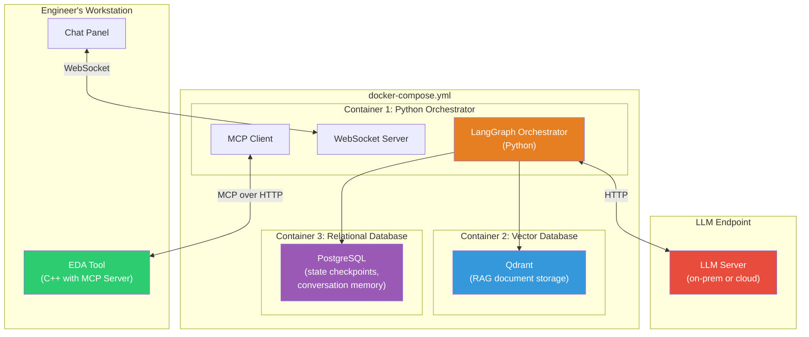

### What goes in the Docker container:

| Component | Purpose |
|---|---|
| **Python Orchestrator** (LangGraph) | The brain — routes queries, plans tasks, calls tools, verifies results |
| **Qdrant** (Vector Database) | Stores embedded documents for RAG (documentation, API references, past solutions) |
| **PostgreSQL** | Stores LangGraph checkpoints (state persistence), conversation memory, user preferences |
| **WebSocket Server** | Accepts connections from Chat Panels in EDA tool instances |
| **MCP Client** | Connects to EDA tool instances to call C++ tools |

### What stays outside Docker:

| Component | Why |
|---|---|
| **EDA Tool** (C++) | Must run on the engineer's workstation where they interact with the GUI |
| **LLM Server** | Deployed separately (cloud API or on-prem GPU server) |

---

## 16. What About Data Security for Semiconductor Companies?

This is critical. Semiconductor companies (the customers for EDA tools) are among the most security-conscious organizations in the world. Their chip designs represent billions of dollars of R&D investment.

### Security Requirements

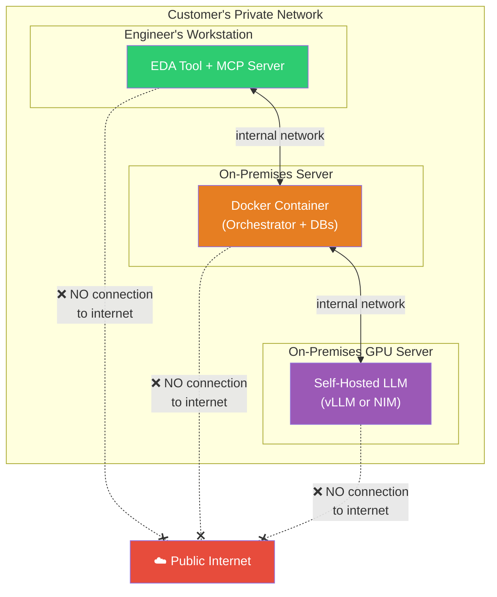

### Key Security Properties of This Architecture:

1. **Everything runs on-premises** — no data leaves the company's network
2. **The LLM is self-hosted** — using vLLM or NVIDIA NIM, running on the company's own GPU servers
3. **No cloud dependencies** — the system works in air-gapped environments (no internet required)
4. **Design data never leaves the process** — the scripting interpreter and design database are accessed locally within the EDA tool process; only query/response text flows over the internal network
5. **Docker makes deployment auditable** — security teams can inspect the container image, scan for vulnerabilities, and approve it once

### What the customer must configure:

| Setting | Description |
|---|---|
| **LLM endpoint** | URL of their self-hosted LLM (e.g., `http://gpu-server:8000/v1`) |
| **Network rules** | Allow WebSocket traffic from workstations to Docker, MCP traffic from Docker to workstations |
| **Storage** | Persistent volume for PostgreSQL and Qdrant data |
| **Authentication** | API keys or certificates for the LLM server |

---

## 17. Does the Docker Container Handle All Persistence?

**Yes.** In the proposed architecture, all persistent state lives in the Docker container's databases:

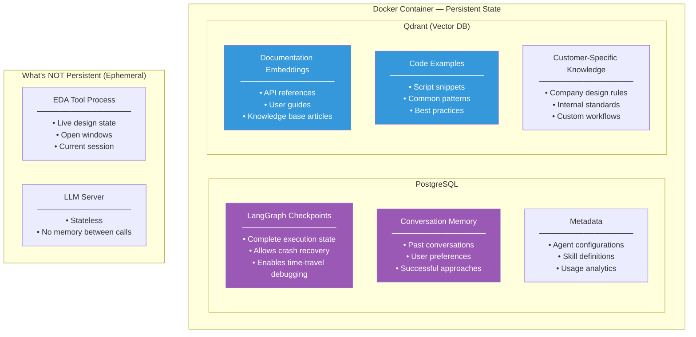

### Why this matters:

- **Crash recovery**: If the Python orchestrator crashes mid-task, it can resume from the last checkpoint (stored in PostgreSQL). The current C++ system has no crash recovery — all state is lost.
- **Cross-session continuity**: If an engineer starts a task today and continues tomorrow, the conversation history and partial results are preserved.
- **Multi-user knowledge**: The RAG database can contain documentation that benefits all engineers, and successful approaches can be shared.
- **Upgradeable**: The databases persist even when the Docker container is upgraded to a new version.

---

## 18. How Would the Vendor Ship This to Customers?

The vendor ships **two matched artifacts** to each customer:

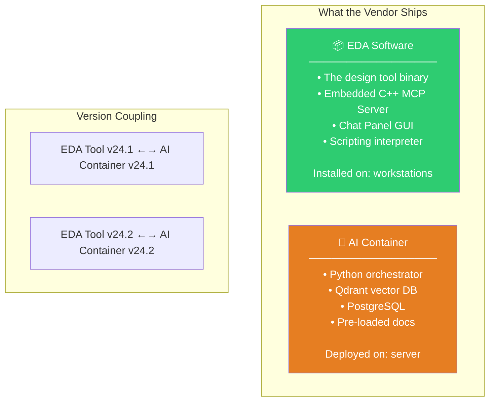

### The deployment topology:

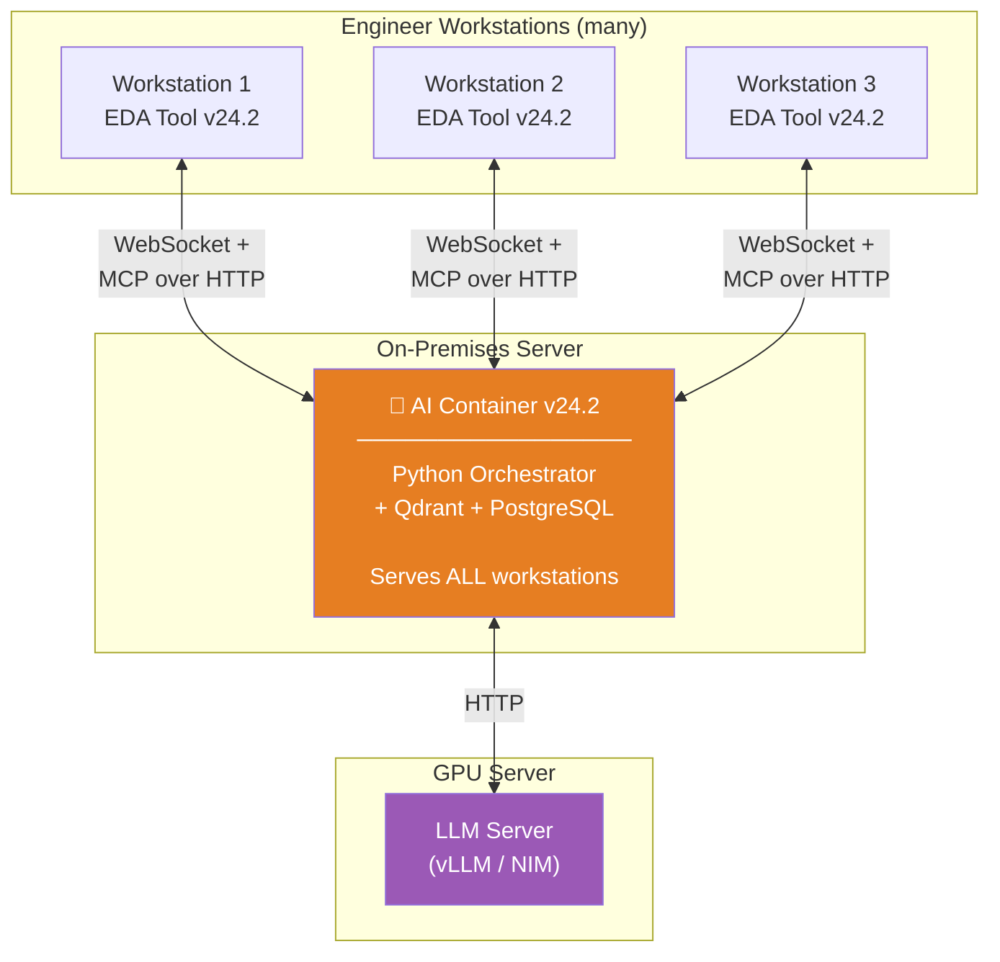

### Key properties of this deployment model:

- **One Docker deployment serves many engineers** — it's a shared service, not per-workstation
- **Upgrades are atomic** — pull the new Docker image and restart; rollback is just pointing back to the previous version
- **The customer doesn't touch Python code** — the container is a black box, just like the EDA binary
- **The two artifacts are version-locked** — the C++ MCP server and the Python orchestrator must agree on tool schemas, so they're tested and shipped together

### Network flow direction:

The MCP connection goes **from the Docker container TO the workstations** (the Python orchestrator is the MCP *client*, and the EDA tool is the MCP *server*). This means each running EDA tool instance must be reachable from the Docker server — standard on a corporate LAN but requires network planning.

Alternatively, the connection can be reversed (EDA tool connects out to the Docker container), which is easier from a firewall perspective. The architecture supports either direction.

---

# Part II — Formal Architecture Review

This section provides a detailed technical analysis of the current system's architecture, with diagrams showing the internal structure, agent hierarchy, routing system, tool execution mechanics, and multi-agent orchestration.

---

## 19. Architecture Overview

### 19.1 High-Level System Architecture

```mermaid
graph TB
    subgraph "EDA Tool Process (C++/Qt)"
        direction TB
        GUI["Chat Panel<br/>(Qt Widget)"]
        AST["Assistant Controller"]
        QR["Query Classifier"]
        SA["Multi-Agent Orchestrator"]
        TA["Tool-Capable Agent Base"]
        
        subgraph "Tool Layer"
            MCP["MCP Protocol Manager"]
            SI["Interpreter Bridge"]
            SS["Contextual Search"]
            CM["Context Manager"]
        end
        
        subgraph "Domain Agents (Plugin Module)"
            TB_Agent["Testbench Agent"]
            SCH["Schematic Agent"]
            LAY["Layout Agent"]
            EAD_AG["Electrically-Aware Agent"]
            SIM["Simulation Agent"]
            CUSTOM["Custom Agents..."]
        end
        
        GUI --> AST
        AST --> QR
        QR --> SA
        SA --> TA
        TA --> MCP
        MCP --> SI
        MCP --> SS
        MCP --> CM
        
        TB_Agent & SCH & LAY & EAD_AG & SIM & CUSTOM -.->|"register into"| QR
    end
    
    subgraph "Python Service (FastAPI)"
        direction TB
        PY_MAIN["Agentic Service"]
        PY_LG["LangChain / LangGraph"]
        PY_MCP["MCP Client"]
    end
    
    subgraph "External"
        LLM["LLM Provider<br/>(Cloud or On-Prem)"]
    end
    
    MCP <-->|"MCP over HTTP"| PY_MCP
    TA <-->|"HTTP"| PY_MAIN
    PY_MAIN --> PY_LG
    PY_LG --> LLM
    
    style GUI fill:#4a90d9,color:#fff
    style MCP fill:#2ecc71,color:#fff
    style PY_LG fill:#e67e22,color:#fff
    style LLM fill:#9b59b6,color:#fff
```

### 19.2 The Two Modules

The system is split into two separately compiled modules:

**Core Module** provides the foundational framework:

```mermaid
classDiagram
    class AbstractAgent {
        <<abstract>>
        +processQuery(query)
        +getAgentType()
        +getAgentDescription()
    }
    
    class ToolCapableAgent {
        +tool execution loop
        +pause/resume mechanism
        +native tool invocation
        -pending execution state
    }
    
    class MultiAgentOrchestrator {
        +delegate to sub-agents
        +sequential execution
    }
    
    class QueryClassifier {
        +classify incoming query
        +select target agent
        +confidence scoring
    }
    
    class ProtocolManager {
        +register tools
        +call interpreter
        +context queries
        +search integration
    }
    
    AbstractAgent <|-- ToolCapableAgent
    ToolCapableAgent <|-- MultiAgentOrchestrator
    QueryClassifier --> ToolCapableAgent : routes to
    ToolCapableAgent --> ProtocolManager : uses tools
```

**Domain Agents Module** provides pluggable specialist agents via a plugin interface:

```mermaid
classDiagram
    class AgentPlugin {
        <<interface>>
        +getAgentDescription() string
        +getAgentType() string
        +registerPrivateTools(toolServer)
        +getContextProvider() lambda
        +getToolSelectionGuidance() string
    }
    
    class AgentServices {
        <<interface>>
        +interpretScript(code) result
        +searchContext(query) results
        +queryContext(path) data
        +askUser(question) response
        +invokeSubAgent(type, query) result
    }
    
    class TestbenchPlugin {
        +registerSimulationTools()
        +getTestbenchContext()
    }
    
    class SchematicPlugin {
        +registerSchematicTools()
        +getSchematicContext()
    }
    
    class LayoutPlugin {
        +registerLayoutTools()
        +getLayoutContext()
    }
    
    AgentPlugin <|.. TestbenchPlugin
    AgentPlugin <|.. SchematicPlugin
    AgentPlugin <|.. LayoutPlugin
    AgentPlugin --> AgentServices : receives
```

### 19.3 Agent Registration Flow

Domain agents are registered dynamically at initialization time through a two-layer architecture:

```mermaid
sequenceDiagram
    participant Init as Initialization Module
    participant Registry as Agent Registry
    participant Plugin as Domain Agent Plugin
    participant Tools as Tool Server
    participant Classifier as Query Classifier
    
    Init->>Registry: registerAgent("testbench", factoryFunction)
    
    Note over Init,Classifier: Later, when the assistant is initialized...
    
    Registry->>Plugin: create("testbench", services)
    Plugin->>Plugin: Configure system prompt
    Plugin->>Tools: registerPrivateTools(server)
    Tools->>Tools: Add domain-specific tools
    Plugin-->>Registry: Return configured agent
    Registry->>Classifier: addAgent("testbench", metadata)
```

### 19.4 The Two-Layer Design

This is a clean plugin architecture that should be preserved in any refactoring:

| Layer | Module | Responsibility |
|-------|--------|----------------|
| **Framework** | Core Module | Query routing, tool loop, LLM calls, memory, GUI |
| **Domain** | Domain Agents Module | Specialist prompts, private tools, context providers |

---

## 20. Agent Hierarchy and Coordination

### 20.1 The Inheritance Chain

The agent system follows a deep inheritance hierarchy, 4 levels deep:

```mermaid
classDiagram
    class AbstractAgent {
        <<abstract>>
        #query
        #settings
        +processQuery()
        +getType()
        +getDescription()
    }
    
    class ProcessingAgent {
        #LLM service interface
        #token usage tracking
        #streaming callback
        +processWithLLM()
        +formatSystemPrompt()
    }
    
    class ToolCapableAgent {
        #protocol manager
        #tool definitions
        #pending state
        +executeWithTools()
        -toolExecutionLoop()
        -handleToolCalls()
        -pauseExecution()
        -resumeExecution()
    }
    
    class DirectResponseAgent {
        +singleShotLLMCall()
    }
    
    class MultiAgentOrchestrator {
        #agent registry
        #delegation logic
        +processMultiAgentQuery()
        -delegateToAgent()
    }
    
    class CustomSkillAgent {
        #skill registry
        #markdown parser
        +loadSkillPrompt()
    }
    
    AbstractAgent <|-- ProcessingAgent
    ProcessingAgent <|-- ToolCapableAgent
    ProcessingAgent <|-- DirectResponseAgent
    ToolCapableAgent <|-- MultiAgentOrchestrator
    ToolCapableAgent <|-- CustomSkillAgent
    
    note for ToolCapableAgent "This is where the critical\ntool execution loop lives.\n~400 lines of while-loop logic."
    
    note for MultiAgentOrchestrator "Delegates to sub-agents\nbut only sequentially,\nno parallel execution."
```

### 20.2 Key Issue: Deep Hierarchy

The inheritance chain is 4 levels deep, and the tool execution loop — the most critical piece of logic — is embedded in the middle. This means:

- Every agent that needs tools must inherit from the tool-capable base class
- The multi-agent orchestrator inherits the tool loop but adds its own delegation logic on top
- Custom skill agents re-use the tool loop but override the prompt construction

This creates **tight coupling** between orchestration logic and agent identity. In LangGraph, orchestration is defined by the graph topology, not by class inheritance.

---

## 21. Query Routing System

### 21.1 How Routing Works

```mermaid
sequenceDiagram
    participant User as 👤 Engineer
    participant Chat as Chat Panel
    participant Controller as Assistant Controller
    participant Classifier as Query Classifier
    participant LLM as LLM Service
    participant Agent as Selected Agent
    
    User->>Chat: "Create a testbench for my amplifier"
    Chat->>Controller: handleUserMessage()
    Controller->>Classifier: classifyQuery(text, context)
    
    Classifier->>Classifier: Build classification prompt with<br/>all agent descriptions + context
    Classifier->>LLM: Send classification request
    LLM-->>Classifier: JSON classification response
    
    Classifier->>Classifier: Parse classification result
    Classifier-->>Controller: {agent: "testbench", confidence: 0.92}
    
    alt confidence > threshold
        Controller->>Agent: processQuery()
    else confidence <= threshold
        Controller->>Controller: Fallback to general agent
    end
```

### 21.2 Classification Architecture

The classifier sends a prompt to the LLM containing descriptions and routing guidance for **all registered agents**, plus the current application context (which windows are open, what the user is working on). The LLM returns a JSON classification including the target agent type and confidence level.

The classification prompt is constructed dynamically by iterating through all registered agents and collecting their self-descriptions and routing hints. This is extensible — adding a new agent automatically includes it in the classification prompt.

### 21.3 Routing Limitations

1. **Single-shot**: Once classified, there's no re-routing. If the testbench agent fails, the system doesn't try the schematic agent.
2. **No composite routing**: Can't say "this needs testbench AND layout agents working together."
3. **Context is a snapshot**: The application context is captured once at classification time and not refreshed during execution.
4. **No confidence-based branching**: The confidence score exists but isn't used for sophisticated branching (e.g., "try top-2 agents in parallel").

---

## 22. Tool Execution Loop (Detailed)

### 22.1 The Core Loop Architecture

The tool execution loop follows the ReAct pattern, implemented as a C++ `while`-loop with approximately 400 lines of logic:

```mermaid
flowchart TD
    Start(["Query arrives"]) --> BuildPrompt["Build system prompt<br/>+ tool definitions<br/>+ context"]
    BuildPrompt --> CallLLM["Call LLM with messages<br/>+ tool definitions"]
    CallLLM --> CheckResponse{"Response has<br/>tool calls?"}
    
    CheckResponse -->|"No"| TextResponse["Return text response<br/>to user"]
    CheckResponse -->|"Yes"| ProcessTools["Process tool calls"]
    
    ProcessTools --> ToolLoop["For each tool call:"]
    ToolLoop --> ExecuteTool["Execute tool via<br/>protocol manager"]
    
    ExecuteTool --> CheckPause{"Needs user<br/>input?"}
    CheckPause -->|"Yes"| SaveState["Serialize entire state<br/>(manual JSON serialization)"]
    SaveState --> Pause["⏸️ Pause execution<br/>Return to GUI"]
    Pause --> UserInput["User provides input"]
    UserInput --> RestoreState["Deserialize state<br/>(manual JSON parsing)"]
    RestoreState --> ResumeLoop["Resume tool loop"]
    
    CheckPause -->|"No"| CollectResult["Collect tool result"]
    ResumeLoop --> CollectResult
    
    CollectResult --> AppendResult["Append tool result<br/>to conversation messages"]
    AppendResult --> MoreTools{"More tool<br/>calls in batch?"}
    
    MoreTools -->|"Yes"| ExecuteTool
    MoreTools -->|"No"| CallLLM
    
    style SaveState fill:#e74c3c,color:#fff
    style RestoreState fill:#e74c3c,color:#fff
    style Pause fill:#f39c12,color:#fff
```

### 22.2 The Pause/Resume Mechanism

The most complex part of this loop is the **pause/resume mechanism**. When the LLM calls a "user ask" tool (to ask the user a question), the execution must:

1. **Serialize** the entire execution state — message history, pending tool calls, partial results, iteration counter
2. **Return control** to the Qt event loop (the GUI must remain responsive)
3. **Resume** when the user responds, by deserializing state and continuing exactly where it left off

This is essentially **manual coroutine implementation in C++**. Every state field must be explicitly saved and restored. If a developer adds a new state variable and forgets to update both the serialization and deserialization routines, the resume will silently produce incorrect results.

### 22.3 Why This Is Problematic

| Issue | Description |
|-------|-------------|
| **Manual state serialization** | Error-prone — every new field must be added to both serialize and deserialize |
| **No checkpointing** | If the process crashes mid-execution, all state is lost |
| **No backtracking** | Once a tool is called, its result is committed. No "undo and try differently" |
| **No parallel tool execution** | Tools are called sequentially, even when independent |
| **Hardcoded loop limits** | Maximum iteration count is a compile-time constant |

---

## 23. Multi-Agent Orchestration

### 23.1 How Multi-Agent Coordination Works

The multi-agent orchestrator is a special agent that can delegate work to specialist sub-agents. It inherits from the tool-capable base class, gaining tool execution capabilities, and adds orchestration logic on top.

```mermaid
sequenceDiagram
    participant Classifier as Query Classifier
    participant Orchestrator as Multi-Agent Orchestrator
    participant LLM as LLM Service
    participant Sub1 as Specialist Agent 1
    participant Sub2 as Specialist Agent 2
    participant Tools as Tool Server
    
    Classifier->>Orchestrator: processQuery("complex multi-domain task")
    
    Orchestrator->>LLM: "Plan: which specialists are needed?"
    LLM-->>Orchestrator: "Need specialist 1 then specialist 2"
    
    Orchestrator->>Sub1: delegate("sub-task 1")
    Sub1->>Tools: Use tools (search, interpret, etc.)
    Tools-->>Sub1: Results
    Sub1-->>Orchestrator: Result 1
    
    Orchestrator->>LLM: "Specialist 1 done, proceed?"
    LLM-->>Orchestrator: "Yes, now specialist 2"
    
    Orchestrator->>Sub2: delegate("sub-task 2", context=result1)
    Sub2->>Tools: Use tools
    Tools-->>Sub2: Results
    Sub2-->>Orchestrator: Result 2
    
    Orchestrator->>LLM: "Synthesize all results"
    LLM-->>Orchestrator: Final response
    
    Orchestrator-->>Classifier: Return final response
```

### 23.2 Key Limitations

1. **Sequential only**: Specialist 2 always waits for specialist 1 to finish. No parallel fan-out.
2. **No verification**: Results from sub-agents are passed through without structured validation.
3. **No re-planning**: If specialist 1 fails, the orchestrator doesn't revise the plan.
4. **Flat delegation**: The orchestrator → sub-agent relationship is one level deep. Sub-agents cannot delegate to other sub-agents.

---

## 24. End-to-End Query Flow Examples

To make the architecture concrete, here are five detailed examples tracing real queries through every component, showing which parts are **C++** and which are **Python**.

### Example 1: Simple Documentation Query — *"How do I create a via in the layout editor?"*

This is a **simple informational query** that stays entirely within C++ except for the LLM call.

```mermaid
sequenceDiagram
    participant User as 👤 Engineer
    participant ChatPanel as Chat Panel<br/>(C++/Qt)
    participant Classifier as Query Classifier<br/>(C++)
    participant LLM_R as LLM — Routing Call
    participant DocAgent as Documentation Agent<br/>(C++)
    participant LLM_A as LLM — Answer Generation
    participant DocTool as Documentation Search Tool<br/>(C++)

    User->>ChatPanel: "How do I create a via in the layout editor?"
    Note over ChatPanel: Builds query object with<br/>window context, attachments

    ChatPanel->>Classifier: processQuery(queryObject)
    Classifier->>LLM_R: Classification prompt + agent list + context
    LLM_R-->>Classifier: {agent: "documentation", confidence: 0.95}

    Classifier->>DocAgent: processQuery(query)
    Note over DocAgent: Single-shot agent (no tool loop)

    DocAgent->>DocTool: Search documentation index
    DocTool-->>DocAgent: Relevant documentation passages

    DocAgent->>LLM_A: System prompt + retrieved docs + user question
    LLM_A-->>DocAgent: Formatted answer with references
    DocAgent-->>ChatPanel: Display response to user
```

**Key observation**: The documentation agent is a direct-response agent — it doesn't use the tool execution loop. It searches, gets results, and makes one LLM call to synthesize an answer.

---

### Example 2: Tool-Using Task — *"Add a DC operating point analysis to my testbench"*

This query requires **tool calling** — the LLM must reason about what scripting commands to execute, run them, and verify the results.

```mermaid
sequenceDiagram
    participant User as 👤 Engineer
    participant ChatPanel as Chat Panel<br/>(C++/Qt)
    participant Classifier as Query Classifier<br/>(C++)
    participant LLM_R as LLM — Routing
    participant TestbenchAgent as Testbench Agent<br/>(C++ domain plugin)
    participant ToolLoop as Tool Execution Loop<br/>(C++ while-loop)
    participant LLM_T as LLM — Tool Selection
    participant ToolServer as Tool Server<br/>(C++)
    participant Interpreter as Scripting Interpreter<br/>(C++, main GUI thread)
    participant Search as Contextual Search<br/>(C++)

    User->>ChatPanel: "Add a DC operating point analysis to my testbench"
    ChatPanel->>Classifier: processQuery(queryObject)

    Classifier->>LLM_R: Classification prompt + context<br/>(testbench window is open)
    LLM_R-->>Classifier: {agent: "testbench", confidence: 0.93}

    Classifier->>TestbenchAgent: processQuery(query)
    Note over TestbenchAgent: Provides its own system prompt<br/>+ private tools + domain context

    TestbenchAgent->>ToolLoop: Enter tool execution loop

    loop Iteration 1: Search for API
        ToolLoop->>LLM_T: Messages + tool definitions
        LLM_T-->>ToolLoop: tool_call: contextual_search("DC analysis API")
        ToolLoop->>ToolServer: callTool("contextual_search", params)
        ToolServer->>Search: Execute search
        Search-->>ToolServer: API documentation results
        ToolServer-->>ToolLoop: Tool result JSON
    end

    loop Iteration 2: Execute script command
        ToolLoop->>LLM_T: Updated messages + tool definitions
        LLM_T-->>ToolLoop: tool_call: interpreter("script to add DC analysis")
        ToolLoop->>ToolServer: callTool("interpreter", script_code)
        ToolServer->>Interpreter: Cross-thread dispatch to main GUI thread
        Note over Interpreter: Executes scripting code on main thread<br/>(thread-affinity constraint)
        Interpreter-->>ToolServer: Execution result
        ToolServer-->>ToolLoop: Tool result JSON
    end

    loop Iteration 3: LLM concludes
        ToolLoop->>LLM_T: All messages + all results
        LLM_T-->>ToolLoop: Text response (no tool calls)
        Note over ToolLoop: No tool calls → exits while-loop
    end

    ToolLoop-->>TestbenchAgent: Final response
    TestbenchAgent-->>ChatPanel: Display to user
```

**Key observations**:
- The **tool execution loop** alternates between asking the LLM and executing tools — this is the ReAct pattern
- The **scripting interpreter** must run on the main GUI thread (thread-affinity constraint), achieved via Qt's cross-thread dispatch mechanism
- The **domain agent plugin** provides its prompt and private tools but delegates the tool loop to the base class

---

### Example 3: Query With User Interaction — *"Delete all simulation results from my testbench"*

This exercises the **pause/resume mechanism** — the LLM asks for confirmation before a destructive action.

```mermaid
sequenceDiagram
    participant User as 👤 Engineer
    participant ChatPanel as Chat Panel<br/>(C++/Qt)
    participant Classifier as Query Classifier<br/>(C++)
    participant TestbenchAgent as Testbench Agent<br/>(C++ plugin)
    participant ToolLoop as Tool Execution Loop<br/>(C++)
    participant LLM as LLM
    participant State as Pending Execution State<br/>(C++ manual serialization)

    User->>ChatPanel: "Delete all simulation results from my testbench"
    ChatPanel->>Classifier: processQuery(queryObject)
    Classifier->>TestbenchAgent: processQuery(query)
    TestbenchAgent->>ToolLoop: Enter tool execution loop

    ToolLoop->>LLM: Messages + tool definitions
    LLM-->>ToolLoop: tool_call: user_ask("Are you sure you want<br/>to delete all simulation results?<br/>This cannot be undone.")

    Note over ToolLoop: Detects user_ask tool call
    ToolLoop->>State: Serialize entire state:<br/>• message history<br/>• pending tool calls<br/>• iteration counter<br/>• system prompt<br/>• partial results
    Note over State: Manual JSON serialization<br/>(every field explicitly handled)

    ToolLoop-->>ChatPanel: {status: "waiting_for_user",<br/>question: "Are you sure...?"}
    ChatPanel->>User: Display confirmation question

    Note over User: Engineer thinks...
    User->>ChatPanel: "Yes, go ahead"

    ChatPanel->>Classifier: processQuery("Yes, go ahead")
    Note over Classifier: Detects that an agent has focus<br/>(waiting for response) →<br/>forwards to same agent

    Classifier->>TestbenchAgent: handleUserResponse("Yes, go ahead")
    TestbenchAgent->>ToolLoop: Resume from paused state
    ToolLoop->>State: Deserialize state
    Note over ToolLoop: Resumes from exact point of pause,<br/>injecting user response as tool result

    ToolLoop->>LLM: Prior messages + user response + tool definitions
    LLM-->>ToolLoop: tool_call: interpreter("delete results script")
    Note over ToolLoop: Executes deletion via interpreter
    ToolLoop-->>ChatPanel: "Done — all simulation results deleted."
```

**Key observation**: In LangGraph, this entire pause/serialize/resume mechanism is replaced by a single `interrupt()` call. The framework automatically persists state and resumes when the user responds.

---

### Example 4: Complex Multi-Agent Query — *"Set up a complete simulation environment: create a testbench, add corners, and run a DC sweep"*

This triggers the **multi-agent orchestrator**, which plans and delegates to specialist agents.

```mermaid
sequenceDiagram
    participant User as 👤 Engineer
    participant ChatPanel as Chat Panel<br/>(C++/Qt)
    participant Classifier as Query Classifier<br/>(C++)
    participant LLM_R as LLM — Routing
    participant SkillMatcher as Custom Skill Matcher<br/>(C++ + LLM)
    participant Orchestrator as Multi-Agent Orchestrator<br/>(C++)
    participant LLM_O as LLM — Planning
    participant TestbenchAgent as Testbench Agent<br/>(C++ plugin)
    participant ToolLoop as Tool Execution Loop<br/>(C++)
    participant Tools as Tool Server<br/>(C++)

    User->>ChatPanel: "Set up complete simulation environment..."
    ChatPanel->>Classifier: processQuery(queryObject)

    Classifier->>LLM_R: Classification prompt + context
    LLM_R-->>Classifier: {agent: "general", confidence: 0.78}

    Note over Classifier: Low confidence for complex query<br/>→ Check custom skill matcher

    Classifier->>SkillMatcher: identifyMatchingSkills(query)
    Note over SkillMatcher: Two-pass matching:<br/>1. Semantic search narrows candidates<br/>2. LLM confirms match

    SkillMatcher-->>Classifier: Match: "orchestrator", confidence: 0.94
    Note over Classifier: High confidence →<br/>upgrade to orchestrator agent

    Classifier->>Orchestrator: processQuery(query)
    Note over Orchestrator: Has private tool:<br/>"delegate_to_specialist"

    Orchestrator->>LLM_O: Plan the query
    LLM_O-->>Orchestrator: tool_call: user_ask("Here is my plan:<br/>1. Create testbench<br/>2. Add corners<br/>3. Run DC sweep<br/>Shall I proceed?")

    Orchestrator-->>ChatPanel: Shows plan, waits for approval
    User->>ChatPanel: "Yes, proceed"

    Note over Orchestrator: Resumes from pause

    Orchestrator->>LLM_O: User approved plan
    LLM_O-->>Orchestrator: tool_call: delegate_to_specialist<br/>(agent="testbench", task="Create testbench")

    Orchestrator->>TestbenchAgent: Create specialist instance
    TestbenchAgent->>ToolLoop: Execute tool loop for sub-task
    ToolLoop->>Tools: Multiple tool calls (search, interpret, verify)
    Tools-->>ToolLoop: Results
    ToolLoop-->>TestbenchAgent: Success
    TestbenchAgent-->>Orchestrator: Sub-task 1 complete

    Orchestrator->>LLM_O: "Step 1 done, continue plan"
    LLM_O-->>Orchestrator: tool_call: delegate_to_specialist<br/>(agent="testbench", task="Add corners")

    Note over Orchestrator: Repeats for steps 2 and 3...<br/>Sequential only — no parallel execution

    Orchestrator-->>ChatPanel: Final summary of all completed steps
```

**Key observations**:
- **No verification** between steps — if step 1 fails, the error propagates to step 2
- **No re-planning** — the plan is fixed after initial approval
- **Sequential only** — steps that could run in parallel (e.g., independent tool calls) wait for each other

---

### Example 5: External Tool Invocation via MCP — *Python client calls C++ tools*

When the proposed Python orchestrator (or any external MCP client) calls a tool, the flow inverts:

```mermaid
sequenceDiagram
    participant PythonClient as External MCP Client<br/>(Python)
    participant MCPServer as MCP Server<br/>(C++, in EDA process)
    participant IOThread as I/O Thread<br/>(C++)
    participant MainThread as Main GUI Thread<br/>(C++)
    participant Interpreter as Scripting Interpreter<br/>(C++)

    PythonClient->>MCPServer: MCP request: interpreter("script code")
    MCPServer->>IOThread: Receive on background thread

    IOThread->>MainThread: Cross-thread dispatch<br/>(blocking, waits for result)
    Note over MainThread: Scripting interpreter has<br/>thread-affinity constraint —<br/>must execute on GUI thread

    MainThread->>Interpreter: Execute script code
    Interpreter-->>MainThread: Result
    MainThread-->>IOThread: Return result
    IOThread-->>MCPServer: Package as MCP response
    MCPServer-->>PythonClient: MCP response: {result: "..."}
```

**Key observation**: This path already works today. The MCP server already supports external clients. This is the bridge that makes the proposed LangGraph migration viable — the Python orchestrator simply becomes another MCP client.

---

### Language Boundary Summary

| Component | Language | Notes |
|-----------|----------|-------|
| Chat Panel (GUI) | **C++/Qt** | User-facing panel, manages conversation display |
| Query Classifier | **C++** | Builds classification prompt, parses LLM response |
| Agent Factory and Registry | **C++** | Creates and caches agent instances |
| Tool Execution Loop | **C++** | ~400-line while-loop, the core ReAct loop |
| Multi-Agent Orchestrator | **C++** | Sequential delegation via private tool |
| Pending Execution State | **C++** | Manual serialization for pause/resume |
| MCP Protocol Manager (tool server) | **C++** | Exposes all tools via MCP |
| Scripting Interpreter Bridge | **C++** | Must run on main GUI thread |
| Contextual Search | **C++** | Vector similarity search for API/command lookup |
| Context Manager | **C++** | Structured access to live EDA session state |
| Domain Agent Plugins | **C++** | Provide prompts, private tools, context providers |
| Custom Skill Registry | **C++** | Markdown-based extensible skill definitions |
| LLM HTTP Communication | **C++** | Direct HTTP to LLM (Qt network client) |
| Agentic Service | **Python** | FastAPI + LangChain + LangGraph (underutilized) |
| MCP Client (in Python service) | **Python** | Can call C++ tools — the bridge for migration |

**The critical insight**: Everything above the LLM proxy is in C++, including the orchestration logic that modern Python frameworks handle better. The MCP bridge between C++ and Python already works. The migration path is to push orchestration through this existing bridge.

---

# Part III — Assessment and Proposal

This section identifies the architectural shortcomings of the current system, compares it against modern agent frameworks, presents the proposed LangGraph-based architecture, and lays out a phased migration strategy.

---

## 25. Architectural Shortcomings

### 25.1 Hand-Rolled Agent Orchestration in C++

**Problem**: The tool execution loop and multi-agent orchestration logic comprise approximately 400+ lines of hand-written C++ that reimplement what LangGraph provides in fewer than 50 lines of Python.

**Impact**: Every new feature (backtracking, parallel execution, human-in-the-loop patterns) requires writing and testing custom C++ code instead of using well-tested, actively-maintained framework primitives.

### 25.2 No Verification or Backtracking

**Problem**: Once the LLM decides on an action (tool call, agent delegation), the result is committed. There is no verification node, no retry-with-different-approach, and no backtracking to a previous state.

**Impact**: Errors compound. If the interpreter bridge returns a script error, the LLM must figure out the fix in the next iteration — but there's no structured mechanism to detect "this approach isn't working, try something else."

**In LangGraph**: A verifier node after execution can route to a re-planner node, which revises the approach. Conditional edges make this trivial.

### 25.3 Single-Shot Routing Without Recovery

**Problem**: The query classifier makes one routing decision and commits to it. If the selected agent can't handle the query, the system doesn't fall back to another agent.

**Impact**: Misclassified queries fail completely instead of gracefully degrading.

**In LangGraph**: The router is just a node in the graph. It can be re-entered after failure with additional context (e.g., "Agent X failed with error Y, re-route").

### 25.4 Fragile State Management

**Problem**: Execution state is manually serialized to JSON for the pause/resume mechanism. This is:
- Error-prone (new fields must be manually added to serialization)
- Not persistent (state is lost on process crash)
- Not inspectable (no observability into state transitions)

**In LangGraph**: State is a typed data structure. The checkpointer automatically persists every state transition. Time-travel debugging lets developers rewind to any point.

### 25.5 No Parallel Tool Execution

**Problem**: The tool execution loop processes tool calls sequentially, even when they're independent. If the LLM requests three independent search queries, they run one after another.

**Impact**: Latency scales linearly with the number of tool calls per iteration.

**In LangGraph**: The fan-out API can dispatch independent work items in parallel, with automatic synchronization at the next node.

### 25.6 Underutilized Python Service

**Problem**: The Python agentic service already imports LangChain, LangGraph, and FastMCP — but the actual orchestration logic runs in C++. The Python service is used as a thin proxy.

**Impact**: The team maintains two agent frameworks — a hand-rolled C++ one and an underused Python one. This is a duplication of effort.

### 25.7 Limited Observability

**Problem**: Debugging relies on preprocessor-macro-based debug logging. There is no structured tracing, no token-usage tracking per node, no execution visualization, and no replay capability.

**In LangGraph**: LangSmith integration provides full execution traces, token tracking, latency per node, and replay. The system can visualize the graph execution in real-time.

### 25.8 Tightly Coupled Agent Identity and Orchestration

**Problem**: The agent type determines how it's orchestrated (via inheritance hierarchy). The tool-capable agent, the multi-agent orchestrator, and the custom skill agent all embed orchestration logic in their class definitions.

**In LangGraph**: Orchestration is defined by the graph topology, not by class inheritance. An agent is just a node — its behavior is defined by its prompt and tools, not by its class.

### 25.9 Memory System Limitations

**Problem**: The memory system stores conversation history and can retrieve relevant memories, but it's not integrated with the orchestration system. There's no way to say "recall the approach that worked last time for this type of query."

**In LangGraph**: Memory can be a node in the graph that enriches context before routing, and a post-execution node that stores successful approaches for future reference.

### 25.10 No Framework-Level Human-in-the-Loop for Planning

**Problem**: For complex multi-step operations, the system doesn't consistently show the user a plan and ask for approval before executing. The "user ask" tool exists but is ad-hoc — the LLM decides when to ask, not the orchestration framework.

**In LangGraph**: The built-in interrupt mechanism can pause execution at predefined points (e.g., always before executing a multi-step plan) and wait for user approval. This is a graph-level concern, not an LLM-level concern.

---

## 26. Framework Comparison

### 26.1 Current Architecture vs. Modern Frameworks

| Capability | Current System (C++) | LangGraph | CrewAI | AutoGen |
|-----------|---------------------|-----------|--------|---------|
| **Tool loop** | Custom while-loop (~400 lines) | Built-in ReAct agent (~10 lines) | Built-in | Built-in |
| **Multi-agent** | Custom orchestrator | State graph with conditional edges | Role-based crews | Conversational |
| **Backtracking** | ❌ None | ✅ Conditional edges + re-entry | ❌ Limited | ❌ Limited |
| **Parallel execution** | ❌ Sequential only | ✅ Fan-out API | ✅ Parallel tasks | ✅ Group chat |
| **Human-in-the-loop** | Ad-hoc (user-ask tool) | ✅ Built-in interrupt | ❌ None | ✅ Human proxy |
| **State persistence** | ❌ Manual serialization | ✅ Checkpointers (PostgreSQL, SQLite) | ❌ None | ❌ None |
| **Observability** | Debug macros | ✅ LangSmith integration | ❌ Basic logging | ❌ Basic logging |
| **Time-travel debug** | ❌ None | ✅ Replay from any checkpoint | ❌ None | ❌ None |
| **Streaming** | Custom Qt-based | ✅ Native async streaming | ❌ Limited | ❌ Limited |
| **MCP support** | ✅ Built-in | ✅ Via langchain-mcp-adapters | ❌ Community | ❌ Community |

### 26.2 Why LangGraph Is the Best Fit

1. **MCP-native**: The existing C++ tools are already exposed via MCP. LangGraph integrates with MCP tools seamlessly through official adapters.
2. **Graph topology matches the domain**: EDA operations are inherently multi-step, conditional, and require verification — exactly what a state graph excels at.
3. **Already in the codebase**: The Python agentic service already imports LangGraph. The infrastructure exists.
4. **Checkpointing for crash recovery**: EDA operations can be long-running. Checkpointing allows resumption after crashes.
5. **Human-in-the-loop is native**: Approval of multi-step plans is a first-class feature.

### 26.3 Why Not CrewAI or AutoGen?

| Factor | CrewAI | AutoGen | Verdict |
|--------|--------|---------|---------|
| State management | No persistence | No persistence | LangGraph wins |
| Tool integration | Custom wrappers | Custom wrappers | LangGraph wins (MCP native) |
| Backtracking | No | No | LangGraph wins |
| Streaming | Limited | Limited | LangGraph wins |
| Community | Growing | Large | LangGraph competitive |
| Production readiness | Startup | Microsoft-backed | LangGraph most battle-tested for agentic |

---

## 27. Proposed Architecture: Graph-Based Orchestration

### 27.1 Design Principles

1. **Keep C++ tools as MCP servers** — zero changes to the tool layer
2. **Move orchestration to Python/LangGraph** — the graph, routing, and state management
3. **Domain agents become specialist nodes** — each agent's prompt, tools, and context provider map to a LangGraph node
4. **Chat Panel connects via WebSocket** — replacing direct C++ method calls with a thin WebSocket bridge

### 27.2 The Target Architecture

```mermaid
graph TB
    subgraph "EDA Tool Process (C++/Qt)"
        direction TB
        GUI2["Chat Panel<br/>(Qt, WebSocket client)"]
        
        subgraph "MCP Tool Servers (unchanged)"
            MCP2["Protocol Manager"]
            SI2["Interpreter Bridge"]
            SS2["Contextual Search"]
            CM2["Context Manager"]
            PT["Private Tools<br/>(per domain)"]
        end
    end
    
    subgraph "Python Orchestrator Process (Docker)"
        direction TB
        WS["WebSocket Server"]
        
        subgraph "LangGraph State Graph"
            Router2["🔀 Router Node"]
            Planner["📋 Planner Node"]
            Executor["⚡ Executor Node<br/>(specialist agent)"]
            Verifier["✅ Verifier Node"]
            Replanner["🔄 Re-Planner"]
            Memory2["🧠 Memory Node"]
        end
        
        MCPClient["MCP Client"]
        CP["Checkpointer<br/>(PostgreSQL)"]
        LS["Observability<br/>(Tracing Service)"]
    end
    
    subgraph "External"
        LLM2["LLM Provider"]
    end
    
    GUI2 <-->|"WebSocket"| WS
    WS --> Router2
    Router2 --> Planner
    Planner --> Executor
    Executor --> Verifier
    Verifier --> Replanner
    Replanner --> Executor
    
    Executor <-->|"MCP"| MCPClient
    MCPClient <-->|"HTTP"| MCP2
    
    Router2 & Planner & Executor & Verifier --> LLM2
    Router2 & Planner & Executor & Verifier -.-> CP
    Router2 & Planner & Executor & Verifier -.-> LS
    
    Memory2 --> Router2
    
    style GUI2 fill:#4a90d9,color:#fff
    style MCP2 fill:#2ecc71,color:#fff
    style Router2 fill:#e67e22,color:#fff
    style Executor fill:#e67e22,color:#fff
    style Verifier fill:#27ae60,color:#fff
    style Replanner fill:#f39c12,color:#fff
    style CP fill:#9b59b6,color:#fff
    style LS fill:#9b59b6,color:#fff
```

### 27.3 Graph State Definition

The graph uses a typed state object that holds all information needed across nodes:

- **messages**: The conversation history (LLM message format), accumulated across nodes
- **route_decision**: The output of the router — "simple", "complex", or "ambiguous"
- **route_confidence**: The router's confidence score (0.0–1.0)
- **active_agent**: The currently selected specialist agent type
- **plan**: An ordered list of plan steps, each with a description, assigned agent type, dependencies on other steps, and retry/status tracking
- **current_step_index**: Which step in the plan is currently being executed
- **step_results**: A dictionary mapping step numbers to their results
- **application_context**: A structured snapshot of the EDA tool's current state — open windows, active design, selected objects — refreshed before each routing decision via MCP
- **execution_trace**: A running log of which nodes were visited and what they decided
- **verification_passed**: Whether the last execution step passed verification
- **verification_feedback**: The verifier's explanation of what went wrong (if anything)
- **human_response**: The user's response to an interrupt (plan approval, clarification, etc.)
- **replan_count / max_replans**: Counters to limit re-planning loops and escalate to a human when exceeded

### 27.4 MCP Tool Bridge

The MCP tool bridge connects the LangGraph orchestrator to the C++ tool servers:

1. Discovers all available C++ tools by connecting to the MCP server endpoint
2. Converts MCP tool definitions into the format expected by LangGraph
3. Wraps each tool call so results flow back into the graph state
4. Handles per-agent tool filtering — each specialist node only sees the tools relevant to its domain

### 27.5 Graph Nodes

The graph has six core nodes:

**Router Node**: Refreshes the application context via MCP (querying the current EDA tool state), then asks the LLM to classify the query into "simple" (single agent), "complex" (multi-agent plan needed), or "ambiguous" (need user clarification). The LLM also selects the primary agent type and provides a confidence score.

**Planner Node**: For complex queries, the planner asks the LLM to decompose the user's request into ordered steps, each assigned to a specialist agent. It identifies dependencies between steps and marks which steps can run in parallel.

**Plan Approval Node**: Before executing a multi-step plan, this node uses LangGraph's built-in interrupt to present the plan to the user and wait for approval. The user can approve, request modifications, or cancel.

**Executor Node**: Runs a specialist agent for the current step. It gathers context from previous step results, selects the appropriate tool set for the agent type, and creates a ReAct-style agent with the specialist's system prompt and filtered tools. The specialist agent then runs its own tool loop using LangGraph's built-in ReAct agent, calling C++ tools via MCP.

**Verifier Node**: After each execution step, the verifier asks the LLM to review the result: Did it accomplish what was requested? Are there errors? Should we proceed, retry, or re-plan? This is the critical node that enables backtracking — something the current architecture completely lacks.

**Re-Planner Node**: When verification fails, this node asks the LLM to revise the approach. If the retry count exceeds the maximum, it escalates to the user via another interrupt.

### 27.6 The Complete Graph Visualization

```mermaid
graph TD
    START(("▶ Start")) --> Router["🔀 Router Node<br/>Classify query + refresh context"]
    
    Router -->|"simple"| Executor["⚡ Executor Node<br/>Run specialist agent"]
    Router -->|"complex"| Planner["📋 Planner Node<br/>Decompose into steps"]
    Router -->|"ambiguous"| HumanClarify["👤 Human Clarification<br/>(interrupt)"]
    
    HumanClarify --> Router
    
    Planner --> PlanApproval["👤 Plan Approval<br/>(interrupt)"]
    PlanApproval -->|"approved"| Executor
    PlanApproval -->|"modify"| Planner
    PlanApproval -->|"cancel"| END_NODE(("⏹ End"))
    
    Executor -->|"calls tools<br/>via MCP"| MCPBridge["🔧 MCP Tool Bridge<br/>(C++ tools)"]
    MCPBridge --> Executor
    
    Executor --> Verifier["✅ Verifier Node<br/>Check results"]
    
    Verifier -->|"passed +<br/>more steps"| NextStep["➡️ Next Step<br/>Advance index"]
    Verifier -->|"passed +<br/>all done"| Summary["📊 Final Summary"]
    Verifier -->|"failed"| Replanner["🔄 Re-Planner Node<br/>Revise approach"]
    
    NextStep --> Executor
    Replanner --> Executor
    Replanner -->|"max retries<br/>exceeded"| HumanEscalate["👤 Human Escalation<br/>(interrupt)"]
    HumanEscalate --> Replanner
    
    Summary --> END_NODE
    
    style Router fill:#4a90d9,color:#fff
    style Planner fill:#7b68ee,color:#fff
    style Executor fill:#e67e22,color:#fff
    style Verifier fill:#27ae60,color:#fff
    style Replanner fill:#f39c12,color:#fff
    style MCPBridge fill:#2ecc71,color:#fff
    style HumanClarify fill:#e74c3c,color:#fff
    style HumanEscalate fill:#e74c3c,color:#fff
    style PlanApproval fill:#e74c3c,color:#fff
```

### 27.7 How Domain Agents Become Specialist Nodes

Each current domain agent plugin becomes a **specialist node** in the graph — not a separate graph, but a ReAct agent invocation with the agent's prompt, tools, and context:

```mermaid
graph TB
    subgraph "Current Domain Agent Plugin (C++)"
        direction TB
        AI["Agent Plugin Interface"]
        AI -->|"description"| Desc["System Prompt"]
        AI -->|"tool registration"| PTools["Private Tools"]
        AI -->|"context provider"| Ctx["Context Provider"]
        AI -->|"tool guidance"| Guide["Tool Selection Guidance"]
    end
    
    subgraph "Proposed LangGraph Specialist Node"
        direction TB
        ReactAgent["ReAct Agent Node"]
        ReactAgent -->|"system message"| SysPrompt["Description + Guidance<br/>(from C++ via MCP)"]
        ReactAgent -->|"tools"| ToolSet["MCP Global Tools<br/>+ Private Tools<br/>(filtered per domain)"]
        ReactAgent -->|"pre-hook"| CtxFetch["Fetch context<br/>via MCP before each step"]
    end
    
    Desc -.->|"exposed via MCP<br/>resource/prompt"| SysPrompt
    PTools -.->|"exposed via<br/>MCP tool server"| ToolSet
    Ctx -.->|"exposed via<br/>context query tool"| CtxFetch
    
    style AI fill:#ffcccc
    style ReactAgent fill:#ccffcc
```

**Key point**: The C++ domain agent plugins stay exactly as they are. Their private tools remain registered in C++ and exposed via MCP. The only change is that **the tool loop moves from C++ to Python** — the C++ while-loop is replaced by LangGraph's built-in ReAct agent.

### 27.8 The Communication Bridge

The Chat Panel needs to communicate with the Python orchestrator:

**Option A: WebSocket Bridge (Recommended)**

```mermaid
sequenceDiagram
    participant ChatPanel as Chat Panel (C++/Qt)
    participant WS as WebSocket Server (Python)
    participant LG as LangGraph Orchestrator
    participant MCP as MCP Tool Server (C++)
    
    ChatPanel->>WS: send_message({ text: "Create testbench..." })
    WS->>LG: Start graph execution
    
    loop Streaming events
        LG->>WS: StreamEvent(node="router", data=...)
        WS->>ChatPanel: ws.send({ type: "status", node: "router" })
        
        LG->>MCP: call_tool("interpreter", ...)
        MCP->>MCP: Execute script on main thread
        MCP-->>LG: Result
        
        LG->>WS: StreamEvent(node="executor", tool_call=...)
        WS->>ChatPanel: ws.send({ type: "tool_progress", ... })
    end
    
    LG->>WS: StreamEvent(node="end", ...)
    WS->>ChatPanel: ws.send({ type: "final", message: "..." })
    ChatPanel->>ChatPanel: Display final response
```

**Option B: MCP-Native (Leverage Existing Infrastructure)**

The existing protocol manager already supports external MCP clients. The Python orchestrator could be an MCP client that:
1. Receives queries via an existing agent invocation tool
2. Calls C++ tools via the MCP server
3. Streams results back via MCP notifications

This option requires minimal C++ changes since the agent invocation mechanism already exists.

### 27.9 What Changes and What Doesn't

| Component | Changes? | Details |
|-----------|----------|---------|
| **Chat Panel** | Minor | Add WebSocket client for orchestrator communication |
| **MCP Protocol Manager** | None | Already exposes all tools via MCP server |
| **Context Manager** | None | Already accessible via context query tool |
| **Domain Private Tools** | None | Still registered in C++, exposed via MCP |
| **Custom Skill Registry** | Minor | Expose skill metadata via MCP resource |
| **Query Classifier** | **Replaced** | Routing logic moves to Python graph node |
| **Tool Execution Loop** | **Replaced** | Tool loop moves to LangGraph ReAct agent |
| **Multi-Agent Orchestrator** | **Replaced** | Orchestration moves to LangGraph state graph |
| **Pending Execution State** | **Replaced** | LangGraph checkpointer handles state |
| **Memory System** | **Replaced** | LangGraph checkpointer + memory nodes |

---

## 28. Migration Strategy

### 28.1 Phased Approach

The migration should be **incremental**, not big-bang. Each phase delivers value independently:

```mermaid
gantt
    title Agent Framework Migration Phases
    dateFormat  YYYY-MM
    axisFormat  %Y-%m
    
    section Phase 1: Bridge
    MCP tool exposure audit        :p1a, 2026-05, 2w
    WebSocket bridge (C++ to Python):p1b, after p1a, 3w
    Tool integration tests         :p1c, after p1b, 2w
    
    section Phase 2: Simple Agent
    Single-agent graph             :p2a, after p1c, 3w
    Replace tool execution loop    :p2b, after p2a, 2w
    A/B test against current system:p2c, after p2b, 3w
    
    section Phase 3: Orchestrator
    Multi-agent graph              :p3a, after p2c, 4w
    Verifier + Re-Planner nodes    :p3b, after p3a, 3w
    Plan approval via interrupt    :p3c, after p3a, 2w
    
    section Phase 4: Advanced
    Parallel execution (fan-out)   :p4a, after p3b, 3w
    Database checkpointing         :p4b, after p3b, 2w
    Observability integration      :p4c, after p4b, 2w
    
    section Phase 5: Cleanup
    Remove C++ orchestration code  :p5a, after p4a, 4w
    Documentation + training       :p5b, after p5a, 2w
```

### 28.2 Phase 1: Bridge Infrastructure

**Goal**: Establish reliable bidirectional communication between C++ and Python.

**Steps**:
1. Audit all MCP tools in the protocol manager — ensure every tool is externally accessible
2. Ensure domain private tools (all specialist domains) are also exposed via MCP
3. Implement a WebSocket bridge in C++ (Chat Panel → Python orchestrator)
4. Write integration tests that call every C++ tool from Python via MCP

**Risk**: The "user ask" tool requires a synchronous response from the user. In the current architecture, this pauses the C++ tool loop. In the new architecture, LangGraph's interrupt mechanism handles this natively — but the Qt UI must be able to send the response back to the Python process.

### 28.3 Phase 2: Simple Agent Replacement

**Goal**: Replace the C++ tool loop for single-agent queries with a LangGraph ReAct agent.

```mermaid
flowchart LR
    subgraph "Phase 2 Architecture"
        CW["Chat Panel"] -->|"WebSocket"| PY["Python Orchestrator"]
        PY --> ReactAgent["ReAct Agent<br/>(LangGraph)"]
        ReactAgent -->|"MCP"| MCPSrv["C++ MCP Server"]
    end
```

This is the lowest-risk step because:
- It's functionally identical to the current tool execution loop
- The same tools are called in the same order
- The only difference is that the loop runs in Python instead of C++

### 28.4 Phase 3: Orchestrator Replacement

**Goal**: Replace the multi-agent orchestrator and query classifier with the full LangGraph state graph.

This is the highest-value step — it adds backtracking, verification, and re-planning that don't exist today.

### 28.5 Phase 4: Advanced Features

**Goal**: Leverage LangGraph capabilities that would be extremely difficult to build in C++.

- **Parallel execution**: Use the fan-out API to dispatch independent plan steps simultaneously
- **State persistence**: Database checkpointer for crash recovery and session continuity
- **Observability**: Tracing service integration for execution traces, token tracking, and debugging
- **Time-travel debugging**: Replay and debug past executions by rewinding checkpoints

### 28.6 Risk Matrix

| Risk | Likelihood | Impact | Mitigation |
|------|-----------|--------|------------|
| IPC latency (Python ↔ C++) | Medium | Medium | Measure: target <100ms per tool call; batch where possible |
| Script interpreter main-thread deadlock | Low | High | Existing cross-thread dispatch mechanism already handles this |
| LLM API differences | Medium | Low | LangChain abstracts all providers; same models used |
| User experience regression | Medium | High | A/B testing in Phase 2; feature flags for rollback |
| Loss of zero-latency private tools | High | Medium | Keep private tools in C++ MCP servers; only orchestration moves |
| Python process management | Medium | Medium | Use the EDA tool's existing process supervision pattern |

---

## 29. Conclusion

### What Was Done Right

1. **Tool layer** — The MCP-based tool registry with interpreter bridge, contextual search, context queries, and private tools per agent is well-designed and should be preserved as-is.
2. **Plugin architecture** — The agent plugin interface cleanly separates domain agents from core infrastructure. New agents can be added without modifying the framework.
3. **Custom Skills** — The markdown-based skill extensibility system is innovative and should be mapped to graph-based prompt templates.
4. **Context management** — The context manager provides rich, structured access to live EDA tool session state.
5. **MCP server** — The embedded MCP server already supports external tool access, making the migration bridge functional today.

### What Should Change

1. **Orchestration** — The hand-rolled while-loop in the tool execution logic and the linear delegation in the multi-agent orchestrator should be replaced by a LangGraph state graph with proper backtracking, verification, and re-planning.
2. **State management** — The manual pending execution state should be replaced by LangGraph's checkpointing system.
3. **Routing** — The single-shot query classifier should become a graph node that can re-route on failure.
4. **Observability** — Debug macros should be supplemented (and eventually replaced) by structured tracing (observability service / OpenTelemetry).
5. **Deployment** — The Python orchestrator should be packaged as a Docker container (with vector DB and PostgreSQL) for clean, auditable, upgradeable deployment.

### The Bottom Line

The C++ tool surface is excellent. The Python orchestration infrastructure (LangChain, LangGraph, FastMCP) already exists in the codebase. **The bridge between them already works.** The only thing preventing the system from having world-class agent orchestration is pushing the orchestration logic through the bridge instead of reimplementing it in thousands of lines of C++.

The estimated effort for full migration is **4–5 months** with a team of 2–3 engineers, with incremental value delivery at each phase.

### Deployment Summary

The vendor ships two version-locked artifacts: the EDA tool binary (installed on engineer workstations) and a Docker container (deployed on an on-premises server). The Docker container holds the Python orchestrator, vector database, and relational database. Everything runs inside the customer's private network — no data leaves the premises. The LLM is self-hosted on the customer's GPU servers. This architecture satisfies the stringent security requirements of semiconductor companies while delivering modern AI agent capabilities.

---

*End of Report — v2*
