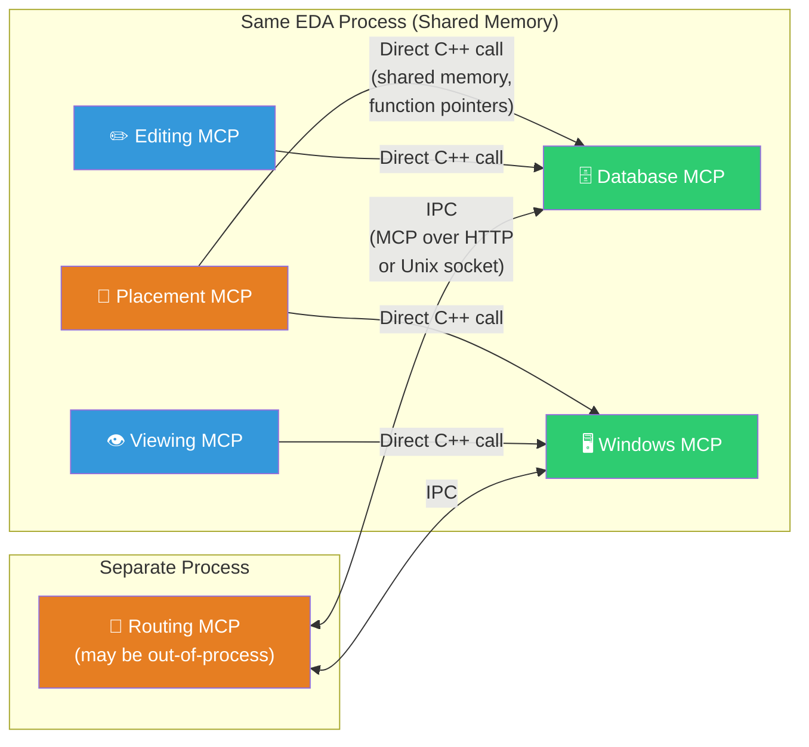
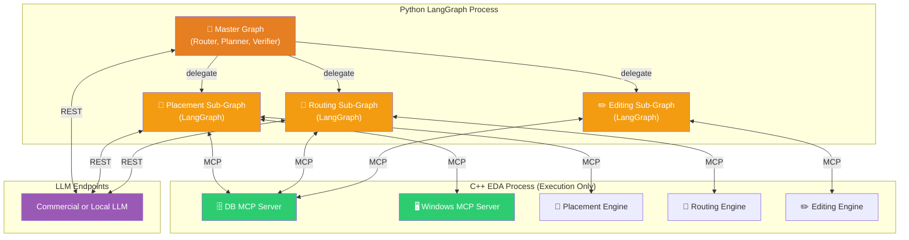
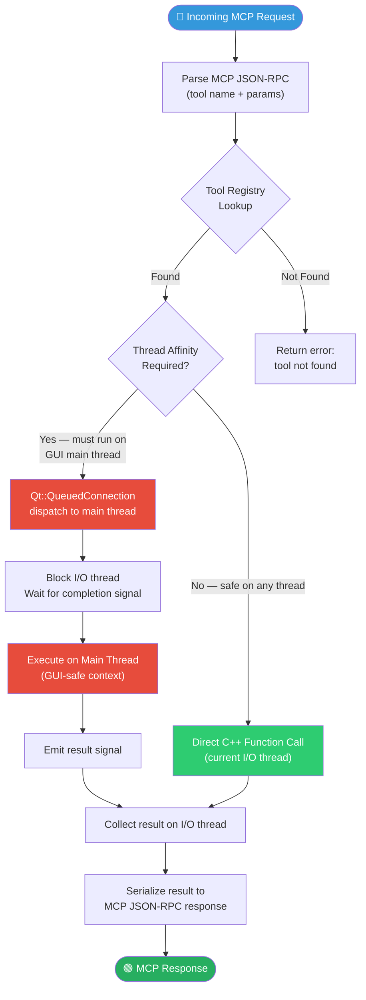
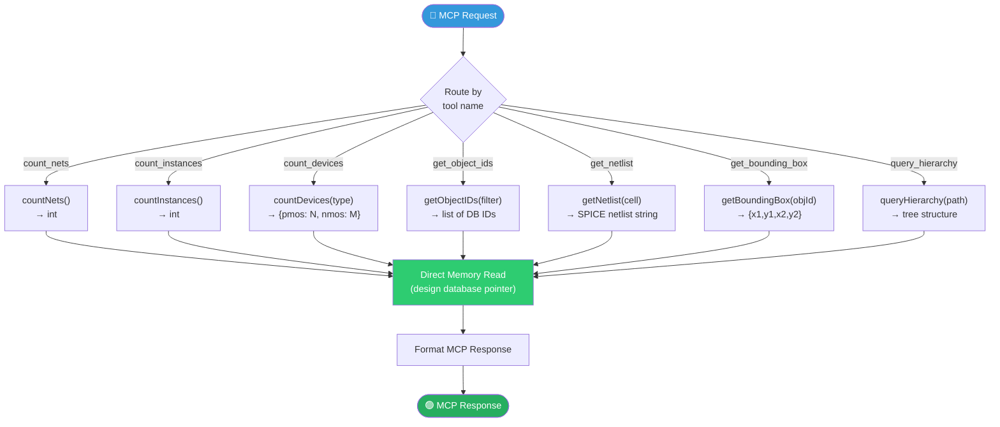
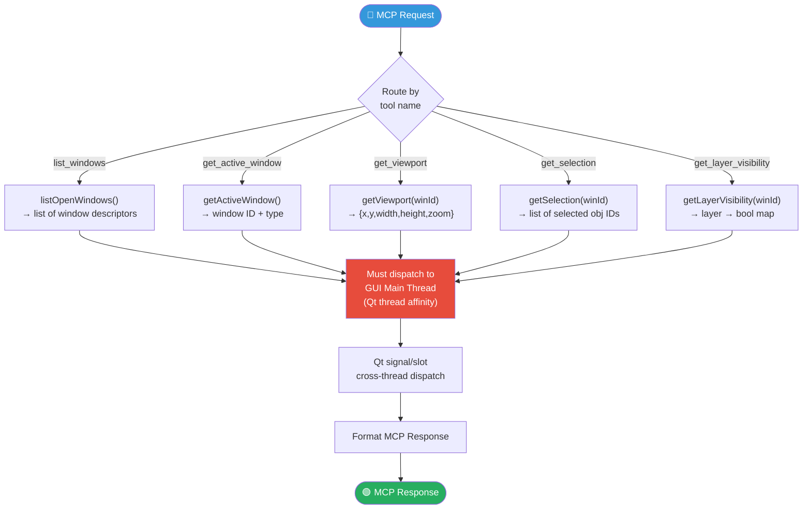
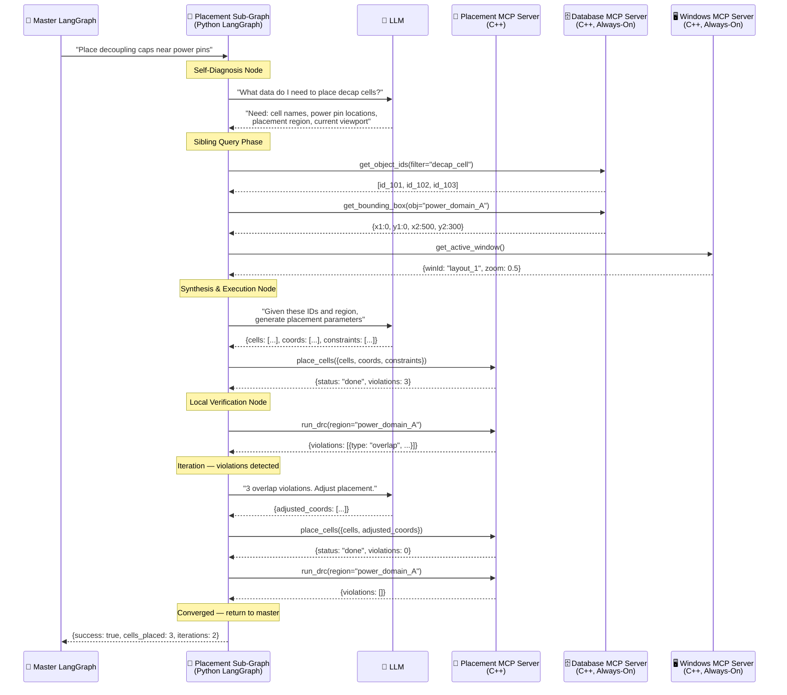
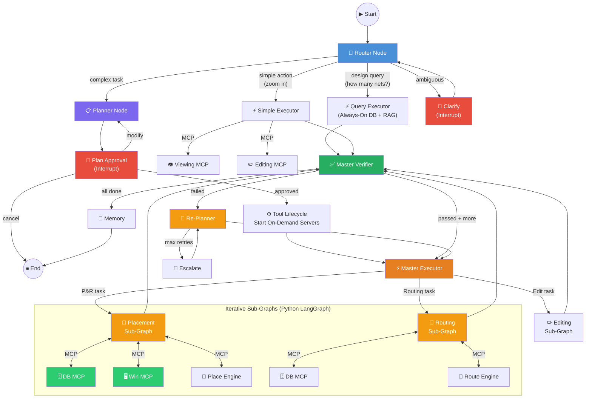
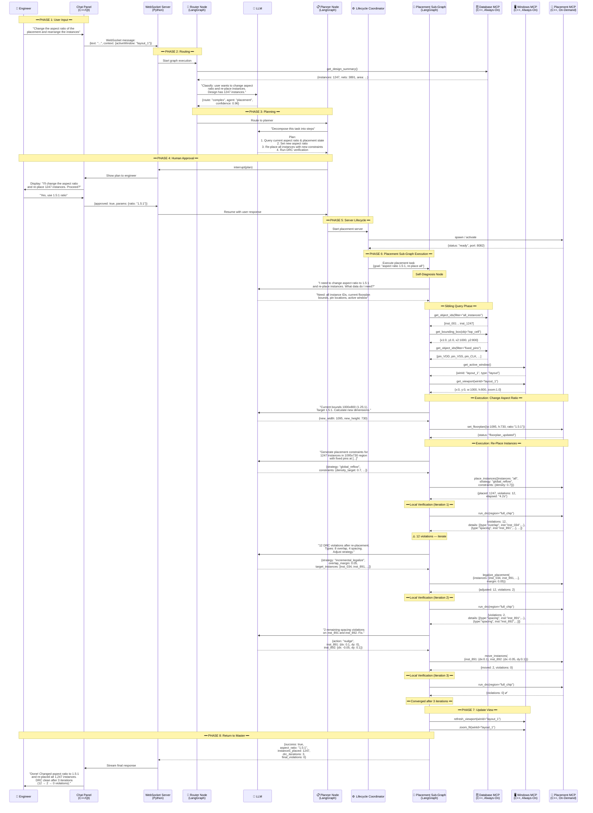

# Graph-Based VLSI AI Agent Architecture Spec (v5)

This specification defines a **Distributed Mini-Orchestrator** model where subtools are exposed as independent, "smart" MCP Servers. Each server contains its own Python LangGraph sub-graph granting it the autonomy to resolve missing context by querying peer MCP servers before invoking the underlying C++ tool engine.

---

## 1. Security and Deployment Constraints

- **Dual-Model Support**: Standardized LLM APIs route sanitized planning requests to commercial cloud models (OpenAI, Anthropic, Gemini) and data-sensitive specialist loops to local on-premises GPU clusters (NVIDIA NIM, Ollama, vLLM).
- **Fully Air-Gappable**: Supports 100% on-premises deployment within the corporate LAN.

---

## 2. Distributed Modular Server Architecture

The C++ layer exposes capabilities as individual, independent MCP servers — each modular, each with defined skills.

### 2.1 Always-On Informational Servers (Auto-Start)
These start automatically alongside the Agentic Service and remain persistent:

| Server | Capabilities | Communication |
|--------|-------------|---------------|
| **Database Layer MCP** | DB Object IDs, net counts, instance queries, PMOS/NMOS device analysis, netlists, bounding boxes | Direct memory access (same process) |
| **Windows/View Layer MCP** | Active windows, focused pane, visible coordinates, zoom level, selection state | Direct memory access (same process) |
| **Documentation RAG MCP** | Full-text search, semantic retrieval, API reference lookup | In-process or IPC (may index external docs) |

### 2.2 On-Demand Subtool Servers (Started When Needed)
These are heavyweight subtools started only when the orchestrator requires them:

| Server | Capabilities | Communication |
|--------|-------------|---------------|
| **Placement MCP** | Component placement, floorplanning, legalization | Direct memory or IPC |
| **Routing MCP** | Signal routing, via insertion, DRC-aware path finding | Direct memory or IPC |
| **Editing MCP** | Design modifications, wire editing, instance property changes | Direct memory access |
| **Viewing MCP** | Zoom, pan, layer visibility, highlight, screenshot | Direct memory access |

### 2.3 Inter-Server Communication Strategy

Since most tools live in the **same process memory space**, we use a hybrid approach:



**Rule**: If the calling server and the target server share the same process address space, use **direct C++ function calls** through the internal tool registry (fast, zero-copy, no serialization). If the target is out-of-process, fall back to **MCP over HTTP/Unix sockets** (IPC). Every MCP server exposes the same MCP protocol interface regardless — the transport is an implementation detail abstracted behind a unified `ToolClient` interface.

---

## 3. Python LangGraph as Universal Orchestrator

**All orchestration logic — both the master graph and every mini-orchestrator inside each subtool MCP server — runs in Python LangGraph.** The C++ layer is purely the execution substrate: it exposes capabilities, executes commands, and returns results. It never makes LLM calls or routing decisions.



---

## 4. C++ MCP Server Internal Architecture

Each C++ MCP Server follows a common internal pattern. The server itself is a **thin wrapper** — it receives MCP protocol requests, dispatches to the appropriate C++ function, handles thread-affinity constraints, and returns structured results.

### 4.1 Single C++ MCP Server — Internal Flow



### 4.2 Database Layer MCP Server — Tools and Dispatch



### 4.3 Windows/View Layer MCP Server — Tools and Dispatch



### 4.4 Placement MCP Server — Tools, Peer Queries, and Iteration

This is an **On-Demand** server. Its Python LangGraph sub-graph orchestrates a multi-step workflow that queries peer servers before invoking the C++ engine.



---

## 5. Master Orchestration Graph (Complete)



---

## 6. Resolving Lifecycle and Interoperability

| Concern | Resolution |
|---------|-----------|
| **Master stays lightweight** | Python LangGraph master only routes, plans, and verifies. Domain logic lives in sub-graphs. |
| **C++ is execution-only** | C++ servers never call LLMs or make routing decisions. They expose pure functions via MCP. |
| **Inter-server queries are fast** | Same-process servers use direct memory calls. Out-of-process servers use MCP/IPC. All behind a unified `ToolClient` interface. |
| **Sub-graphs are autonomous** | Each domain sub-graph independently queries DB, Windows, and RAG servers to resolve its own parameters before acting. |
| **Modularity preserved** | C++ engineers define what tools their server exposes. Python engineers define how those tools are orchestrated. Clean boundary. |

---

## 7. End-to-End Example: "Change the aspect ratio of the placement and rearrange the instances"

This traces every call, every boundary crossing, and every iteration loop for a real user query.

### 7.1 Annotated Flow — Python vs C++ Boundaries, LLM Interactions, and Command Assembly

> **Legend**: 🟠 Orange = Python (LangGraph, out-of-process) · 🟢 Green = C++ (in-tool memory) · 🔵 Blue = LLM call · 🔴 Red = Human interrupt

```mermaid
flowchart TD
    subgraph "C++ EDA Process (In-Tool Memory)"
        ChatPanel["🟢 Chat Panel (C++/Qt)<br/>━━━━━━━━━━━━━━<br/>Captures: user text,<br/>active window ID,<br/>selection state"]
        
        DBMCP["🟢 Database MCP Server<br/>━━━━━━━━━━━━━━<br/>Always-On · Direct Memory<br/>Reads design DB pointers"]
        
        WinMCP["🟢 Windows MCP Server<br/>━━━━━━━━━━━━━━<br/>Always-On · GUI Thread<br/>Reads Qt widget state"]
        
        PlaceMCP["🟢 Placement MCP Server<br/>━━━━━━━━━━━━━━<br/>On-Demand · Executes C++<br/>placement engine functions"]
    end
    
    subgraph "Python Orchestrator (Out-of-Process, Docker)"
        WSServer["🟠 WebSocket Server<br/>━━━━━━━━━━━━━━<br/>Receives: {text, context}"]
        
        Router["🟠🔵 Router Node<br/>━━━━━━━━━━━━━━<br/>SENDS to LLM:<br/>· user query text<br/>· design summary from DB MCP<br/>· list of registered agents<br/>━━━━━━━━━━━━━━<br/>EXPECTS back:<br/>· {route, agent_type, confidence}<br/>━━━━━━━━━━━━━━<br/>Here: route=complex, agent=placement"]
        
        Planner["🟠🔵 Planner Node<br/>━━━━━━━━━━━━━━<br/>SENDS to LLM:<br/>· user query + route decision<br/>· available tool capabilities<br/>━━━━━━━━━━━━━━<br/>EXPECTS back:<br/>· ordered list of plan steps<br/>━━━━━━━━━━━━━━<br/>Here: 4 steps returned"]
        
        PlanApproval["🟠🔴 Plan Approval<br/>━━━━━━━━━━━━━━<br/>interrupt() → shows plan<br/>Waits for engineer response<br/>Engineer adds: ratio=1.5:1"]
        
        Lifecycle["🟠 Tool Lifecycle Coordinator<br/>━━━━━━━━━━━━━━<br/>Spawns Placement MCP Server<br/>Waits for {status: ready}"]
        
        subgraph "Placement Sub-Graph (Python LangGraph)"
            SelfDiag["🟠🔵 Self-Diagnosis Node<br/>━━━━━━━━━━━━━━<br/>SENDS to LLM:<br/>· task description<br/>· available peer servers<br/>━━━━━━━━━━━━━━<br/>EXPECTS back:<br/>· list of required data fields<br/>━━━━━━━━━━━━━━<br/>Here: need instance IDs,<br/>floorplan bounds, pin locs, viewport"]
            
            Collect["🟠 Parameter Collection<br/>━━━━━━━━━━━━━━<br/>Queries peer C++ servers:<br/>· DB MCP → get_object_ids<br/>· DB MCP → get_bounding_box<br/>· DB MCP → get_object_ids(pins)<br/>· Win MCP → get_active_window<br/>· Win MCP → get_viewport<br/>━━━━━━━━━━━━━━<br/>Collects into state dict:<br/>{ids:[...], bbox:{...},<br/>pins:[...], viewport:{...}}"]
            
            Synthesize["🟠🔵 Command Synthesis Node<br/>━━━━━━━━━━━━━━<br/>SENDS to LLM:<br/>· collected params from state<br/>· target aspect ratio (1.5:1)<br/>· current bbox (1000x800)<br/>━━━━━━━━━━━━━━<br/>EXPECTS back:<br/>· new floorplan dimensions<br/>· placement strategy + constraints<br/>━━━━━━━━━━━━━━<br/>ASSEMBLES C++ commands:<br/>set_floorplan(w=1095,h=730)<br/>place_instances(strategy=<br/>global_reflow, density=0.7)"]
            
            Execute["🟠 Execution Node<br/>━━━━━━━━━━━━━━<br/>Sends assembled commands<br/>to C++ Placement MCP Server<br/>via MCP over HTTP"]
            
            Verify["🟠🔵 Local Verifier<br/>━━━━━━━━━━━━━━<br/>Calls: PlaceMCP.run_drc()<br/>━━━━━━━━━━━━━━<br/>If violations > 0:<br/>SENDS to LLM:<br/>· violation count + types<br/>· previous strategy<br/>EXPECTS back:<br/>· adjusted parameters<br/>ASSEMBLES new command:<br/>legalize_placement(margin=0.05)<br/>━━━━━━━━━━━━━━<br/>Loops until violations=0<br/>or max_retries hit"]
        end
        
        MasterVerify["🟠🔵 Master Verifier<br/>━━━━━━━━━━━━━━<br/>SENDS to LLM:<br/>· sub-graph result summary<br/>· original user intent<br/>EXPECTS back:<br/>· {passed: bool, reason: str}"]
        
        Memory["🟠 Memory Node<br/>━━━━━━━━━━━━━━<br/>Stores to PostgreSQL:<br/>· successful approach<br/>· parameters used"]
    end
    
    subgraph "LLM Endpoint"
        LLM["🔵 Commercial or Local LLM<br/>━━━━━━━━━━━━━━<br/>OpenAI / Anthropic / Gemini<br/>or vLLM / NIM / Ollama"]
    end
    
    ChatPanel -->|"WebSocket:<br/>{text, activeWindow,<br/>selectionState}"| WSServer
    WSServer --> Router
    
    Router -->|"MCP call"| DBMCP
    Router -->|"LLM call"| LLM
    Router -->|"route=complex"| Planner
    
    Planner -->|"LLM call"| LLM
    Planner --> PlanApproval
    
    PlanApproval -->|"interrupt →<br/>WebSocket → Chat"| ChatPanel
    PlanApproval --> Lifecycle
    
    Lifecycle -->|"spawn"| PlaceMCP
    Lifecycle --> SelfDiag
    
    SelfDiag -->|"LLM call"| LLM
    SelfDiag --> Collect
    
    Collect -->|"MCP calls"| DBMCP
    Collect -->|"MCP calls"| WinMCP
    Collect --> Synthesize
    
    Synthesize -->|"LLM call"| LLM
    Synthesize --> Execute
    
    Execute -->|"MCP commands"| PlaceMCP
    Execute --> Verify
    
    Verify -->|"MCP: run_drc"| PlaceMCP
    Verify -->|"LLM call<br/>(on failure)"| LLM
    Verify -->|"violations > 0"| Execute
    Verify -->|"violations = 0"| MasterVerify
    
    MasterVerify -->|"LLM call"| LLM
    MasterVerify --> Memory
    
    Memory -->|"WebSocket:<br/>final response"| ChatPanel
    
    style ChatPanel fill:#2ecc71,color:#fff
    style DBMCP fill:#2ecc71,color:#fff
    style WinMCP fill:#2ecc71,color:#fff
    style PlaceMCP fill:#2ecc71,color:#fff
    style WSServer fill:#e67e22,color:#fff
    style Router fill:#e67e22,color:#fff
    style Planner fill:#7b68ee,color:#fff
    style PlanApproval fill:#e74c3c,color:#fff
    style Lifecycle fill:#e67e22,color:#fff
    style SelfDiag fill:#f39c12,color:#fff
    style Collect fill:#f39c12,color:#fff
    style Synthesize fill:#f39c12,color:#fff
    style Execute fill:#f39c12,color:#fff
    style Verify fill:#f39c12,color:#fff
    style MasterVerify fill:#27ae60,color:#fff
    style Memory fill:#e67e22,color:#fff
    style LLM fill:#9b59b6,color:#fff
```



### 7.1.1 LLM Interaction Summary

| Node | Sends to LLM | Expects Back | Uses Result To |
|------|-------------|-------------|----------------|
| **Router** | User text + design summary + agent list | `{route, agent_type, confidence}` | Decide: simple exec vs planner vs clarify |
| **Planner** | User query + route decision + tool capabilities | Ordered list of plan steps | Present plan for approval |
| **Self-Diagnosis** | Task description + available peer servers | List of required data fields | Know which peer MCP servers to query |
| **Command Synthesis** | Collected params + target constraints | New dimensions + strategy + placement params | **Assemble the actual C++ MCP commands**: `set_floorplan(w=1095, h=730)`, `place_instances(strategy="global_reflow", density=0.7)` |
| **Local Verifier** | Violation count + types + previous strategy | Adjusted parameters | **Re-assemble corrected commands**: `legalize_placement(instances=[...], margin=0.05)` or `move_instances(inst_891={dx:0.1})` |
| **Master Verifier** | Sub-graph result summary + original intent | `{passed: bool, reason}` | Decide: done vs re-plan vs escalate |

### 7.1.2 Command Assembly Pattern

The **Command Synthesis Node** is the critical translation layer. It does NOT pass raw user text to C++. Instead:

```
1. COLLECT from peers:     DB MCP → ids, bbox, pins
                           Win MCP → viewport, window ID

2. REASON via LLM:         "Given 1000x800 bbox, target 1.5:1 →
                            new dims = 1095x730.
                            1247 instances, density target 0.7,
                            strategy = global_reflow"

3. ASSEMBLE MCP command:   place_instances({
                             instances: [inst_001..inst_1247],
                             region: {w:1095, h:730},
                             strategy: "global_reflow",
                             constraints: {density: 0.7},
                             fixed_pins: [pin_VDD, pin_VSS, ...]
                           })

4. DISPATCH to C++:        → Placement MCP Server executes
                             the fully-formed command
```

### 7.2 Detailed Call Sequence



### 7.3 Call Boundary Summary

| Phase | Where | What Happens |
|-------|-------|-------------|
| **1. User Input** | C++ Chat Panel → WebSocket | Query + GUI context sent to Python |
| **2. Routing** | Python LangGraph + LLM | Classified as "complex / placement" |
| **3. Planning** | Python LangGraph + LLM | Decomposed into 4 ordered steps |
| **4. Human Approval** | Python → C++ → Engineer | `interrupt()` pauses graph, shows plan |
| **5. Server Lifecycle** | Python → C++ | On-demand Placement MCP server started |
| **6. Sub-Graph Execution** | Python LangGraph ↔ C++ MCP Servers | Sub-graph queries DB + Windows peers, invokes Placement engine, iterates DRC loop (3 cycles: 12→2→0 violations) |
| **7. Update View** | Python → C++ Windows MCP | Refresh + zoom-fit the layout window |
| **8. Response** | Python → WebSocket → C++ Chat Panel | Final summary streamed to engineer |

---

## 8. C++ Algorithmic Core Memory Management (A* Maze Router)

While the Python/MCP boundary handles orchestration, the pure performance engine relies on strict C++ memory management within the `DetailedGridRouter` beneath the Python wrappers.

### 8.1 The "Whiteboard" Analogy for Boost::Pool
In physical VLSI routing, an A* path search can easily expand millions of nodes across the unified 3D grid graph. 

Imagine organizing a massive library by handing out a brand-new notebook (an OS memory allocation, i.e., `new Node()`) to every single patron (an A* search path) who enters, and then throwing the notebook in the trash (`delete Node()`) when they leave. The system would collapse under the administrative overhead of allocating and deallocating memory.

To solve this, the **A* Grid Router implements a `boost::object_pool`**. This acts like a stack of reusable whiteboards. When a routing thread needs to expand an edge, it quickly grabs a whiteboard from the pre-allocated pool, weights the new $G + H$ costs, and places it in the `std::priority_queue`. Once the route converges, the whole stack of whiteboards is wiped clean and reused for the next net in $O(1)$ time. This completely eliminates dynamic heap allocations on the hot path, ensuring deterministic, ultra-fast routing execution.

### 8.2 The "Traffic Cop and Toll Booth" Analogy for PathFinder
The core engine relies on the `NegotiatedRoutingLoop` and `HistoryCostUpdater` to resolve shorts and overlaps.

* **NegotiatedRoutingLoop (The Traffic Cop)**: Imagine 10,000 drivers (nets) who all want to take the exact same highway at rush hour. If they drive blindly, they crash. The Negotiated Routing Loop acts as a Master Traffic Cop managing bounds. It lets everyone drive, sees exactly where the crashes (DRC shorts) happen, and rips up the crashed cars, forcing them to re-route.
* **HistoryCostUpdater (The Toll Booth Operator)**: Whenever cars crash on a specific highway lane, the Traffic Cop tells the Toll Booth Operator to permanently increase the toll price for that specific lane for all future passes. On the next round, the A* drivers see the expensive toll and naturally route themselves around the contention point. This repeats until 0 crashes occur.

---

## 9. Modern C++ 17/23 Concepts & Analogies

Throughout the V3 architecture, several bleeding-edge C++ features are heavily utilized for performance and safety.

### 9.1 `[[nodiscard]]` (The Unopened Mail Analogy)
Imagine a postman hands you a highly important certified letter, and you immediately throw it into the trash without opening it. The post office would trigger an alarm! 
`[[nodiscard]]` acts as this alarm. It mathematically forces the C++ compiler to throw a warning if an EDA function (like `route_nets()`) generates a complex route, and the programmer dangerously forgets to capture the result in a variable to use it.

### 9.2 `std::expected<T, E>` (The Package Delivery Analogy)
When you open a sealed package, you either find your physical item inside (the `value`), **OR** you find an apology slip stating why it couldn't be delivered (the `error`). You cannot have both, and you cannot have neither. 
Introduced in C++23, `std::expected` forces the API to return either a successful `RoutedPath` OR a strict `RouterError`. This mathematically forces the programmer to handle failure states rather than blindly relying on loose `bool` checks.

### 9.3 `[[likely]]` & `[[unlikely]]` (The Train Switch Analogy)
In a train system, if 99% of trains go straight and 1% turn left, operators will permanently lock the physical tracks to "straight" so trains never have to slow down. If a left-turning train comes, the track has to explicitly halt and switch, creating a delay.
`[[likely]]` instructs the physical CPU hardware to branch-predict and pre-load the "straight path" instructions right into the L1 CPU Cache. In our heavy A* maze router, we label standard matrix expansions as `[[likely]]` to drastically increase pathfinding speeds.

### 9.4 `std::span<T>` (The Glass Window Analogy)
If your colleague needs to read one specific paragraph from your 10,000-page book, photocopying the entire book to hand to them is incredibly wasteful. Instead, you just place a small glass framing window over that exact paragraph. 
`std::span` is a zero-copy pointer window that looks directly into an existing array in memory (such as a subset array of `NetIds`), allowing sub-functions to read the data without triggering massive memory duplication via pass-by-value.
