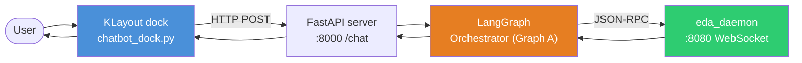
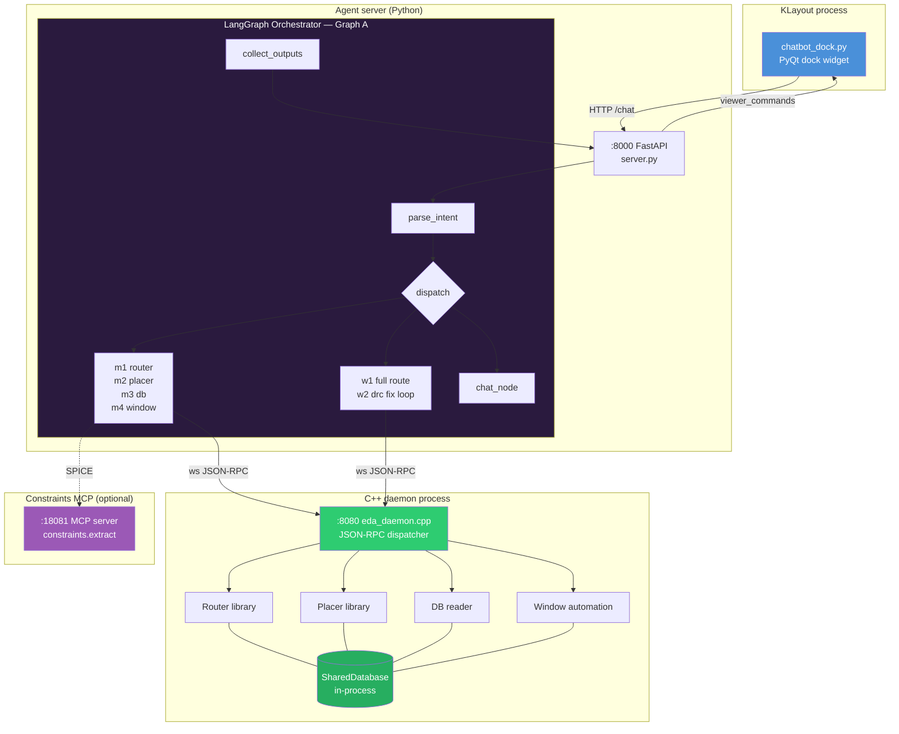
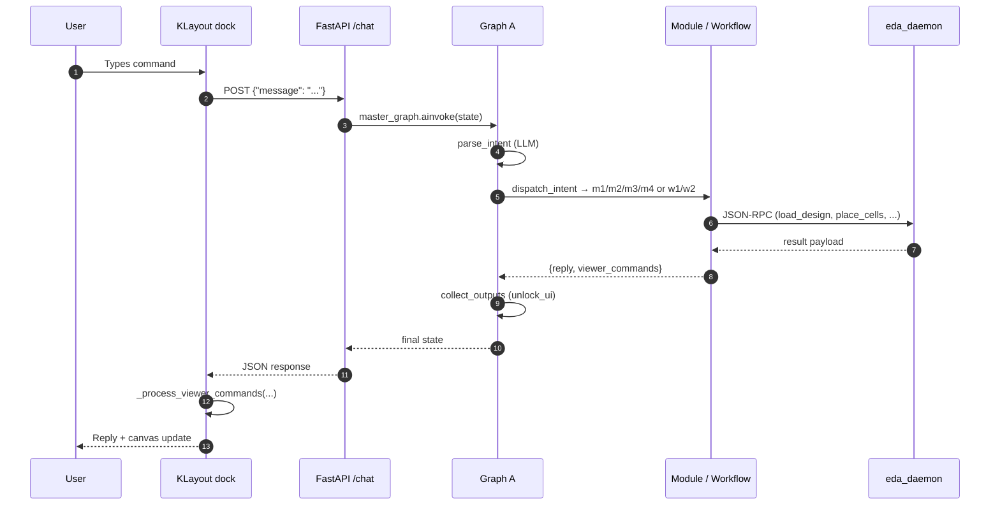
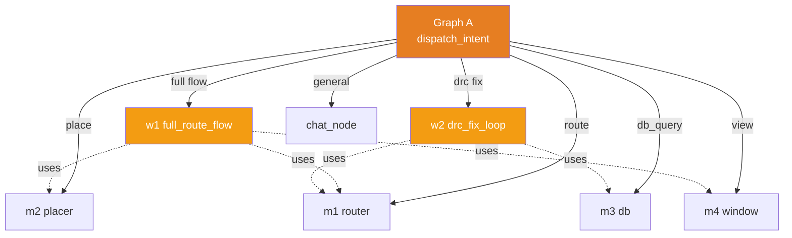
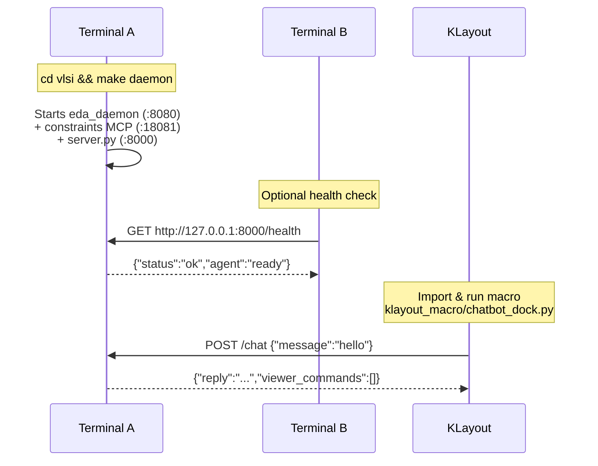
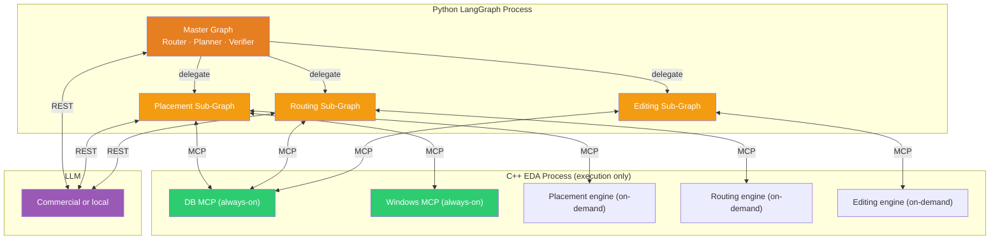
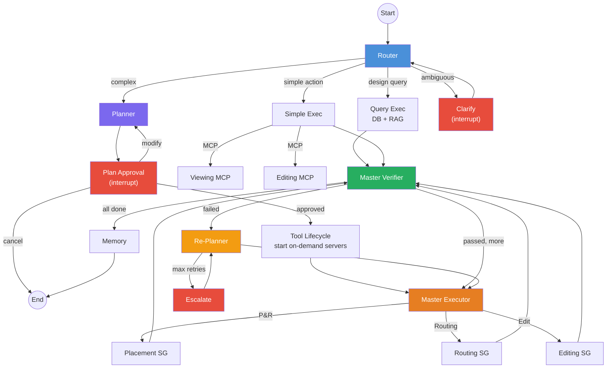
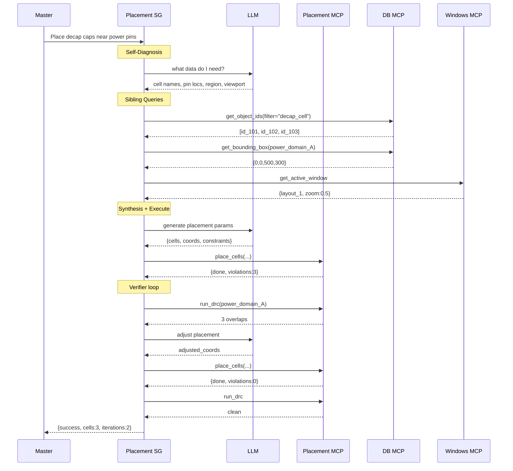

# VLSI Agent — Architecture

> Single source of truth for the VLSI agent's architecture. For the C++ routing-engine internals, see [`implementation.md`](./implementation.md). For how to run the stack end-to-end, see [`chatbot_howto.md`](./chatbot_howto.md).

## Table of contents

1. [At a Glance](#1-at-a-glance)
2. [Components](#2-components)
3. [Request Flow](#3-request-flow)
4. [Modules and Workflows](#4-modules-and-workflows)
5. [Interfaces and Contracts](#5-interfaces-and-contracts)
6. [Design Rules](#6-design-rules)
7. [Running the Stack](#7-running-the-stack)
8. [Future Direction (v3)](#8-future-direction-v3)
9. [Appendices](#9-appendices)

---

## 1. At a Glance

A user types a command into a KLayout dock panel. That request is routed through a Python LangGraph orchestrator which decides whether to answer directly or invoke an EDA module. Modules and workflows talk to a single C++ daemon over WebSocket JSON-RPC; the daemon hosts all algorithm code (router, placer, DB, window) in one process with a shared database.



**Three processes, one shared language (JSON).** The KLayout macro, the agent server, and the C++ daemon each run independently and can be restarted without bringing the others down.

---

## 2. Components

Four cooperating pieces. Read this table first; drill into later sections only for the piece you're changing.

| Component | Process / Port | File(s) | Responsibility |
|---|---|---|---|
| **KLayout Chatbot** | KLayout (PyQt dock) | `vlsi/agent/klayout_macro/chatbot_dock.py` | Capture user text, show replies, render `viewer_commands` on the canvas |
| **Agent Server** | Python / FastAPI · `:8000` | `vlsi/agent/server.py` | HTTP entry point; owns one compiled LangGraph instance |
| **Orchestrator (Graph A)** | Inside agent server | `vlsi/agent/src/orchestrator/orchestrator_graph.py` | LLM intent parsing, dispatch to modules or workflows |
| **C++ Daemon** | Native binary · `:8080` (WS) | `vlsi/eda_tools/eda_cli/` | JSON-RPC gateway; router / placer / DB / window all linked in one process sharing a `SharedDatabase` |

Two auxiliary pieces extend the flow without adding processes:

- **Constraints MCP tool** (`:18081`) — Python MCP server parsing SPICE into a tool-neutral `analog_problem`; used by the placer path.
- **Module subgraphs and workflows** — internal LangGraph nodes (`m1`…`m4`, `w1`, `w2`) that compose simple and multi-step EDA tasks.



---

## 3. Request Flow

A single chat turn, end-to-end. Later sections expand each hop.



**Reading the flow.** The only LLM call in the hot path is `parse_intent` (step 4). Everything else is deterministic routing and tool invocation. This keeps latency predictable and debugging tractable.

---

## 4. Modules and Workflows

Two kinds of children under Graph A:

- **Modules** (`m1…m4`) — single-tool wrappers. They validate input, make one call to the daemon, format a response. Use them for "do one thing" intents.
- **Workflows** (`w1`, `w2`) — multi-step pipelines that may call several modules internally and iterate. Use them when the user asks for a compound outcome (full P&R, DRC fix loop).



<details>
<summary><b>m2 — Placer subgraph (detail)</b></summary>

File: `vlsi/agent/src/orchestrator/modules/m2_placer_subgraph.py`

Nodes, in order:

1. `validate_placement_input` — checks daemon reachability.
2. `call_placer_via_cli` — invokes placement via MCP. If `placement_params.spice_netlist_path` is set, builds an `analog_problem` via the **constraints MCP tool** (preferred) or the local fallback in `utils/spice_to_analog_problem.py`.
3. `format_placer_response` — returns the user-facing message plus viewer commands:
   - `draw_instances` on layer `999/0`
   - `draw_routes` on layer `998/0` (early-route visualization, built by `utils/early_router.build_early_routes`)

</details>

<details>
<summary><b>m1 — Router subgraph (detail)</b></summary>

File: `vlsi/agent/src/orchestrator/modules/m1_router_subgraph.py`

Nodes: `validate_routing_input` → `call_router_via_cli` → `format_router_response`.

Uses the shared `_cli_client.mcp_call(method, params)` over WebSocket to the daemon (`ws://127.0.0.1:8080`).

</details>

<details>
<summary><b>m3 / m4 — DB and Window subgraphs</b></summary>

- `m3_db_subgraph.py` — status queries, net lists, bounding boxes. Calls DB-side MCP methods.
- `m4_window_subgraph.py` — emits viewer commands (`zoom_to`, `refresh_view`, `screenshot`, ...). These are serialized back to the KLayout dock which executes them on the canvas.

</details>

<details>
<summary><b>w1 / w2 — Workflows</b></summary>

- `w1_full_route_flow.py` — orchestrates placer → router → window refresh for a full P&R turn.
- `w2_drc_fix_loop.py` — iterative DRC correction. Queries violations via `m3`, re-routes offenders via `m1`, repeats until clean or retry budget is exhausted.

Workflows expose only `start` / `finished` edges to Graph A — Graph A never sees their internal iteration.

</details>

---

## 5. Interfaces and Contracts

Three boundaries — each one is a narrow, auditable contract.

### 5.1 Dock ↔ Agent server (HTTP)

```
POST http://127.0.0.1:8000/chat
Content-Type: application/json

Request:  {"message": "<user text>"}
Response: {"reply": "<text>", "viewer_commands": [ {...}, ... ]}
```

`viewer_commands` is the only way the agent changes the canvas. The dock's `_process_viewer_commands(commands)` implements actions such as `draw_instances`, `draw_routes`, `zoom_fit`, `refresh_view`, `screenshot`.

### 5.2 Agent ↔ C++ daemon (WebSocket JSON-RPC)

All module and workflow code calls `mcp_call(method, params)` in `modules/_cli_client.py`. Representative methods:

| Method | Owner inside daemon |
|---|---|
| `load_design` | DB server |
| `db.status`, `db.get_nets`, `db.get_bboxes` | DB server |
| `route_nets` | Router server |
| `place_cells` | Placer server |
| `view.zoom_to`, `view.refresh` | Window server |

### 5.3 Agent ↔ Constraints MCP (optional, SPICE path)

- **Server** `vlsi/eda_tools/python/constraints_tool/mcp_server.py` exposes `constraints.extract`.
- **Client** `vlsi/agent/src/orchestrator/utils/constraints_mcp_client.py` is called by `m2` when a SPICE netlist is provided.

---

## 6. Design Rules

Four anti-coupling guarantees the code base enforces:

1. **No Python module calls another Python module directly.** `m1` never imports from `m2`. Cross-module communication goes through Graph A or through the C++ daemon's JSON-RPC interface.
2. **No C++ module calls another C++ module through Python.** Router/Placer/DB all share one process memory via `SharedDatabase`. Inter-module calls are direct C++ function calls inside the daemon binary — never a round-trip through Python.
3. **`eda_cli` is the gateway, not an algorithm.** Algorithm modules (e.g. `routing_genetic_astar`, `eda_placer`) are compiled as libraries and linked into the daemon.
4. **Workflows own their iteration logic.** `w1`, `w2` use module subgraphs internally but expose only `start` / `finished` to Graph A.

---

## 7. Running the Stack

Three terminals, three ports. See [`chatbot_howto.md`](./chatbot_howto.md) for the full guide including troubleshooting.



| Port | Process | Purpose |
|---|---|---|
| `:8000` | Python `server.py` | HTTP `/chat` |
| `:8080` | C++ `eda_daemon` | WebSocket JSON-RPC |
| `:18081` | Python `constraints_tool` MCP | SPICE parsing (optional) |

---

## 8. Future Direction (v3)

This section describes the **target architecture** — a distributed mini-orchestrator model where each MCP server has its own LangGraph sub-graph and can query peers before invoking the underlying C++ engine. The current system (above) is a stepping-stone toward this.

### 8.1 Model in One Picture



### 8.2 Principles

1. **Master stays lightweight** — it routes, plans, and verifies. Domain logic lives in sub-graphs.
2. **C++ is execution-only** — servers never call LLMs or make routing decisions.
3. **Inter-server queries are fast** — same-process servers use direct memory; out-of-process servers use MCP. One unified `ToolClient` interface hides the transport.
4. **Sub-graphs are autonomous** — each domain sub-graph queries DB/Windows/RAG independently to resolve its own parameters.
5. **Modularity preserved** — C++ owns capability exposure; Python owns orchestration.

### 8.3 Master Graph (complete)



### 8.4 Placement Sub-Graph Example

A single delegation with sibling queries, LLM-driven command synthesis, DRC loop, and convergence.

<details>
<summary><b>Expand: "place decoupling caps near power pins" — step-by-step</b></summary>



</details>

### 8.5 Security & Deployment

- **Dual-model support** — sanitized planning → commercial cloud LLM; data-sensitive specialist loops → on-prem GPU (NIM, vLLM, Ollama).
- **Fully air-gappable** — supports 100% on-premises deployment within the corporate LAN.

---

## 9. Appendices

### 9.1 File Map (current code)

```text
vlsi/agent/
  server.py                            FastAPI entry point (:8000)
  main.py                              CLI entry point (dev/test)
  constraints.py                       constraint helpers (shared)
  pyproject.toml
  klayout_macro/
    chatbot_dock.py                    KLayout PyQt dock widget
    viewer_client.py                   viewer command helpers
  src/orchestrator/
    orchestrator_graph.py              Graph A master orchestrator
    router_subgraph.py                 top-level routing subgraph
    modules/
      _cli_client.py                   shared WebSocket MCP client
      m1_router_subgraph.py            Router module
      m2_placer_subgraph.py            Placer module (analog + SPICE)
      m3_db_subgraph.py                DB reader module
      m4_window_subgraph.py            Window automation module
    workflows/
      w1_full_route_flow.py            Full placement + routing
      w2_drc_fix_loop.py               Iterative DRC correction
    utils/
      constraints_mcp_client.py        constraints.extract client
      early_router.py                  Manhattan early-route preview
      env_bootstrap.py                 environment setup
      spice_to_analog_problem.py       SPICE → analog_problem

vlsi/eda_tools/
  eda_cli/                             C++ CLI + MCP gateway (daemon)
  routing_genetic_astar/               router library
  eda_placer/                          placer library (WIP)
  python/constraints_tool/             Python constraints MCP server
```

### 9.2 Key Utilities

<details>
<summary><b>Early routing visualizer</b></summary>

- File: `utils/early_router.py`
- Function: `build_early_routes(...)`
- Produces Manhattan preview segments (layer 998/0) for visual feedback. Not DRC-clean; no PDK metal stack.

</details>

<details>
<summary><b>SPICE → analog placement problem</b></summary>

- File: `utils/spice_to_analog_problem.py`
- Function: `build_analog_problem_from_spice(...)`
- Builds a tool-neutral `analog_problem` for the C++ placer. Preferred path uses the constraints MCP (`constraints.extract`); a local parser is the fallback.

</details>

### 9.3 Viewer Commands (partial)

| Action | Argument shape | Used by |
|---|---|---|
| `draw_instances` | `{layer: "999/0", rectangles: [{x, y, w, h, name}]}` | m2 |
| `draw_routes` | `{layer: "998/0", segments: [{x1, y1, x2, y2}]}` | m2 |
| `zoom_fit` | `{}` | m4 |
| `refresh_view` | `{}` | m4 |
| `screenshot` | `{path?: string}` | m4 |
| `unlock_ui` | `{}` | `collect_outputs` |
