# VLSI Agent — Architecture

> Single source of truth for the VLSI agent's architecture. For the C++ routing-engine internals, see [`implementation.md`](./implementation.md). For how to run the stack end-to-end, see [`chatbot_howto.md`](./chatbot_howto.md).

## 1. Requirements and Capabilities

This architecture fulfills the goal of orchestrating autonomous electronic design automation (EDA) workflows across **two cooperating tool layers** under a single LangGraph orchestrator.

- **Internal Tool Layer** — production algorithms that run *inside* a proprietary EDA host (Cadence Virtuoso, Synopsys ICC2, KLayout). The orchestrator reaches them through a thin **Host Execution Agent (HEA)** embedded in the host process and dispatches self-contained **Execution Units (EUs)** that keep dense, iterative loops (DRC fixes, place-and-route convergence) inside host memory. No UI lockups, no per-iteration IPC.
- **External Tool Layer** — the compiled C++ `eda_daemon` (with its `routing_genetic_astar`, `eda_placer`, DB reader, window automation libraries) and Python MCP tools (e.g., constraints parser). These run as separate processes and communicate over WebSocket JSON-RPC. This layer is the home of custom research algorithms and tool-neutral utilities.

Several capabilities — notably the router and placer — are present in **both** layers. A host's production router is battle-tested on real silicon; a custom C++ router may explore a novel algorithm on the same netlist. The orchestrator treats these as peer implementations and picks between them according to an explicit routing policy.

### Routing Policy

1. **Default — Internal-first with analyze-then-augment.** The orchestrator dispatches to the internal (host) tool first. Results are analyzed, and the external (custom) tool is invoked only when the internal run fails, leaves open work, or the workflow explicitly wants a cross-check.
2. **Explicit `internal_only`.** Skip the external layer entirely. The user is telling the agent "stay inside the host."
3. **Explicit `external_only`.** Skip the internal layer entirely. Typical for custom-algorithm experiments or when the host is unavailable.

This policy is the single source of truth for tool dispatch — see [§4 Tool Layers and Routing Policy](#4-tool-layers-and-routing-policy) for the state machine and [§10 Native Execution Units](#10-native-execution-units-eu-pattern) for the EU implementation.

## Table of contents

1. [Requirements and Capabilities](#1-requirements-and-capabilities)
2. [At a Glance](#2-at-a-glance)
3. [Components](#3-components)
4. [Tool Layers and Routing Policy](#4-tool-layers-and-routing-policy)
5. [Request Flow](#5-request-flow)
6. [Modules and Workflows](#6-modules-and-workflows)
7. [Interfaces and Contracts](#7-interfaces-and-contracts)
8. [Design Rules](#8-design-rules)
9. [Running the Stack](#9-running-the-stack)
10. [Native Execution Units (EU Pattern)](#10-native-execution-units-eu-pattern)
11. [Appendices](#11-appendices)
12. [RAG Memory System](#12-rag-memory-system)
13. [Docker Deployment](#13-docker-deployment)
14. [Geometry-Level DRC and Write Protocol](#14-geometry-level-drc-and-write-protocol)

---

## 2. At a Glance

A user types a command into a KLayout dock panel (or equivalent dock inside Virtuoso / ICC2). The request is routed through a Python LangGraph orchestrator which decides whether to answer directly or invoke an EDA capability. When it invokes one, a **policy layer** selects between the **internal tool layer** (Execution Units running inside the host tool) and the **external tool layer** (the C++ `eda_daemon` reached over WebSocket JSON-RPC). By default the orchestrator tries internal first, analyzes the result, and escalates to external only when needed.

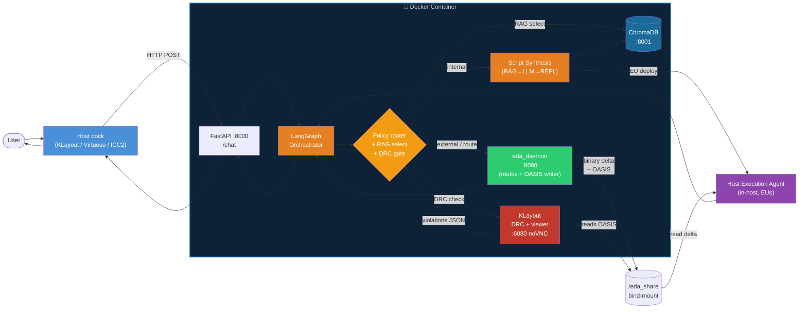

**Containerised agent, host-native execution.** The C++ daemon now writes two outputs per job: a flat binary delta (fast, for the HEA apply loop) and an OASIS file (for KLayout DRC and the debug viewer), both on a shared bind-mount volume. The DRC gate runs KLayout headlessly inside Docker against the OASIS file before the agent ever touches the live EDA database. The noVNC viewer lets engineers inspect the routing result in a browser without needing a full EDA tool licence.

---

## 3. Components

The stack is organized into an **orchestration plane** (host-agnostic) and two **tool layers** (host-specific and custom). Read this table first; drill into later sections only for the piece you're changing.

### 3.1 Orchestration plane

| Component | Process / Port | File(s) | Responsibility |
|---|---|---|---|
| **Host Chatbot Dock** | Host (PyQt / Tk / native) | `vlsi/agent/klayout_macro/chatbot_dock.py` (+ Virtuoso/ICC2 equivalents) | Capture user text, show replies, render `viewer_commands` on the canvas |
| **Agent Server** | Python / FastAPI · `:8000` | `vlsi/agent/server.py` | HTTP entry point; owns one compiled LangGraph instance |
| **Orchestrator (Graph A)** | Inside agent server | `vlsi/agent/src/orchestrator/orchestrator_graph.py` | LLM intent parsing, policy-driven layer selection, dispatch to modules or workflows |
| **Policy Router** | Inside Graph A | `vlsi/agent/src/orchestrator/policy/layer_router.py` | Applies the internal-first routing policy; honors `internal_only` / `external_only` overrides |
| **EU Compiler Node** | Inside Graph A | `vlsi/agent/src/orchestrator/eu_compiler.py` | Renders Jinja2 templates, validates syntax, packages EUs for the HEA |

### 3.2 External tool layer (custom, separate process)

| Component | Process / Port | File(s) | Responsibility |
|---|---|---|---|
| **C++ Daemon** | Native binary · `:8080` (WS) | `vlsi/eda_tools/eda_cli/` | JSON-RPC gateway; router / placer / DB / window all linked in one process sharing a `SharedDatabase` |
| **Constraints MCP tool** | Python MCP · `:18081` | `vlsi/eda_tools/python/constraints_tool/` | Parses SPICE into a tool-neutral `analog_problem`; used by the placer path |

### 3.3 Internal tool layer (host-embedded, EU pattern)

| Component | Process | File(s) | Responsibility |
|---|---|---|---|
| **Host Execution Agent (HEA)** | Embedded inside the EDA host (Virtuoso / ICC2 / KLayout) | `vlsi/agent/src/hea/` (hosts each ship their own loader script) | Minimal MCP server exposing `deploy_eu`, `query_state`, `write_state`, `stream_log`. Defers execution to the host's idle callback so UI threads never deadlock. |
| **Shared State Store** | In-host key-value dict | part of HEA | Carries inputs/outputs between EUs without round-tripping to LangGraph |
| **Window / DB Adapters** | In-host | part of HEA | Resolve generic ops (`zoom_to_bbox`, `get_cellview`) to host-specific APIs (`hiZoomIn`, `gui_start_wait_cursor`, `pya.LayoutView`) |
| **EU Registry** | On disk, external | `vlsi/agent/src/orchestrator/eu_registry/{cadence_virtuoso,synopsys_icc2,klayout}/` | Jinja2 templates of validated, reusable EU scripts |

### 3.4 RAG memory system

| Component | Process / Port | File(s) | Responsibility |
|---|---|---|---|
| **RAG Service** | Inside agent process | `vlsi/agent/src/rag/rag_service.py` | Retrieves vendor API doc chunks relevant to a capability or query; used by policy router (tool selection) and script synthesis (API context) |
| **ChromaDB** | Sidecar container · `:8001` | `docker/chromadb/` | Persistent vector store; one collection per EDA tool × software version (e.g., `virtuoso_icadvm_23_1`) |
| **RAG Ingestor** | One-shot CLI / scheduled | `vlsi/agent/src/rag/ingestor.py` | Chunks and embeds vendor docs on first install; re-indexes when EDA version is updated |

### 3.5 Script synthesis and Python REPL

| Component | Process / Port | File(s) | Responsibility |
|---|---|---|---|
| **Script Synthesis Node** | Inside Graph A | `vlsi/agent/src/orchestrator/script_synthesis.py` | RAG retrieval → LLM synthesis → REPL dry-run → static validation pipeline; produces a ready-to-deploy EU when the registry has no matching template |
| **Python REPL (sandbox)** | Subprocess inside container | `vlsi/agent/src/orchestrator/python_repl.py` | Executes KLayout-Python EUs in an isolated `subprocess` before they are deployed to the HEA. For SKILL / Tcl EUs syntax-only validation is used (no native interpreter in Docker). |

### 3.6 Geometry engine and DRC service

| Component | Process / Port | File(s) | Responsibility |
|---|---|---|---|
| **KLayout service** | Container · headless + VNC · `:5900` / `:6080` | `docker/klayout/` | Three roles: (1) headless geometric DRC engine against OASIS delta files; (2) graphical debug viewer accessible via browser (noVNC `:6080`); (3) optional standalone layout editor for result inspection before committing to live EDA DB |
| **OASIS delta writer** | Inside C++ daemon | `vlsi/eda_tools/eda_cli/oasis_writer.cpp` | Writes the routing / placement result as an OASIS file to the shared volume alongside the binary delta — used as input to KLayout DRC and the debug viewer |
| **DRC script generator** | Inside agent process | `vlsi/agent/src/drc/drc_script_gen.py` | Converts extracted techfile rules (JSON) into a KLayout Ruby DRC script; runs KLayout headlessly and parses the `.rdb` violation report back to a structured JSON |
| **Techfile rule extractor** | HEA EU (one-shot) | `eu_registry/{host}/extract_tech_rules.{skill,tcl}.j2` | Reads `techGetLayerParamValue` (SKILL) or `tech::get_rule` (Tcl) to produce a rules JSON: `{layer, minWidth, minSpacing, minEnclosure, minArea, ...}` per layer and layer-pair |
| **Shared volume** | Bind-mount | `/tmp/eda_share` (host) ↔ `/eda_share` (container) | Staging area for binary delta files, OASIS files, DRC scripts, and violation reports |

Two auxiliary pieces extend the flow without adding processes:

- **Module subgraphs and workflows** — internal LangGraph nodes (`m1`…`m4`, `w1`, `w2`) that compose simple and multi-step EDA tasks. Each module now supports both layers; see [§6 Modules and Workflows](#6-modules-and-workflows).
- **Constraints MCP tool** — as listed above, shared across both layers.

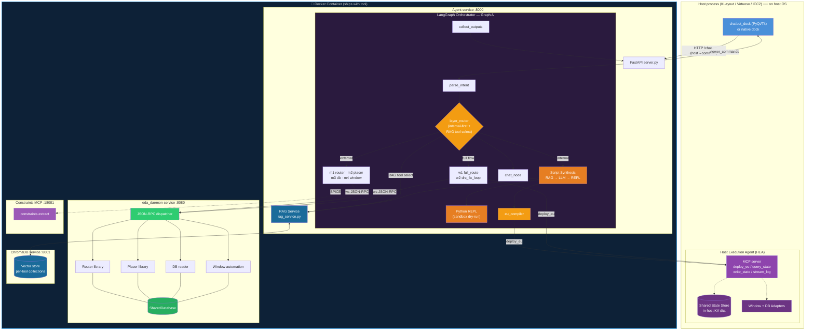

---

## 4. Tool Layers and Routing Policy

Graph A sees the world as **capabilities** (route nets, place cells, query DB, automate window, run a full flow). Every capability can be served by at least one layer; several are served by both. The policy layer — `layer_router` — is what turns a parsed intent into a concrete layer selection.

### 4.1 Capability matrix

| Capability | Internal (HEA / EU) | External (C++ daemon) | Default policy |
|---|---|---|---|
| Route nets (`route_nets`) | ✓ Host router via EU (`route_nets.skill.j2`, `route_nets.tcl.j2`) | ✓ `routing_genetic_astar` | Internal-first, external as cross-check or fallback |
| Place cells (`place_cells`) | ✓ Host placer via EU | ✓ `eda_placer` (+ constraints MCP) | Internal-first, external for custom analog flows or when SPICE path is requested |
| DB queries (`db.*`) | ✓ Direct host DB via EU | ✓ DB reader | Internal-first (host DB is authoritative) |
| Window automation (`view.*`) | ✓ Host native UI via EU + Window Adapter | ✓ KLayout-only via viewer commands | Always **internal** if the user is in a proprietary host; external for KLayout dock |
| Full P&R (`w1`) | ✓ Host-native EU sequence | ✓ External module chain | Internal-first; external allowed as augmentation step |
| DRC fix loop (`w2`) | ✓ Tight in-host EU loop (preferred — zero IPC per iteration) | ✓ External module chain | Strongly internal-first; the in-host loop is the whole point of the EU pattern |
| Constraints extraction | — | ✓ Constraints MCP (`:18081`) | External only (tool-neutral by design) |

### 4.2 Routing policy state machine

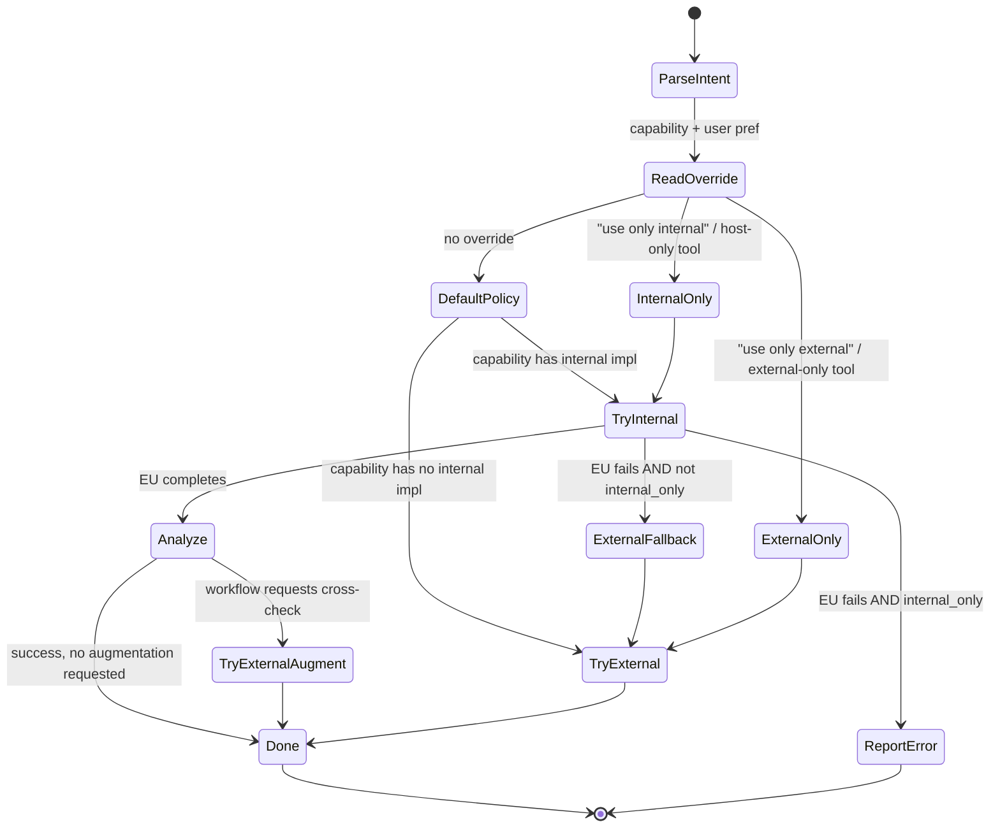

### 4.3 How the policy is expressed

Every module subgraph (m1…m4) and workflow (w1, w2) accepts a `layer_pref` field in its input state:

```python
class LayerPref(Enum):
    AUTO          = "auto"            # default: internal-first, analyze, escalate
    INTERNAL_ONLY = "internal_only"   # no external fallback
    EXTERNAL_ONLY = "external_only"   # skip internal entirely
    BOTH          = "both"            # run both, return combined result
```

The policy router reads `layer_pref` off the parsed intent:

- If the user's message contains phrases like *"use only custom"*, *"ignore the host"*, *"external-only"* → `EXTERNAL_ONLY`
- If the user says *"stay inside Virtuoso"*, *"host-only"*, *"don't use the custom engine"* → `INTERNAL_ONLY`
- If the user says *"cross-check with both"*, *"run it both ways"* → `BOTH`
- Otherwise → `AUTO`

The LLM node `parse_intent` extracts this preference as a typed field on state; no tool call examines the raw message for intent.

### 4.4 Analyze-then-augment

In `AUTO` mode, after the internal EU completes, an `analyze_internal_result` node decides whether to augment with the external layer. Typical augmentation triggers:

- Internal DRC-clean but wirelength significantly above a threshold → try external router for comparison
- Internal route failed on N specific nets → hand those nets to external router, merge results
- Internal placer gave a legal placement but user explicitly requested the SPICE-driven analog path → run external placer with constraints MCP, compare QoR

Augmentation is **opt-in per workflow**. `w1_full_route_flow` turns it on by default; `m1`/`m2` single-tool calls leave it off unless the intent explicitly asks for a cross-check.

---

## 5. Request Flow

A single chat turn, end-to-end, showing both the internal and external paths. Later sections expand each hop.

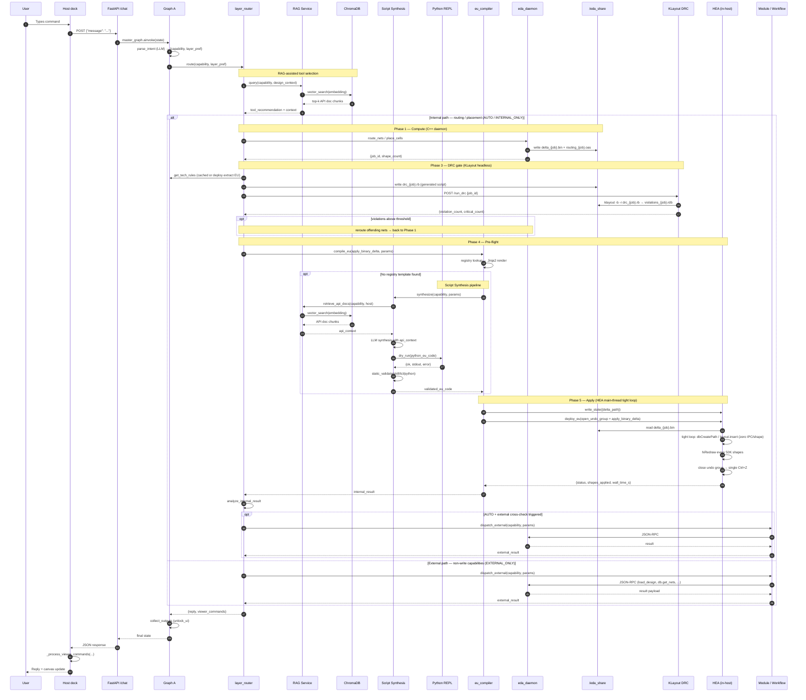

**Reading the flow.** There are two LLM calls in the hot path: `parse_intent` (step 4) and, when no registry template exists, the script synthesis LLM call. The **DRC gate** (Phase 3, steps 12–14) runs KLayout headlessly inside Docker against the OASIS file — this catches geometric violations before the live EDA database is ever touched. The **apply loop** (Phase 5, steps 20–25) runs entirely on the HEA main thread reading a compact binary file, with zero IPC round-trips per shape and a single undo-group wrap. Engineers can open `http://localhost:6080` at any point to inspect the routing OASIS in the KLayout debug viewer.

---

## 6. Modules and Workflows

Two kinds of children under Graph A:

- **Modules** (`m1…m4`) — single-capability wrappers. Each module now has **two execution paths**: an internal path that deploys an EU to the HEA, and an external path that calls the C++ daemon. The module's job is to validate input, honor `layer_pref`, invoke the appropriate path(s), and format a unified response.
- **Workflows** (`w1`, `w2`) — multi-step pipelines that may call several modules internally and iterate. Workflows are where the analyze-then-augment policy lives; they can run all iterations in-host (preferred for tight loops) or interleave with external calls.

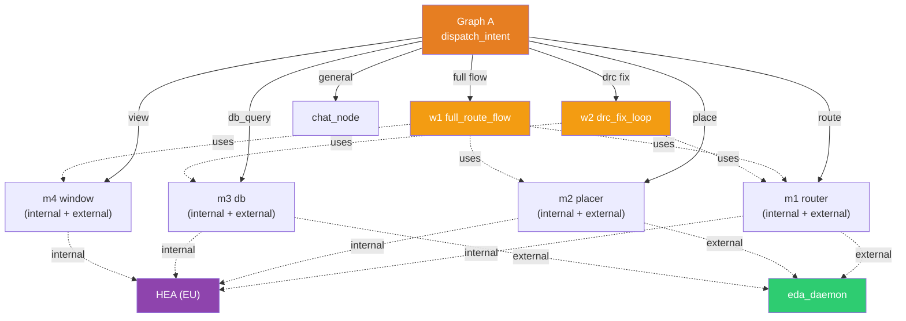

### 6.1 Dual-path module structure

Each module subgraph follows the same four-node shape:

```
validate_input → route_by_layer_pref ─┬── internal_branch ──┐
                                      │   (eu_compiler +    ├── merge_and_format
                                      │    HEA dispatch)    │
                                      └── external_branch ──┘
                                          (C++ daemon
                                           JSON-RPC)
```

`route_by_layer_pref` is not an LLM call — it's a pure function that reads `layer_pref` from state and picks which branch(es) to execute. In `AUTO` mode it runs the internal branch first, inspects the result, and conditionally invokes the external branch.

<details>
<summary><b>m2 — Placer subgraph (detail)</b></summary>

File: `vlsi/agent/src/orchestrator/modules/m2_placer_subgraph.py`

**Nodes (dual-path):**

1. `validate_placement_input` — checks daemon reachability *and* HEA handshake (whichever layer the policy will touch).
2. `route_by_layer_pref` — reads `layer_pref` and fans out.
3. `internal_branch.compile_eu` — renders `eu_registry/<host>/place_cells.{skill,tcl,py}.j2` with `cell_name`, `region_bbox`, and `constraints_handle`.
4. `internal_branch.deploy_eu` — sends the EU over MCP, receives final `output.placement_handle` plus QoR summary.
5. `external_branch.call_placer_via_cli` — invokes placement via MCP. If `placement_params.spice_netlist_path` is set, builds an `analog_problem` via the **constraints MCP tool** (preferred) or the local fallback in `utils/spice_to_analog_problem.py`.
6. `analyze_internal_result` — in `AUTO` mode, compares internal placement QoR against augmentation thresholds; decides whether to also run external.
7. `format_placer_response` — returns the user-facing message plus viewer commands:
   - `draw_instances` on layer `999/0` (from whichever layer produced the placement)
   - `draw_routes` on layer `998/0` (early-route visualization, built by `utils/early_router.build_early_routes`)

</details>

<details>
<summary><b>m1 — Router subgraph (detail)</b></summary>

File: `vlsi/agent/src/orchestrator/modules/m1_router_subgraph.py`

Nodes: `validate_routing_input` → `route_by_layer_pref` → {`internal: compile_eu → deploy_eu`, `external: call_router_via_cli`} → `analyze_internal_result` → `format_router_response`.

The internal branch uses `eu_registry/<host>/route_nets.{skill,tcl,py}.j2`. The external branch uses the shared `_cli_client.mcp_call(method, params)` over WebSocket to the daemon (`ws://127.0.0.1:8080`).

</details>

<details>
<summary><b>m3 / m4 — DB and Window subgraphs</b></summary>

- `m3_db_subgraph.py` — status queries, net lists, bounding boxes. Internal path reads directly from host DB via EU (authoritative source when working in a proprietary host). External path calls DB-side MCP methods on the daemon.
- `m4_window_subgraph.py` — internal path runs EUs that call the host's native window APIs (via the Window Adapter). External path emits viewer commands (`zoom_to`, `refresh_view`, `screenshot`, ...) for the KLayout dock. For proprietary hosts, the internal path is always used.

</details>

<details>
<summary><b>w1 / w2 — Workflows</b></summary>

- `w1_full_route_flow.py` — orchestrates placer → router → window refresh for a full P&R turn. Supports `AUTO`, `INTERNAL_ONLY`, `EXTERNAL_ONLY`, and `BOTH` layer preferences. In `AUTO`, runs placement internally, analyzes QoR, then routes internally; can augment with an external router cross-check when requested.
- `w2_drc_fix_loop.py` — iterative DRC correction. The whole loop body (query violations → re-route offenders → re-check) is packaged as **a single EU** when the internal layer is available. This is the canonical example of why the EU pattern exists: thousands of inner iterations with zero IPC round-trips. External fallback exists for KLayout or when the host doesn't expose the needed DRC API.

Workflows expose only `start` / `finished` edges to Graph A — Graph A never sees their internal iteration.

</details>

---

## 7. Interfaces and Contracts

Four boundaries — each one is a narrow, auditable contract.

### 7.1 Dock ↔ Agent server (HTTP)

```
POST http://127.0.0.1:8000/chat
Content-Type: application/json

Request:  {"message": "<user text>", "layer_pref": "auto"}
Response: {"reply": "<text>", "viewer_commands": [ {...}, ... ],
           "layer_used": "internal" | "external" | "both"}
```

`viewer_commands` is the only way the agent changes the canvas of the KLayout dock. The dock's `_process_viewer_commands(commands)` implements actions such as `draw_instances`, `draw_routes`, `zoom_fit`, `refresh_view`, `screenshot`. For proprietary hosts the equivalent canvas changes happen in-host as a side-effect of the EU; `viewer_commands` is then used only for any external overlays the orchestrator needs to draw.

### 7.2 Agent ↔ C++ daemon (WebSocket JSON-RPC) — external layer

All external-path module and workflow code calls `mcp_call(method, params)` in `modules/_cli_client.py`. Representative methods:

| Method | Owner inside daemon |
|---|---|
| `load_design` | DB server |
| `db.status`, `db.get_nets`, `db.get_bboxes` | DB server |
| `route_nets` | Router server |
| `place_cells` | Placer server |
| `view.zoom_to`, `view.refresh` | Window server |

### 7.3 Agent ↔ HEA (MCP over WebSocket) — internal layer

The HEA exposes exactly four MCP tools. This minimal surface is deliberate — the HEA is a queue, not a graph runtime. All graph logic stays in LangGraph.

| MCP tool | Purpose |
|---|---|
| `deploy_eu(eu_id, language, code, timeout_s, stream)` | Enqueue and execute an EU on the host's main thread via idle callback |
| `query_state(keys)` | Read values from the in-host state store |
| `write_state(kv)` | Seed inputs into the state store before an EU runs |
| `stream_log(eu_id)` | Server-streamed log lines for a running EU |

**`deploy_eu` request/response contract:**

```json
// Request
{
  "eu_id": "eu_place_drc_001",
  "language": "skill",           // "skill" | "tcl" | "klayout_python"
  "code": "<fully rendered, validated script>",
  "timeout_s": 120,
  "stream": true
}

// Response (sync, after EU completes or times out)
{
  "eu_id": "eu_place_drc_001",
  "status": "success",           // "success" | "error" | "timeout"
  "output_keys": ["output.iter_count", "output.drc_passed"],
  "error_detail": null,
  "wall_time_s": 4.3
}
```

The `output_keys` field tells the orchestrator exactly which state-store keys the EU wrote, so `query_state()` never has to guess. See [§10](#10-native-execution-units-eu-pattern) for the state-store preamble/epilogue convention that guarantees this.

### 7.4 Agent ↔ Constraints MCP (optional, SPICE path)

- **Server** `vlsi/eda_tools/python/constraints_tool/mcp_server.py` exposes `constraints.extract`.
- **Client** `vlsi/agent/src/orchestrator/utils/constraints_mcp_client.py` is called by `m2` when a SPICE netlist is provided — on either the internal or external branch.

---

## 8. Design Rules

Six anti-coupling guarantees the code base enforces:

1. **No Python module calls another Python module directly.** `m1` never imports from `m2`. Cross-module communication goes through Graph A or through a tool-layer contract (daemon JSON-RPC or HEA MCP).
2. **No C++ module calls another C++ module through Python.** Router/Placer/DB all share one process memory via `SharedDatabase`. Inter-module calls are direct C++ function calls inside the daemon binary — never a round-trip through Python.
3. **`eda_cli` is the gateway, not an algorithm.** Algorithm modules (e.g. `routing_genetic_astar`, `eda_placer`) are compiled as libraries and linked into the daemon.
4. **Workflows own their iteration logic.** `w1`, `w2` use module subgraphs internally but expose only `start` / `finished` to Graph A.
5. **The HEA is not a graph runtime.** Its only job is to receive EUs, execute them on the host's main thread, and expose the state store. All orchestration logic — sequencing, conditionals, retries, analyze-then-augment — lives in LangGraph. No SKILL/Tcl graph DSL, no duplicate orchestrator.
6. **Layer selection is policy, not code.** Modules do not hard-code a layer. The policy router reads `layer_pref` off state and drives the branch selection; adding a new layer (or a new internal host) does not require touching the module bodies.

---

## 9. Running the Stack

Four ports in the full configuration. See [`chatbot_howto.md`](./chatbot_howto.md) for the full guide including troubleshooting.

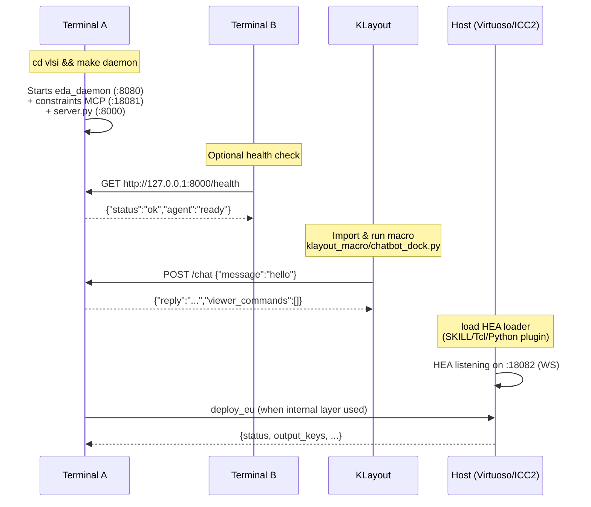

| Port | Process | Purpose |
|---|---|---|
| `:8000` | Python `server.py` | HTTP `/chat` |
| `:8080` | C++ `eda_daemon` | WebSocket JSON-RPC (external layer) |
| `:18081` | Python `constraints_tool` MCP | SPICE parsing (optional) |
| `:18082` | HEA (embedded in host) | MCP for internal layer (only when a proprietary host is running) |

**The internal layer is optional.** If no HEA is reachable, the orchestrator downgrades `AUTO` to `EXTERNAL_ONLY` automatically and emits a log line. The existing KLayout-plus-daemon workflow keeps working unchanged.

---

## 10. Native Execution Units (EU Pattern)

The **Execution Unit** pattern is the internal tool layer's runtime model. It lets the external LangGraph orchestrator drive work inside a proprietary EDA host (Cadence Virtuoso, Synopsys ICC2, KLayout) **without duplicating the graph runtime inside the host** (the "Dual-Graph" anti-pattern, rejected during design review).

The single orchestrator reaches into the host via one mechanism — deploying a compiled, self-contained script (an EU) to a thin Host Execution Agent. Tight inner loops (DRC fix iterations, place-and-route convergence) run entirely in host memory, bypassing IPC on every iteration. The orchestrator only sees the final state when the EU completes.

### 10.1 Pattern overview

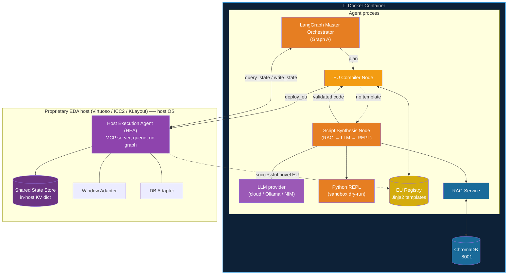

### 10.2 Core components

**Execution Unit (EU)** — a pre-compiled, self-contained, language-specific script bundle (SKILL, Tcl, or Python depending on host) that performs one atomic multi-step task (e.g., a place→DRC→fix loop). EUs declare their inputs, outputs, and required window ops up front. They follow a strict preamble/epilogue convention for reading and writing the state store.

**Host Execution Agent (HEA)** — a minimal MCP server embedded in the host. Its only jobs are: receive EUs, enqueue them on the host's main thread via idle callback, execute, stream logs, and expose the state store. It is not a graph runtime. It is ~200 lines of host-native code.

**EU Compiler Node** — a LangGraph node that turns a parsed intent into a ready-to-deploy EU. Four sub-steps:
1. Check the registry for a matching Jinja2 template
2. Render the template with state parameters
3. If no template exists, delegate to the **Script Synthesis Node**
4. Statically validate the rendered script before calling `deploy_eu`

**Script Synthesis Node** — activated when the registry has no matching template. Pipeline:
1. **RAG retrieval** — query ChromaDB for the top-k relevant vendor API doc chunks (e.g., `hiZoomIn`, `geRunDRC`, `pya.LayoutView.insert`) relevant to the capability and target host
2. **LLM synthesis** — prompt the configured LLM with the API context to produce a SKILL / Tcl / Python EU
3. **REPL dry-run** — for KLayout-Python EUs, execute in an isolated `subprocess` inside the container to catch runtime errors before they reach the host; for SKILL / Tcl, apply static syntax validators (balanced parentheses / braces)
4. **Repair loop** — on validation failure, re-prompt the LLM with the error detail (budget: 2 repair attempts)
5. Return validated code to the EU Compiler Node

**Python REPL (sandbox)** — a lightweight subprocess executor (`python_repl.py`) that runs KLayout-Python EU code with mocked `pya` stubs. It captures stdout/stderr and exits with a structured result. It is not an interactive shell — the REPL runs a single EU payload and terminates. It is never deployed to the host; its only job is to catch runtime errors before `deploy_eu` is called.

**Shared State Store** — a key-value dict living in host memory. EUs read `input.*` keys, write `output.*` keys. The orchestrator seeds inputs via `write_state` and harvests outputs via `query_state`. The store decouples EU-to-EU data flow from external round-trips.

**EU Registry** — an on-disk library of Jinja2 templates, one tree per target host:

```text
vlsi/agent/src/orchestrator/eu_registry/
├── cadence_virtuoso/
│   ├── place_drc_loop.skill.j2
│   ├── route_nets.skill.j2
│   ├── place_cells.skill.j2
│   └── get_bbox.skill.j2
├── synopsys_icc2/
│   ├── place_drc_loop.tcl.j2
│   ├── route_nets.tcl.j2
│   └── place_cells.tcl.j2
├── klayout/
│   ├── zoom_and_highlight.py.j2
│   └── draw_early_routes.py.j2
└── manifest.json         # declares inputs/outputs/window_ops per template
```

### 10.3 State store contract

Each EU template follows a standard preamble/epilogue. This is what makes EUs composable without orchestrator mediation.

**Virtuoso SKILL example** — `place_drc_loop.skill.j2`:

```
let((cellName maxIter iter drcClean)
    ; --- preamble: read seeded inputs from state store ---
    cellName = euStateGet("input.cell_name")
    maxIter  = {{ max_iter }}                  ; compile-time constant
    iter = 0
    drcClean = nil

    ; --- body: tight in-host loop, zero IPC per iteration ---
    while(!drcClean && iter < maxIter
        geMoveCellsByRule(cellName)
        drcClean = geRunDRC(cellName)
        iter++
    )

    ; --- epilogue: write outputs to state store ---
    euStateSet("output.iter_count" iter)
    euStateSet("output.drc_passed" drcClean)
)
```

The HEA helper functions `euStateGet` / `euStateSet` are pre-installed when the HEA loads. EU2 can read `output.*` from EU1 directly without LangGraph in the middle.

### 10.4 EU Compiler Node (pseudocode)

```python
def compile_eu_node(state: State) -> dict:
    capability = state.capability
    host       = state.target_host
    params     = state.capability_params

    # 1. Registry lookup first
    eu_code = try_render_from_registry(host, capability, params)
    source  = "registry"

    # 2. Fallback: Script Synthesis (RAG → LLM → REPL)
    if eu_code is None:
        eu_code, source = script_synthesis_node(
            capability, host, params, repair_budget=state.repair_budget
        )
        if eu_code is None:          # synthesis failed all repair attempts
            return {"pending_eu": None, "eu_error": source}

    # 3. Static validation — catch syntax errors before they hit the host
    validation = validate_eu(eu_code, language=language_for(host))
    if not validation.ok:
        return {"pending_eu": None, "eu_error": validation.error}

    return {
        "pending_eu": ExecutionUnit(
            id=f"eu_{uuid4()}",
            language=language_for(host),
            code=eu_code,
            source=source,
            declared_inputs=params.keys(),
            declared_outputs=manifest_outputs_for(capability),
            timeout_s=state.timeout_s or 120,
        )
    }


def script_synthesis_node(capability, host, params, repair_budget=2):
    """RAG-augmented LLM synthesis + REPL dry-run."""
    language = language_for(host)

    # Step 1: RAG retrieval — pull vendor API doc chunks from ChromaDB
    api_context = rag_service.retrieve(
        query=f"{capability} {host} {language}",
        collection=chroma_collection_for(host),
        top_k=8,
    )

    eu_code = None
    for attempt in range(repair_budget + 1):
        # Step 2: LLM synthesis with API context
        eu_code = llm.generate_eu(
            capability=capability,
            host=host,
            language=language,
            params=params,
            api_context=api_context,
            repair_error=locals().get("last_error"),
        )

        # Step 3a: REPL dry-run for Python EUs (KLayout)
        if language == "klayout_python":
            repl_result = python_repl.run(eu_code, stubs=KLAYOUT_STUBS)
            if not repl_result.ok:
                last_error = repl_result.error
                continue

        # Step 3b: Static syntax validation for SKILL / Tcl
        validation = validate_eu(eu_code, language=language)
        if validation.ok:
            return eu_code, "llm_generated"
        last_error = validation.error

    return None, f"synthesis_failed: {last_error}"
```

`validate_eu` is cheap and deterministic: balanced parentheses for SKILL, balanced braces for Tcl, `ast.parse` for Python. The REPL dry-run catches runtime errors (undefined variables, bad `pya` calls) before they reach the host. The goal is to prevent a half-executed EU from leaving the host DB dirty.

### 10.5 Host-specific HEA implementations

Each host has different threading rules, but the HEA interface is identical. The key is deferring execution to the host's idle callback so EU scripts never block the UI thread or the WebSocket I/O loop.

<details>
<summary><b>KLayout (Python + PyQt event loop)</b></summary>

```python
# runs inside KLayout
import pya

_state_store: dict = {}

class KLayoutHEA:
    def on_deploy_eu(self, eu: ExecutionUnit):
        # Never execute on the WS thread — defer to Qt main thread
        pya.Application.instance().post_runnable(
            lambda: self._execute_native(eu)
        )

    def _execute_native(self, eu: ExecutionUnit):
        local_env = {
            "window_adapter": KLayoutWindowAdapter(),
            "db_adapter":     KLayoutDBAdapter(),
            "state_in":       _state_store,
            "state_out":      {},
        }
        try:
            exec(eu.code, globals(), local_env)
            _state_store.update(local_env["state_out"])
            return {"status": "success",
                    "output_keys": list(local_env["state_out"].keys())}
        except Exception as e:
            return {"status": "error", "error_detail": str(e)}
```

</details>

<details>
<summary><b>Cadence Virtuoso (SKILL)</b></summary>

```
; HEA running inside Virtuoso
euQueue = list()
euStateStore = list()

procedure(euStateSet(key val)
    euStateStore = putAssoc(key val euStateStore)
)
procedure(euStateGet(key)
    cdr(assoc(key euStateStore))
)

procedure(handleDeployEu(euCode)
    euQueue = append1(euQueue euCode)
    hiSetIdleCallback(
        lambda(()
            let((code)
                code = car(euQueue)
                euQueue = cdr(euQueue)
                errset( evalstring(code) )
            )
        )
        nil  ; one-shot
    )
    return("EU Enqueued")
)
```

</details>

<details>
<summary><b>Synopsys ICC2 / Custom Compiler (Tcl)</b></summary>

```tcl
# HEA running inside ICC2
array set eu_state_store {}

proc eu_state_set {key val} {
    global eu_state_store
    set eu_state_store($key) $val
}
proc eu_state_get {key} {
    global eu_state_store
    return $eu_state_store($key)
}

proc handle_deploy_eu {eu_code} {
    # Defer to the main event loop so we never block it
    after idle [list eval_eu_code $eu_code]
    return "EU Enqueued"
}

proc eval_eu_code {code} {
    if {[catch {eval $code} result]} {
        # stream failure
    } else {
        # outputs already in eu_state_store via eu_state_set
    }
}
```

</details>

### 10.6 Registry feedback loop (self-learning agent)

The registry is not static. When the LLM synthesizes a novel EU and it runs successfully, the orchestrator parameterizes it back into a reusable template:

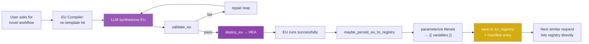

```python
def maybe_persist_eu_to_registry(eu: ExecutionUnit,
                                  state: State,
                                  result: EUResult):
    if eu.source != "llm_generated" or not result.success:
        return

    template = parameterize_eu(eu.code, state.capability_params)
    path = f"eu_registry/{state.target_host}/{state.capability}.{eu.language}.j2"

    if not exists(path):  # don't clobber existing templates
        write_template(path, template)
        update_manifest(path,
                        inputs=eu.declared_inputs,
                        outputs=eu.declared_outputs)
        log.info(f"persisted new EU template: {path}")
```

Over time the registry grows from actual usage rather than manual authoring. Eviction of stale or superseded templates is a separate maintenance concern and is handled by the `tools/eu_registry_prune.py` script.

### 10.7 Security and deployment

- **Dual-model support** — sanitized planning inputs can go to a commercial cloud LLM; EU synthesis that sees sensitive design data can be routed to a locally-hosted model. The policy knob is per-request.
- **Fully air-gappable** — the HEA is an MCP server on localhost; the registry is on disk; the LLM can be fully local. The entire stack supports on-premises deployment inside the corporate LAN.
- **EU validation is the main safety boundary.** A validated EU can still do anything the host's scripting language allows — the agent must never deploy EUs that were not produced by the trusted compiler pipeline. The HEA rejects EUs whose `eu_id` is not pre-registered in the current session.

### 10.8 What the EU pattern is not

- **Not a replacement for the C++ daemon.** The external layer still exists for custom algorithms and for use cases where the host is not running.
- **Not a graph runtime.** The HEA executes scripts; it does not orchestrate them. All conditional logic, retries, and multi-step flow lives in LangGraph.
- **Not a substitute for layer routing.** The policy router decides *when* to use the internal layer. The EU pattern only defines *how* that layer is implemented.

---

## 11. Appendices

### 11.1 File Map (current + planned for EU pattern)

```text
vlsi/agent/
  server.py                            FastAPI entry point (:8000)
  main.py                              CLI entry point (dev/test)
  pyproject.toml
  klayout_macro/
    chatbot_dock.py                    KLayout PyQt dock widget
    viewer_client.py                   viewer command helpers
  src/
    orchestrator/
      orchestrator_graph.py            Graph A master orchestrator
      router_subgraph.py               top-level routing subgraph
      eu_compiler.py                   EU Compiler Node
      script_synthesis.py              Script Synthesis Node (RAG → LLM → REPL)
      python_repl.py                   Python REPL sandbox (KLayout-Python dry-run)
      policy/
        layer_router.py                internal-first routing policy + RAG tool select
      modules/
        _cli_client.py                 shared WebSocket MCP client (external)
        _hea_client.py                 shared WebSocket MCP client (HEA)
        m1_router_subgraph.py          Router module (dual-path)
        m2_placer_subgraph.py          Placer module (analog + SPICE, dual-path)
        m3_db_subgraph.py              DB reader module (dual-path)
        m4_window_subgraph.py          Window automation module (dual-path)
      workflows/
        w1_full_route_flow.py          Full placement + routing
        w2_drc_fix_loop.py             Iterative DRC correction (EU-preferred)
      eu_registry/                     Jinja2 templates per host
        cadence_virtuoso/
          extract_tech_rules.skill.j2  Layer minWidth/minSpacing/minArea/minEnclosure → JSON
          extract_via_tech.skill.j2    Via definitions (cut/enclosure/stacking rules) → JSON
        synopsys_icc2/
          extract_tech_rules.tcl.j2
          extract_via_tech.tcl.j2
        klayout/
        manifest.json
      utils/
        constraints_mcp_client.py      constraints.extract client
        early_router.py                Manhattan early-route preview
        env_bootstrap.py               environment setup
        spice_to_analog_problem.py     SPICE → analog_problem
        eu_parameterize.py             literal → {{ variable }} extractor
    hea/                               Host Execution Agent loaders
      virtuoso/                        SKILL loader, euStateStore procedures
      icc2/                            Tcl loader, eu_state_store array
      klayout/                         Python loader, PyQt post_runnable wiring
    rag/                               RAG memory system
      rag_service.py                   Vector retrieval interface (ChromaDB client)
      ingestor.py                      Chunk + embed vendor docs into ChromaDB
      embeddings.py                    Embedding model abstraction (OpenAI / nomic)
      stubs/
        klayout_stubs.py               Mock pya API for Python REPL dry-run
    drc/                               Geometry-level DRC (KLayout-based, no licence)
      drc_script_gen.py                Techfile rules JSON → KLayout Ruby DRC script
      rdb_parser.py                    KLayout .rdb violation report → JSON
      klayout_client.py                HTTP client for KLayout DRC trigger endpoint

vlsi/eda_tools/
  eda_cli/                             C++ CLI + MCP gateway (daemon)
    oasis_writer.cpp / .h              Streaming OASIS encoder (no external dep)
  routing_genetic_astar/               router library
    via_expander.cpp / .h              Stage 2: via type selection, array sizing, 3-layer geometry
    binary_delta_writer.cpp / .h       Flat binary delta writer (20 B/shape)
  eda_placer/                          placer library (WIP)
  python/constraints_tool/             Python constraints MCP server

docker/
  Dockerfile                           Multi-stage build (C++ + Python + agent)
  docker-compose.yml                   Full stack: agent, chromadb, eda_daemon, constraints, klayout, ollama*
  chromadb/
    config.yaml                        ChromaDB server configuration
  klayout/
    Dockerfile                         KLayout + Xvfb + x11vnc + noVNC image
    start-klayout-vnc.sh               Entrypoint: starts Xvfb, KLayout GUI, VNC, noVNC
    klayout_server.py                  Minimal HTTP server for /run_drc and /open endpoints
    drc_runner.sh                      Wrapper that calls klayout -b for headless DRC runs
  nginx/
    nginx.conf                         Optional reverse proxy (if ChromaDB is exposed)
  scripts/
    init_rag.sh                        First-run RAG initialization helper
    healthcheck.sh                     Compose health probe
```

### 11.2 Key Utilities

<details>
<summary><b>Early routing visualizer</b></summary>

- File: `utils/early_router.py`
- Function: `build_early_routes(...)`
- Produces Manhattan preview segments (layer 998/0) for visual feedback. Not DRC-clean; no PDK metal stack.

</details>

<details>
<summary><b>SPICE → analog placement problem</b></summary>

- File: `utils/spice_to_analog_problem.py`
- Function: `build_analog_problem_from_spice(...)`
- Builds a tool-neutral `analog_problem` for the C++ placer. Preferred path uses the constraints MCP (`constraints.extract`); a local parser is the fallback.

</details>

<details>
<summary><b>EU parameterization (planned)</b></summary>

- File: `utils/eu_parameterize.py`
- Function: `parameterize_eu(raw_code, params) -> jinja2_template`
- Replaces concrete literals (cell names, coordinates, iteration counts) back into `{{ variable }}` placeholders using the `params` dict as the ground-truth mapping. Used by the registry feedback loop.

</details>

### 11.3 Viewer Commands (partial, external layer)

| Action | Argument shape | Used by |
|---|---|---|
| `draw_instances` | `{layer: "999/0", rectangles: [{x, y, w, h, name}]}` | m2 |
| `draw_routes` | `{layer: "998/0", segments: [{x1, y1, x2, y2}]}` | m2 |
| `zoom_fit` | `{}` | m4 |
| `refresh_view` | `{}` | m4 |
| `screenshot` | `{path?: string}` | m4 |
| `unlock_ui` | `{}` | `collect_outputs` |

### 11.4 Glossary

| Term | Meaning |
|---|---|
| **Internal layer** | Tool capabilities that run inside a proprietary EDA host, reached via EUs and the HEA |
| **External layer** | Custom C++ `eda_daemon` and Python MCP tools, reached over WebSocket JSON-RPC |
| **EU (Execution Unit)** | A validated, self-contained script bundle sent to the HEA for atomic in-host execution |
| **HEA (Host Execution Agent)** | Minimal MCP server embedded in the host, receives EUs and exposes the state store |
| **State Store** | In-host key-value dict that EUs read from and write to under a preamble/epilogue convention |
| **EU Registry** | On-disk library of Jinja2 templates per target host |
| **Layer preference** | User-expressed or LLM-inferred choice among `AUTO`, `INTERNAL_ONLY`, `EXTERNAL_ONLY`, `BOTH` |
| **Analyze-then-augment** | The `AUTO` behavior: run internal, analyze, conditionally call external |
| **RAG** | Retrieval-Augmented Generation — combine vector search over a knowledge base with LLM synthesis |
| **ChromaDB** | Open-source single-node vector database used as the RAG backing store |
| **Script Synthesis Node** | LangGraph node that runs RAG → LLM → REPL to produce a novel EU when the registry has no template |
| **Python REPL (sandbox)** | Isolated subprocess that dry-runs KLayout-Python EU code with mocked `pya` stubs before host deploy |
| **LLM Provider** | Configurable backend for LLM calls: commercial cloud, local Ollama, or customer NIM endpoint |
| **RAG Ingestor** | One-shot CLI that chunks and embeds EDA vendor docs into ChromaDB at install / version-update time |
| **Binary delta file** | Flat binary file (`delta_{job}.bin`) written by the C++ daemon to `/eda_share/`; read by the HEA EU apply loop at ~200 MB/s with zero IPC per shape |
| **OASIS delta file** | Standard OASIS layout file (`routing_{job}.oas`) written alongside the binary delta; consumed by KLayout DRC engine and debug viewer |
| **DRC gate** | Phase 3 of the five-phase write protocol; runs KLayout headlessly against the OASIS file before any live DB write — catches geometric violations without a proprietary DRC licence |
| **Five-phase write protocol** | Compute → Extract rules → DRC gate → Pre-flight → Apply; the only path by which C++ routing results enter the live EDA database |
| **KLayout service** | Docker sidecar running KLayout + Xvfb + noVNC; serves as open-source DRC engine (headless) and graphical debug viewer (browser on `:6080`) |
| **noVNC** | Browser-based VNC client; exposes the KLayout GUI at `http://localhost:6080` without requiring a VNC client app |
| **/eda_share** | Bind-mounted staging volume shared between all Docker services and the host; ephemeral — cleared after each job |
| **Techfile rule extractor** | One-shot HEA EU that reads `techGetLayerParamValue` (SKILL) or `tech::get_rule` (Tcl) and returns a rules JSON used to generate the KLayout DRC script |
| **OASIS writer** | Streaming C++ encoder in `oasis_writer.cpp`; produces standard OASIS files with delta-encoded coordinates and no external library dependency |

---

## 12. RAG Memory System

The RAG memory system is the agent's knowledge base for EDA tool APIs and usage patterns. It serves three purposes:

1. **Tool selection** — the policy router queries the RAG to determine which tool or router variant applies to a given design/capability (e.g., decide standard-cell router vs. device router vs. memory router before dispatching).
2. **Script synthesis context** — the Script Synthesis Node retrieves the relevant vendor API functions before asking the LLM to write a novel EU. This dramatically reduces hallucinated API names.
3. **User query answering** — `chat_node` can retrieve API doc excerpts to answer questions like "how do I move a cell by 10 units in Virtuoso?" and return an accurate reference.

### 12.1 Data sources

| EDA host | API language | Doc source |
|---|---|---|
| Cadence Virtuoso / Custom Compiler | SKILL | Cadence SKILL Reference Manual (ICADVM) — vendor-provided PDF/HTML |
| Synopsys ICC2 | Tcl | ICC2 Command Reference — `man` pages extracted per release |
| KLayout | Python (`pya`) | KLayout class reference — `pya` module docstrings and online reference |
| Custom additions | Any | Internal Q&A pairs, annotated run examples, EU registry examples |

Docs are processed at **image build time** — the ingestor runs during `docker build` and bakes the embeddings into a named Docker volume snapshot. On a version update the admin runs:

```bash
docker exec agent python -m rag.ingestor --source /eda_docs/ --host virtuoso --version icadvm_23_1
```

This re-indexes only the specified collection and leaves others untouched.

### 12.2 ChromaDB collections

One collection per EDA host × software version to isolate embeddings and allow version-specific queries:

```
chromadb collections
├── virtuoso_icadvm_23_1          # Cadence Virtuoso SKILL API
├── virtuoso_icadvm_22_1          # previous version — kept for rollback
├── custom_compiler_icadvm_23_1   # Synopsys Custom Compiler Tcl
├── icc2_p2024                    # Synopsys ICC2 Tcl
└── klayout_0_29                  # KLayout Python pya
```

Naming convention: `<tool_slug>_<version_slug>` — no spaces, lowercase. The RAG service resolves the correct collection from `state.target_host` and `state.eda_version`.

### 12.3 ChromaDB limitations

> These are known constraints of the open-source ChromaDB single-node edition. Plan around them.

| Limitation | Impact | Mitigation |
|---|---|---|
| **Single-node only** | No clustering or HA | Run one ChromaDB sidecar per Docker container; snapshots via named volume |
| **No built-in auth** | Any process on the compose network can query/write | Expose only on internal Docker network; do not bind to `0.0.0.0` |
| **Data on named volume** | Embeddings lost if volume destroyed | Back up `chroma_data` volume before `docker volume rm` |
| **Performance above ~1 M vectors** | Query latency degrades | Partition by tool + version; prune old collections after 2 releases |
| **No built-in versioning** | Cannot diff collections | Enforce version-slug naming; keep N−1 collection as rollback |

### 12.4 RAG retrieval pipeline

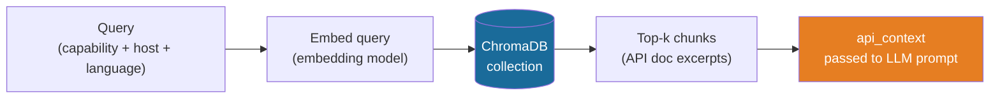

- Embedding model: `text-embedding-3-small` (OpenAI) or `nomic-embed-text` (local, via Ollama)
- `top_k = 8` for script synthesis, `top_k = 3` for tool selection and chat answers
- Chunks are ~400 tokens each with 50-token overlap; metadata carries `{host, version, api_name, language}`

### 12.5 Update lifecycle

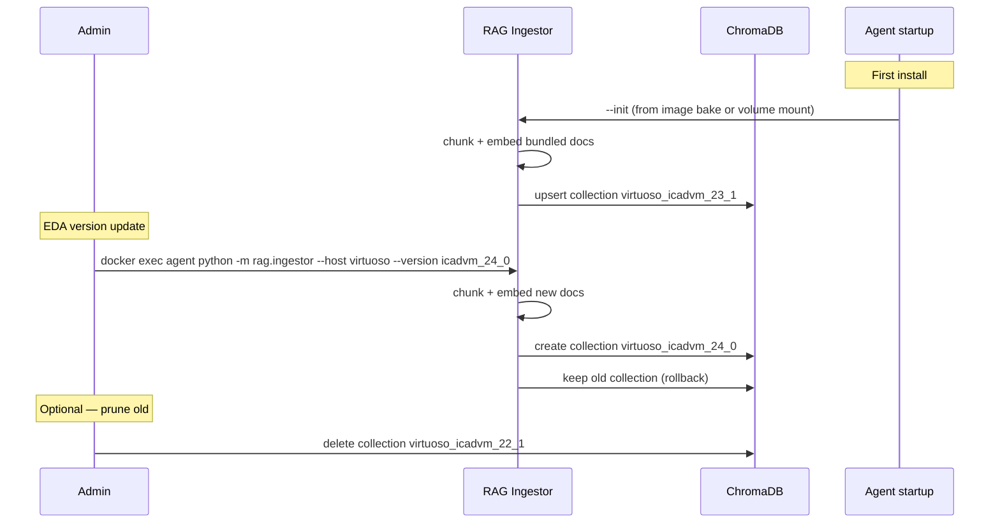

---

## 13. Docker Deployment

The entire agent stack ships as a Docker Compose project. The same image that is tested in-house is delivered to the customer — no re-compilation at the customer site.

### 13.1 Service map

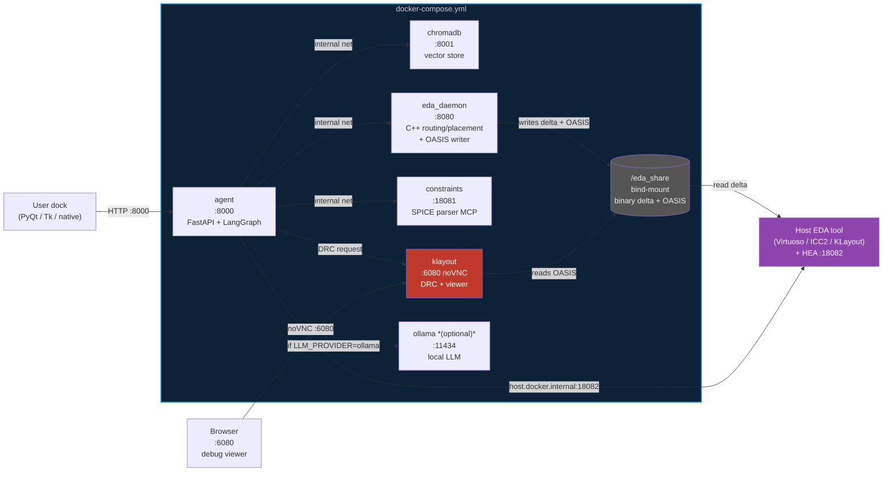

### 13.2 docker-compose.yml (reference)

```yaml
version: "3.9"

services:
  agent:
    image: vlsi-agent:latest
    build: .
    ports:
      - "8000:8000"
    environment:
      # LLM provider — pick one block:
      # Commercial cloud
      - LLM_PROVIDER=openai
      - OPENAI_API_KEY=${OPENAI_API_KEY}
      # Local Ollama (uncomment to use)
      # - LLM_PROVIDER=ollama
      # - OLLAMA_BASE_URL=http://ollama:11434
      # Customer NIM or custom OpenAI-compatible endpoint
      # - LLM_PROVIDER=openai_compatible
      # - LLM_BASE_URL=${LLM_BASE_URL}
      # - LLM_API_KEY=${LLM_API_KEY}
      - CHROMA_URL=http://chromadb:8001
      - EDA_DAEMON_URL=ws://eda_daemon:8080
      - HEA_URL=ws://host.docker.internal:18082
      - KLAYOUT_URL=http://klayout:8000      # KLayout DRC HTTP trigger endpoint
      - EDA_HOST=virtuoso                    # or icc2, klayout
      - EDA_VERSION=icadvm_23_1
    volumes:
      - eda_docs:/eda_docs:ro                # vendor doc mount (read-only)
      - eda_share:/eda_share                 # shared staging volume (delta + OASIS files)
    depends_on:
      - chromadb
      - eda_daemon
      - klayout

  chromadb:
    image: chromadb/chroma:latest
    ports:
      - "127.0.0.1:8001:8000"               # internal only — not exposed to LAN
    volumes:
      - chroma_data:/chroma/chroma

  eda_daemon:
    image: vlsi-agent:latest
    command: ["./eda_daemon", "--port", "8080", "--share-dir", "/eda_share"]
    ports:
      - "127.0.0.1:8080:8080"
    volumes:
      - eda_share:/eda_share                 # daemon writes binary delta + OASIS here

  constraints:
    image: vlsi-agent:latest
    command: ["python", "-m", "constraints_tool.mcp_server", "--port", "18081"]
    ports:
      - "127.0.0.1:18081:18081"

  klayout:
    image: vlsi-klayout:latest               # separate image: KLayout + noVNC + Xvfb
    build: docker/klayout/
    ports:
      - "127.0.0.1:6080:6080"               # noVNC web viewer (browser-accessible)
      - "127.0.0.1:5900:5900"               # raw VNC (optional, for VNC clients)
      - "127.0.0.1:8088:8000"               # KLayout HTTP trigger endpoint (internal use)
    environment:
      - DISPLAY=:1
      - VNC_PASSWORD=${VNC_PASSWORD:-eda_viewer}
      - KLAYOUT_SHARE=/eda_share
    volumes:
      - eda_share:/eda_share                 # reads OASIS / DRC scripts / writes .rdb reports

  # Optional: local Ollama — uncomment when LLM_PROVIDER=ollama
  # ollama:
  #   image: ollama/ollama:latest
  #   ports:
  #     - "11434:11434"
  #   volumes:
  #     - ollama_models:/root/.ollama

volumes:
  chroma_data:
  eda_docs:
  eda_share:                                 # ephemeral staging; bind-mount /tmp/eda_share on host
  # ollama_models:
```

### 13.3 Networking rules

| Traffic | Direction | Address |
|---|---|---|
| User dock → agent | Host → container | `localhost:8000` → container `:8000` |
| Agent → ChromaDB | Container → container | `http://chromadb:8001` (internal net) |
| Agent → eda_daemon | Container → container | `ws://eda_daemon:8080` (internal net) |
| Agent → KLayout DRC trigger | Container → container | `http://klayout:8000` (internal net) |
| eda_daemon → shared volume | Container → volume | `/eda_share/` (writes binary delta + OASIS) |
| KLayout → shared volume | Container → volume | `/eda_share/` (reads OASIS, writes `.rdb` violations) |
| HEA → shared volume | Host → bind-mount | `/tmp/eda_share/` (reads binary delta on host side) |
| Engineer browser → KLayout viewer | Host → container | `localhost:6080` → noVNC |
| Agent → HEA | Container → host | `ws://host.docker.internal:18082` |
| Agent → cloud LLM | Container → internet | Through host network (requires outbound HTTPS) |
| Agent → Ollama | Container → container | `http://ollama:11434` (internal net, if enabled) |

> **Linux note.** `host.docker.internal` is not available by default on Linux. Add `extra_hosts: ["host.docker.internal:host-gateway"]` to the `agent` service, or set `HEA_URL` to the host's LAN IP.

> **Shared volume note.** The `eda_share` volume is bind-mounted to `/tmp/eda_share` on the host so the HEA EU can read the binary delta file from the host filesystem. On Linux this is automatic via the bind-mount. On macOS with Docker Desktop, the `/tmp/eda_share` host path needs to be in the Docker Desktop → Settings → Resources → File Sharing allowlist.

### 13.4 LLM provider configuration

The agent supports three LLM provider modes selected by the `LLM_PROVIDER` environment variable:

| `LLM_PROVIDER` | Required env vars | When to use |
|---|---|---|
| `openai` | `OPENAI_API_KEY` | Standard cloud deployment; best model quality |
| `ollama` | `OLLAMA_BASE_URL` | Air-gapped / on-premises; enable the `ollama` service in compose |
| `openai_compatible` | `LLM_BASE_URL`, `LLM_API_KEY` | Nvidia NIM, Azure OpenAI, or any OpenAI-compatible endpoint |

The same variable controls the embedding model: `openai` → `text-embedding-3-small`; `ollama` / `openai_compatible` → `nomic-embed-text` (must be available at `OLLAMA_BASE_URL` or `LLM_BASE_URL`).

### 13.5 Installation and first run

```bash
# 1. Pull / build the image
docker compose pull          # or: docker compose build

# 2. Mount vendor docs (copy PDFs / HTML from EDA tool installation)
docker volume create eda_docs
docker run --rm -v eda_docs:/docs -v /path/to/vendor/docs:/src alpine \
    cp -r /src/. /docs/

# 3. Initialize RAG embeddings (one-time, ~5–15 min depending on doc size)
docker compose run --rm agent python -m rag.ingestor --init

# 4. Start all services
docker compose up -d

# 5. Health check
curl http://localhost:8000/health
# {"status": "ok", "agent": "ready", "rag": "ready", "chroma_collections": 3}
```

### 13.6 Running ports (full stack)

| Port | Host binding | Service |
|---|---|---|
| `8000` | `0.0.0.0:8000` | Agent FastAPI (`/chat`, `/health`) |
| `8001` | `127.0.0.1:8001` | ChromaDB (internal; do not expose to LAN) |
| `8080` | `127.0.0.1:8080` | C++ `eda_daemon` |
| `8088` | `127.0.0.1:8088` | KLayout DRC trigger HTTP (internal; mapped from container `:8000`) |
| `18081` | `127.0.0.1:18081` | Constraints MCP |
| `18082` | host (not in Docker) | HEA in EDA host process |
| `5900` | `127.0.0.1:5900` | KLayout raw VNC (for VNC desktop clients) |
| `6080` | `127.0.0.1:6080` | KLayout noVNC — open `http://localhost:6080` in browser to view layout |
| `11434` | `127.0.0.1:11434` | Ollama (if enabled) |

---

## 14. Geometry-Level DRC and Write Protocol

This section covers how the agent implements DRC using open-source tooling (no proprietary DRC engine licence required) and how writes are committed to the live EDA database via the five-phase protocol.

### 14.1 Scope and node-dependency of KLayout DRC

> **Critical limitation:** The KLayout DRC approach described here is a **router sanity checker**, not a sign-off DRC engine. Its effectiveness degrades sharply at advanced nodes. Engineers and implementers must understand these limits before relying on it.

#### How rules are stored — the data vs. program gap

At legacy nodes (28nm and above), design rules are stored in the techfile as **structured scalar data** — `techGetLayerParamValue` returns a single number per rule. At advanced nodes the rule model breaks:

| Node | Rule model | `techGetLayerParamValue` returns | Reality |
|---|---|---|---|
| 28nm and above | Scalar data (`minWidth = 0.064um`) | The correct value | Accurate |
| 7nm–5nm | **Parametric tables** (spacing depends on width AND run-length simultaneously) | Scalar floor only — misses conditional violations | Partial / optimistic |
| 3nm–2nm | **Executable runsets** (Calibre SVRF, tens of thousands of lines of procedural rule code) | Scalar floor of the simplest rule only | Misleading — most rules not represented |

#### What the KLayout DRC path CAN check (any node)

These checks are purely geometric and remain valid regardless of process node:

| Check | Why it is always valid |
|---|---|
| **Short circuits** (diff-net polygon overlap on same layer) | Pure intersection test — no technology data needed |
| **Gross width violations** (wire significantly below scalar minimum) | Catches router algorithmic errors, not marginal violations |
| **Obvious via mis-alignment** (via completely outside enclosing metal) | Geometric enclosure test |
| **Off-grid shapes** (coordinates not aligned to manufacturing grid) | Grid value from techfile; valid at any node |

#### What breaks at advanced nodes

| Feature | Why it fails with OA techfile scalars |
|---|---|
| **End-of-line (EOL) spacing** | Rule is a 2D table: spacing depends on line-end length AND adjacent metal width — `techGetLayerParamValue` returns only the scalar floor |
| **Parallel run-length (PRL) spacing** | Spacing between two wires depends on how long they run alongside each other — another 2D table; scalar minimum misses real violations |
| **Jog rules** | Short metal jogs have different spacing than long straight runs — parametric, not scalar |
| **Multi-patterning (SADP/SAQP/EUV)** | Every metal layer at 7nm and below requires coloring/decomposition; the DRC check itself is a graph-coloring validity test — not a geometric width/spacing check |
| **GAAFET topology rules (3nm/2nm)** | Gate cut placement, nanosheet alignment, backside PDN keep-out zones — topological rules about device structure, not polygon geometry |
| **Connectivity-aware rules** | At 2nm almost all rules have connectivity components: same-net vs diff-net, power-rail minimum widths, redundant-via requirements |
| **Foundry runset complexity** | The Calibre SVRF file for a 2nm node is tens of thousands of lines of conditional procedural code. This is not encoded in `techGetLayerParamValue` at all — it is only available in the proprietary runset |
| **CMP density** | Window-based density check over sliding windows; the full rule is not stored as a scalar |

#### Node-suitability summary

| Node | KLayout DRC utility | Risk of false confidence |
|---|---|---|
| 28nm and above | High — catches most common routing violations | Low |
| 16nm / 12nm | Medium — catches gross violations; misses EOL/PRL subtleties | Medium |
| 7nm / 5nm | Low — only gross shorts and width violations are reliable | High — parametric rules not checked |
| 3nm / 2nm | Sanity check only — shorts + grid + obvious width | Very high — do not treat as a DRC pass |

**The correct use at any advanced node:** the KLayout DRC gate is a **fast inner-loop filter** that catches algorithmic bugs in the C++ router (shorts, obviously malformed shapes) before those bugs enter the live EDA database. It is not a substitute for running the foundry-provided Calibre/Pegasus sign-off runset. The agent always triggers the proprietary sign-off DRC at the end of the P&R flow via a HEA EU — see §14.8.

EDA tools store design rules as structured data in the technology file, accessible via scripting APIs:

| EDA host | API to read rules | Example |
|---|---|---|
| Cadence Virtuoso (SKILL) | `techGetLayerParamValue` | `techGetLayerParamValue(techfile "metal1" "minWidth")` → `0.06` |
| Synopsys ICC2 (Tcl) | `tech::get_rule` | `tech::get_rule -layer metal1 -rule min_width` → `0.064` |
| KLayout (Python) | `tech.layer_info` / `DRCEngine` | `RBA::Technology.technology_by_name("sky130").drc_script` |

### 14.2 Techfile rule extraction (one-shot HEA EU)

The rule extractor EU runs once per design session and stores the rules in the agent's state. Rules are re-extracted only when the technology changes.

**SKILL EU — `extract_tech_rules.skill.j2`** (excerpt):

```
let((tf rules layerList)
    tf = techGetTechFile(geGetEditCellView())
    layerList = techGetLayerNames(tf)
    rules = list()

    foreach(layer layerList
        let((minW minS minA)
            minW = techGetLayerParamValue(tf layer "minWidth")
            minS = techGetLayerParamValue(tf layer "minSpacing")
            minA = techGetLayerParamValue(tf layer "minArea")
            when(minW
                rules = append1(rules
                    list("layer" layer
                         "minWidth" minW
                         "minSpacing" (or minS 0.0)
                         "minArea" (or minA 0.0)))
            )
        )
    )
    ; Via enclosure rules
    foreach(via (techGetViaDefs tf)
        let((viaName metals enc)
            viaName = car(via)
            metals = techGetViaLayerPairs(tf viaName)
            enc = techGetLayerParamValue(tf viaName "minEnclosure")
            rules = append1(rules
                list("via" viaName "metals" metals "minEnclosure" (or enc 0.0)))
        )
    )
    euStateSet("output.tech_rules" (buildString (mapcar 'tostring rules) " "))
)
```

The agent's `drc_script_gen.py` parses this JSON and generates a KLayout Ruby DRC script on the fly.

### 14.3 KLayout DRC script generation

```python
# vlsi/agent/src/drc/drc_script_gen.py

KLAYOUT_DRC_TEMPLATE = """\
# Auto-generated from OA techfile rules — do not edit
source($input, $top_cell)


{{ rule.layer_slug }} = input({{ rule.gds_layer }}, {{ rule.gds_purpose }})
{{ rule.layer_slug }}.width({{ rule.minWidth }}.um).output("{{ rule.layer }} min width", "{{ rule.layer }}.W.1")

{{ rule.layer_slug }}.space({{ rule.minSpacing }}.um).output("{{ rule.layer }} min spacing", "{{ rule.layer }}.S.1")


{{ rule.layer_slug }}.area({{ rule.minArea }}.um2).output("{{ rule.layer }} min area", "{{ rule.layer }}.A.1")




{{ via_rule.via_slug }} = input({{ via_rule.gds_layer }}, 0)
{{ via_rule.metal_below_slug }}.enclosing({{ via_rule.via_slug }}, {{ via_rule.minEnclosure }}.um) \\
    .output("{{ via_rule.via }} enclosure in {{ via_rule.metal_below }}", "{{ via_rule.via }}.ENC.1")


# Short circuit check — shapes from different nets overlapping on same layer

{{ layer_slug }}.merged.drc(width < 0).output("Short circuit on {{ layer_slug }}", "{{ layer_slug }}.SHORT.1")


report("DRC Report", $output)
"""

def generate_drc_script(tech_rules: dict, layer_map: dict) -> str:
    """tech_rules: from extract_tech_rules EU; layer_map: GDS layer numbers from techfile"""
    ...
```

### 14.4 Running KLayout DRC headlessly

```bash
# Called by agent via HTTP trigger to the klayout service, or directly via subprocess
klayout -b \
    -r /eda_share/drc_{job_id}.rb \
    -rd input=/eda_share/routing_{job_id}.oas \
    -rd output=/eda_share/violations_{job_id}.rdb \
    -rd top_cell=MYDESIGN
```

The `.rdb` (report database) is an XML format KLayout writes natively. The agent parses it:

```python
# vlsi/agent/src/drc/rdb_parser.py
def parse_rdb(path: str) -> list[DRCViolation]:
    """Returns [{rule, layer, category, bbox, count}] sorted by severity."""
    ...
```

### 14.5 Five-phase write protocol

This is the recommended write protocol from the architecture analysis. The DRC gate in Phase 3 is the key addition — no change is committed to the live EDA database until KLayout reports a clean result (or violations are below the user's accepted threshold).

```mermaid
sequenceDiagram
    autonumber
    participant G as Graph A
    participant D as eda_daemon
    participant SV as /eda_share
    participant KL as KLayout (Docker)
    participant P as Policy router
    participant HEA as HEA (in-host)

    Note over G,D: Phase 1 — Compute
    G->>D: route_nets(design, constraints)
    D->>D: run router algorithm
    D->>SV: write delta_{job}.bin  (binary delta)
    D->>SV: write routing_{job}.oas  (OASIS for DRC/viewer)
    D-->>G: {job_id, shape_count, wire_length_um}

    Note over G,KL: Phase 2 — Extract rules (once per session)
    G->>HEA: deploy_eu(extract_tech_rules)
    HEA-->>G: {tech_rules JSON}

    Note over G,KL: Phase 3 — DRC gate (KLayout headless)
    G->>G: drc_script_gen(tech_rules) → drc_{job}.rb
    G->>SV: write drc_{job}.rb
    G->>KL: POST /run_drc {job_id, top_cell}
    KL->>SV: klayout -b -r drc_{job}.rb
    KL->>SV: write violations_{job}.rdb
    KL-->>G: {violation_count, critical_count}

    alt violations > threshold
        G->>G: analyze violations → reroute offending nets
        G->>D: route_nets(offending_nets, stricter_constraints)
        Note over D,KL: back to Phase 1 for affected nets
    end

    Note over G,HEA: Phase 4 — Pre-flight (HEA EU)
    G->>HEA: deploy_eu(snapshot_and_open_undo_group)
    HEA->>HEA: snapshot DB stamp; hiUndoGroupBegin("Route")
    HEA-->>G: {snapshot_id, undo_open: true}

    Note over HEA,SV: Phase 5 — Apply (HEA EU, main thread tight loop)
    G->>HEA: write_state({delta_path: "/tmp/eda_share/delta_{job}.bin"})
    G->>HEA: deploy_eu(apply_binary_delta)
    HEA->>SV: read delta_{job}.bin
    HEA->>HEA: apply shapes in tight loop (dbCreatePath / layout.insert)
    HEA->>HEA: hiRedraw every 50K shapes (progressive display)
    HEA->>HEA: hiUndoGroupEnd()
    HEA-->>G: {status: success, shapes_applied, wall_time_s}
    G->>SV: delete delta_{job}.bin + routing_{job}.oas
```

**Key properties:**
- The live EDA database is **never modified** until Phase 5
- Phases 1–3 are fully reversible — no side effects on the host
- The DRC gate (Phase 3) catches geometric violations before they enter the undo stack
- If the agent crashes after opening the undo group (Phase 4) but before closing it (Phase 5), the host tool detects an orphaned undo group on the next operation and can roll it back

### 14.6 Binary delta format

The C++ daemon writes a flat binary file. The format is intentionally minimal so it can be parsed by a short SKILL/Tcl reader without a library dependency:

```
Header (16 bytes):
  magic[4]    = 0x45444144  ("EDAD")
  version[2]  = 1
  shape_count[4]
  reserved[6]

Per-shape record (variable length):
  layer_idx[2]     — index into layer table at end of file
  net_idx[2]       — index into net name table at end of file
  shape_type[1]    — 0=rect, 1=path, 2=polygon
  coord_count[2]   — number of (x,y) pairs
  coords[coord_count * 2 * 4]  — int32 in nm (database units)

Footer:
  layer_table: null-terminated name strings
  net_table:   null-terminated name strings
  crc32[4]
```

At 20 bytes average per shape (3 path points), 1M shapes = **~20 MB uncompressed** or **~8 MB with LZ4**. The SKILL binary reader is ~80 lines using SKILL's `getIntFromFile` / `readString` primitives.

### 14.7 KLayout debug viewer

The KLayout service runs Xvfb + KLayout in GUI mode + noVNC, accessible at `http://localhost:6080`. Use cases:

- **Pre-commit inspection** — open `routing_{job}.oas` before Phase 5 to manually verify the routing result
- **Violation highlighting** — open the OASIS file alongside the `.rdb` violation report; KLayout displays violations as colored markers
- **Script debugging** — edit and run SKILL-equivalent Python scripts in KLayout against the OASIS layout without touching the live EDA session
- **Regression snapshots** — dump OASIS after each routing iteration; compare with KLayout's `diff_cell` function

```bash
# Open a specific OASIS file in the KLayout viewer (from host)
curl -X POST http://localhost:8088/open \
     -d '{"file": "/eda_share/routing_001.oas", "top_cell": "MYDESIGN"}'
# Browser opens http://localhost:6080 → see the routing result immediately
```

### 14.8 What this does NOT replace

The KLayout DRC path handles basic geometric checks on the routing delta. It does not replace:

| Proprietary capability | Why it still needs the host tool | Advanced node note |
|---|---|---|
| **Signoff DRC (Calibre, Pegasus)** | Parametric/table-based rules, multi-patterning, CMP density, antenna — required for tape-out | At 5nm and below this is the *only* reliable DRC — KLayout misses the majority of real rules |
| **LVS (Layout vs. Schematic)** | Requires full netlist extraction tied to schematic; KLayout can do LVS but needs accurate CDL | Node-independent in principle; foundry LVS runsets are complex |
| **PEX (Parasitic extraction)** | Requires field-solver or table-based extractor with foundry sign-off | RC models change radically node-to-node; no open-source tool covers advanced node PDKs |
| **Timing closure / STA** | Requires PEX + liberty models | Node-independent architecture; depends on PEX accuracy |
| **Multi-patterning decomposition (7nm+)** | Graph-coloring + SVRF rule code; KLayout coloring is basic | Mandatory for all metal layers at 7nm and below |
| **GAAFET / nanosheet rules (3nm/2nm)** | Topological device rules; not representable as geometry checks | No open-source engine handles this today |

**Triggering sign-off DRC via the agent:** after the agent decides the routing is ready (KLayout sanity check passes + manual inspection), a HEA EU can trigger the host's native DRC launcher (e.g., `hiRunCalibrevsDRC` in Virtuoso or `verify_drc` in ICC2). This is still running the proprietary engine on the proprietary host — the agent merely initiates it and monitors the results.

```
; Example HEA EU — trigger Calibre DRC from Virtuoso
hiRunCalibrevsDRC(
    ?cellName (euStateGet "input.cell_name")
    ?runDir "/tmp/calibre_drc"
    ?ruleFile (euStateGet "input.runset_path")
)
```
