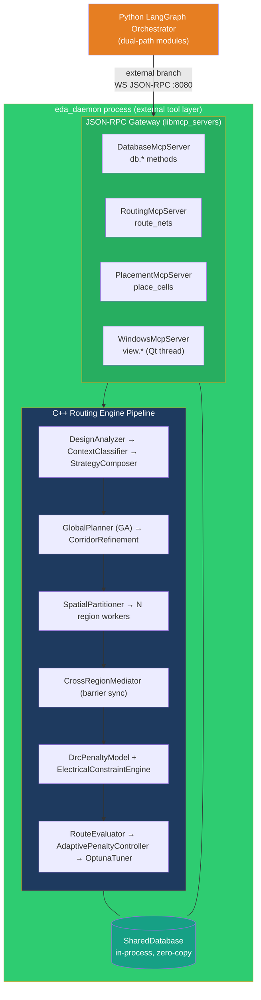
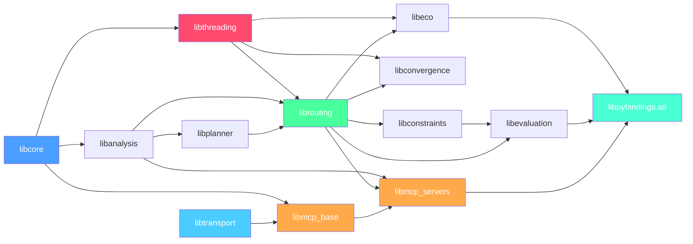
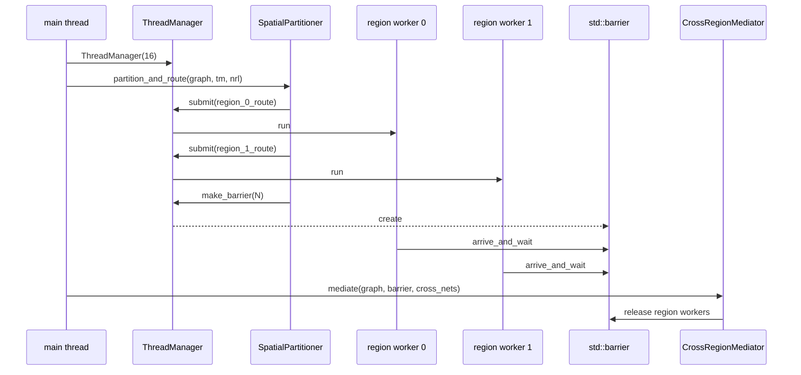
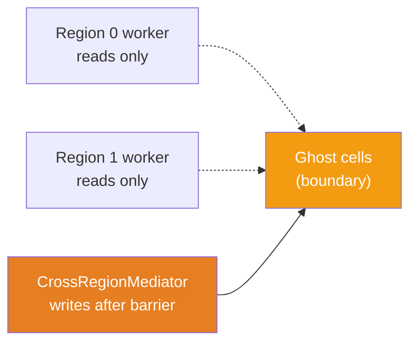

# VLSI Agent — C++ Implementation (Routing Engine)

> **Scope**: C++23 routing engine, MCP server layer, Python bindings, build/test infrastructure.
> **Audience**: C++ engineers building or extending the routing / placement engines.
> **Companion**: [`architecture.md`](./architecture.md) — agent-layer (Python / LangGraph) view, including Docker deployment (§13) and RAG memory system (§12).

This document is the **C++ implementation plan** for the VLSI routing engine that lives under `vlsi/eda_tools/`. It covers how the code is organized into libraries, the key classes in each library, threading rules, transport, Python bindings, the build system, and the verification plan.

> **Deployment note (as of current architecture):** The `eda_daemon` binary runs as a Docker service (`docker-compose.yml` service: `eda_daemon`) alongside the Python agent, ChromaDB, and the constraints MCP server. See [`architecture.md §13`](./architecture.md#13-docker-deployment) for the full Docker setup. The C++ build produces a Linux/amd64 static binary that is copied into the agent Docker image during the multi-stage Docker build — no re-compilation at the customer site.

Each section is self-contained. Use the collapsed `<details>` blocks inside each library section for deep-dive class references — skip them if you're not touching that layer.

## 1. Requirements & Scope

This C++ layer is the **external tool layer** of the VLSI agent (see [`architecture.md`](./architecture.md) §4). It is a standalone process — the `eda_daemon` — that hosts custom routing, placement, DB, and window-automation libraries behind a WebSocket JSON-RPC gateway on port `:8080`. The LangGraph orchestrator reaches it through the **external branch** of each dual-path module subgraph (`m1` router, `m2` placer, `m3` DB, `m4` window) using the shared `_cli_client.mcp_call(method, params)` interface.

This layer is one of two tool layers in the agent:

- **External tool layer (this document)** — custom C++ algorithms in the standalone `eda_daemon` process. Reached via JSON-RPC. The router algorithm (`routing_genetic_astar` namespace) lives in the `eda_router` project and is linked into `eda_daemon` via the `eda_router_io` static library. The placer lives in `eda_placer`.
- **Internal tool layer (not this document)** — host-embedded Host Execution Agent (HEA) running inside a proprietary EDA tool (Cadence Virtuoso, Synopsys ICC2, KLayout). Reached via MCP tools (`deploy_eu`, `query_state`, `write_state`, `stream_log`). Implemented in host-native scripting (SKILL, Tcl, or in-process Python). Documented in [`architecture.md`](./architecture.md) §10.

The two layers cooperate under the orchestrator's routing policy (`AUTO` / `INTERNAL_ONLY` / `EXTERNAL_ONLY` / `BOTH`). For many capabilities — notably `route_nets` and `place_cells` — peer implementations exist in both layers, and the orchestrator may run one, the other, or both for cross-validation. Nothing in this C++ codebase depends on the HEA or on any proprietary host; the daemon is fully standalone and supports `EXTERNAL_ONLY` workflows as well as the external branch of `AUTO` / `BOTH` workflows.

> **What this document does not cover:** the HEA implementations (SKILL / Tcl / PyQt) that live inside proprietary hosts, the EU registry (Jinja2 templates), the EU compiler node, or the policy router — all of those belong to the Python agent layer and are covered in `architecture.md` §10 and the companion `hea/` source tree.

**Dual-output model (planned — not yet in codebase):** For every routing / placement job, the daemon will produce two outputs written to the shared bind-mount volume (`/eda_share/`):

| Output file | Format | Consumer | Purpose |
|---|---|---|---|
| `delta_{job_id}.bin` | Custom flat binary (see `architecture.md §14.6`) | HEA EU (Phase 5 apply loop) | Fast bulk write into the live EDA DB — ~20 B/shape, read by a short SKILL/Tcl parser |
| `routing_{job_id}.oas` | OASIS (open standard) | KLayout DRC service + noVNC debug viewer | Geometric DRC check and visual inspection before the live DB is touched |

The OASIS writer (`eda_router/src/oasis_writer.cpp`) and binary delta writer (`eda_router/src/binary_delta_writer.cpp`) are planned additions to the `eda_router` project. See §12 Build System and §13 Via Rule Handling for the planned interface. Both files are not yet present in the codebase.

---

## Contents

1. [Requirements & Scope](#1-requirements--scope)
2. [Overview and Goals](#2-overview-and-goals)
3. [System Architecture](#3-system-architecture) — layers and data flow
4. [Library Map](#4-library-map) — 13 libraries and their dependency graph
5. [Directory Layout](#5-directory-layout)
6. [Library Reference](#6-library-reference) — class-by-class, collapsed by default
7. [C++ Features Guide](#7-c-features-guide)
8. [Design Patterns Guide](#8-design-patterns-guide)
9. [Threading Guide](#9-threading-guide)
10. [Python Bindings](#10-python-bindings)
11. [Transport / WebSocket](#11-transport--websocket)
12. [Build System](#12-build-system)
13. [Via Rule Handling and Via Generation](#13-via-rule-handling-and-via-generation)
14. [Implementation Roadmap](#14-implementation-roadmap)
15. [Verification Plan](#15-verification-plan)

---

## 2. Overview and Goals

The C++ layer is the **external tool layer** and its execution substrate — it performs chip routing and placement with no LLM dependency. The Python LangGraph orchestrator (see [`architecture.md`](./architecture.md)) reaches it over WebSocket JSON-RPC whenever a module's external branch is selected by the policy router. Inside the C++ process, all algorithm code runs in one address space and shares a single design database, making cross-module calls zero-copy.

> **City analogy** — a routed chip is a city's road network. `GlobalPlanner` sketches highway corridors; `NegotiatedRoutingLoop` is traffic management negotiating conflicts; `ThreadManager` is the transport authority owning every vehicle; the MCP servers are service departments (DB, Windows, Placement, ...) each reachable by a clean JSON-RPC API.

### Design Goals

| # | Goal | Metric |
|---|---|---|
| G1 | Scale to 1 M nets | Full route in ≤30 min on 16-core workstation |
| G2 | Zero DRC / opens / shorts | Verified by built-in DRC engine |
| G3 | All die aspect ratios (1:1 → 10:1) | Fishbone for AR>2, H-Tree for AR≤2 |
| G4 | Congestion handling | ≤5% GCell overflow after convergence |
| G5 | Pluggable algorithms | `std::function` Strategy callbacks — no recompile |
| G6 | EDA DB interop | LEF/DEF native; OpenAccess adapter |
| G7 | Memory efficient | <8 GB for 1 M nets via arena allocators |
| G8 | Python scriptable | Full API via pybind11 |
| G9 | Orchestrator-ready | JSON state export; serves external-branch modules via JSON-RPC on `:8080` |
| G10 | Reproducible | Deterministic with same RNG seed |
| G11 | Peer-comparable | Produces QoR metrics (wirelength, via count, DRC) in a form the orchestrator can compare against internal-layer (HEA/EU) results for `BOTH` policy mode |

<details>
<summary><b>Node coverage matrix</b></summary>

| Node | Tier | Key challenge | Features used |
|---|---|---|---|
| 180nm – 28nm | Mature | Basic DRC spacing rules | `StandardRuleset_28nm`, PathFinder convergence |
| 16nm – 7nm | Advanced | Multi-patterning, EOL rules | `FullBeolRuleset_7nm`, `DrcPenaltyModel` masks |
| 5nm – 2nm | Leading edge | EUV litho, EM/IR | `ElectricalConstraintEngine`, `FullBeolRuleset_3nm` |

</details>

<details>
<summary><b>Coding standards (enforced throughout)</b></summary>

| Rule | Detail |
|---|---|
| C++ version | C++23 primary; C++17 fallbacks via `#if __cplusplus` |
| No macros | Only `#pragma once` and minimal platform detection |
| No globals | All state owned by class instances |
| Naming | GNU: `snake_case` vars/functions, `PascalCase` classes, `k_` constants |
| Inline impls | Every `.hpp` includes a matching `.inl` at its bottom |
| Header docs | Every `.hpp` has `DESIGN PATTERNS:` and `C++ FEATURES:` blocks |
| Threading | `ThreadManager` is the *only* class including `<thread>`, `<barrier>`, `<latch>`, `<mutex>` |
| Error returns | `std::expected<T,E>` everywhere; no naked `bool` + output param |
| `[[nodiscard]]` | Required on all query / factory functions |
| Compilers | g++ and clang++ both supported |

</details>

---

## 3. System Architecture

The C++ daemon is a standalone process that the Python LangGraph orchestrator reaches over WebSocket JSON-RPC. Inside the daemon, all algorithm code runs in one address space and shares a single design database (`SharedDatabase`), making cross-module calls zero-copy. This is the **external tool layer** — peer to the internal tool layer (HEA / EUs inside proprietary hosts) but wholly separate from it.

<details>
<summary><b>3.1 External Tool Layer Architecture</b></summary>

The daemon's JSON-RPC gateway (`libtransport` + `libmcp_base` + `libmcp_servers`) accepts method calls from the orchestrator's `_cli_client.mcp_call()` and dispatches them to the appropriate C++ library. All algorithm libraries share the same in-process database; no IPC hops between them.



The orchestrator's **internal branch** — when operating against a proprietary host — does not come through this daemon at all. It goes to the host-embedded HEA on a different port (`:18082`), deploys EUs written in the host's native scripting language, and reads results from the in-host state store. The two branches are completely independent; only the orchestrator knows both paths exist.

</details>

<details>
<summary><b>3.2 The Five Strata</b></summary>

The engine is organized into five responsibility strata:

| Stratum | Responsibility | Key classes |
|---|---|---|
| 1 — Macro-Planning | GA-based global net/pin ordering; corridor assignment | `GlobalPlanner`, `CorridorRefinement`, `GridFill` |
| 2 — Micro-Execution | Per-region A* routing; conflict negotiation | `NegotiatedRoutingLoop`, `DetailedGridRouter`, `HistoryCostUpdater` |
| 3 — Physical Legality | DRC rule enforcement; access-vector gating | `PinAccessOracle`, `DrcPenaltyModel` |
| 4 — Resolution Bridging | Cross-region boundary routing; barrier coordination | `CrossRegionMediator`, `SpatialPartitioner` |
| 5 — Electrical Integrity | EM/IR-aware weight pre-compute; convergence guarantee | `ElectricalConstraintEngine`, `ConvergenceMonitor`, `IlpSolver` |

</details>

<details>
<summary><b>3.3 JSON-RPC Methods Exposed by the Daemon</b></summary>

The daemon's MCP servers expose the JSON-RPC methods that the orchestrator's external branch calls. These are **not** HEA tools (`deploy_eu` / `query_state` etc. belong to the internal layer only) — they are conventional RPC entry points, one per capability.

| Server | Thread affinity | Representative methods | Called by |
|---|---|---|---|
| `DatabaseMcpServer` | Worker threads — direct shared-memory access | `load_design`, `db.status`, `db.get_nets`, `db.get_bboxes` | `m3_db_subgraph.py` (external branch), and all other modules for context |
| `RoutingMcpServer` | Worker pool via `ThreadManager` | `route_nets` | `m1_router_subgraph.py` (external branch), `w1_full_route_flow.py` |
| `PlacementMcpServer` | Worker pool via `ThreadManager` | `place_cells` | `m2_placer_subgraph.py` (external branch), `w1_full_route_flow.py` |
| `WindowsMcpServer` | **Qt main thread** via `QMetaObject::invokeMethod` | `view.zoom_to`, `view.refresh`, `list_windows` | `m4_window_subgraph.py` (KLayout-only external branch) |

Thread-affinity rules are enforced by each server's `dispatch_tool()` override. `WindowsMcpServer` is the only one that marshals calls onto the Qt GUI thread; see §11.2 for the pattern.

**Cross-check workflows.** In the architecture's `BOTH` policy mode or when `analyze_internal_result` triggers augmentation, the orchestrator may call `route_nets` or `place_cells` on this daemon even after already running the equivalent EU inside a proprietary host. The daemon has no awareness of this — it just services the request. The orchestrator's `merge_and_format` step is what compares the two results.

</details>

---

## 4. Library Map

> **Note on current vs planned build structure.** The `routing_genetic_astar` namespace is the intended logical factoring — the include headers under `eda_router/include/routing_genetic_astar/` define 13 sub-modules. The current `CMakeLists.txt` compiles the I/O and planner sources into a single static library (`routing_genetic_astar_io`, aliased as `eda_router_io`) and links everything else as header-only into the `vlsi_daemon` / `eda_daemon` executables. The 13-library split below describes the **target architecture** that the headers are already organised around, not the current build artefacts. Paths are relative to `vlsi/eda_tools/eda_router/`.



| Library | Depends on | Key headers | Purpose |
|---|---|---|---|
| `libcore` | STL | `core/types.hpp`, `core/grid_graph.hpp` | Foundation types, 3D grid, atomic edge ownership |
| `libanalysis` | `libcore` | `analysis/*` | Design ingestion, congestion, pin access, context tag |
| `libthreading` | `libcore` | `threading/thread_manager.hpp` | **Sole owner** of all threading primitives |
| `libplanner` | `libcore` + `libanalysis` | `planner/*` | GA-based macro planning; corridor assignment |
| `librouting` | `libcore`, `libanalysis`, `libplanner`, `libthreading` | `routing/*` | Core routing algorithms (A*, PathFinder, fishbone, tree) |
| `libconstraints` | `libcore`, `libanalysis`, `librouting` | `constraints/*` | DRC masks; EM/IR weight pre-compute |
| `libconvergence` | `libcore`, `librouting`, `libthreading` | `convergence/*` | Oscillation detection; ILP fallback |
| `libeco` | `libcore`, `librouting`, `libthreading` | `eco/*` | Engineering Change Order incremental re-route |
| `libevaluation` | `libcore`, `librouting`, `libconstraints` | `evaluation/*` | Scoring, feedback, Optuna tuning |
| `libtransport` | Boost.Beast, nlohmann/json | `transport/*` | JSON-RPC 2.0 over HTTP and WebSocket |
| `libmcp_base` | `libcore`, `libtransport` | `mcp/mcp_server_base.hpp`, `tool_registry.hpp`, `tool_client.hpp` | Template Method MCP dispatch; registry; ToolClient facade |
| `libmcp_servers` | `libmcp_base` + all routing libs | `mcp/servers/*.hpp` | The six concrete MCP servers |
| `libpybindings.so` | all `.a` + pybind11 | `python/*` | Two `PYBIND11_MODULE`s: `routing`, `mcp` |

> **Build order (topological)**: `libcore → libanalysis → libthreading → libplanner → librouting → libconstraints → libconvergence → libeco → libevaluation → libtransport → libmcp_base → libmcp_servers → libpybindings.so`


## 5. Directory Layout

The `eda_tools/` tree contains three sibling projects: the router (`eda_router`), the placer (`eda_placer`), and the JSON-RPC gateway daemon (`eda_cli`). `eda_cli`'s CMakeLists.txt consumes the other two via `add_subdirectory`.

```text
vlsi/eda_tools/
│
├── eda_router/               ← Router project (CMake project: eda_router)
│   ├── CMakeLists.txt        builds: routing_genetic_astar_io (static lib, alias eda_router_io)
│   │                                 vlsi_daemon (standalone router executable)
│   ├── src/
│   │   ├── vlsi_daemon.cpp          Standalone router daemon entry point (WebSocket JSON-RPC)
│   │   ├── routing_pipeline.cpp     Top-level routing pipeline orchestration
│   │   ├── io/
│   │   │   └── def_design_loader.cpp  DEF/LEF design reader  ┐ compiled into
│   │   └── planner/                                           │ routing_genetic_astar_io
│   │       └── grid_fill.cpp          Grid fill helper        ┘
│   │
│   ├── include/
│   │   ├── eda_router/              Gateway-level headers
│   │   │   ├── io/
│   │   │   ├── mcp/servers/
│   │   │   └── transport/
│   │   └── routing_genetic_astar/   Algorithm namespace headers (header-only sub-modules)
│   │       ├── core/          types.hpp  grid_graph.hpp  (+ .inl)
│   │       ├── analysis/      design_analyzer.hpp  congestion_oracle.hpp
│   │       │                  pin_access_oracle.hpp  context_classifier.hpp
│   │       ├── planner/       global_planner.hpp  corridor_refinement.hpp  grid_fill.hpp
│   │       ├── threading/     thread_manager.hpp   ← ONLY dir including <thread>/<barrier>
│   │       ├── routing/       spatial_partitioner.hpp  negotiated_routing_loop.hpp
│   │       │                  cross_region_mediator.hpp  detailed_grid_router.hpp
│   │       │                  strategy_composer.hpp  spine_fishbone_router.hpp  tree_router.hpp
│   │       ├── constraints/   drc_penalty_model.hpp  electrical_constraint_engine.hpp
│   │       ├── convergence/   convergence_monitor.hpp  ilp_solver.hpp
│   │       ├── eco/           eco_router.hpp
│   │       ├── evaluation/    route_evaluator.hpp  adaptive_penalty_controller.hpp
│   │       │                  optuna_tuner.hpp
│   │       ├── transport/     websocket_transport.hpp  http_transport.hpp
│   │       ├── mcp/           mcp_server_base.hpp  tool_registry.hpp  tool_client.hpp
│   │       │   └── servers/   db_mcp_server.hpp  routing_mcp_server.hpp  ...
│   │       └── io/            (router-internal I/O helpers)
│   │
│   ├── tests/                 CTest executables — one per sub-module
│   │   ├── test_grid_graph.cpp
│   │   ├── test_design_analyzer.cpp
│   │   ├── test_global_planner.cpp
│   │   ├── test_detailed_grid_router.cpp
│   │   ├── test_convergence_monitor.cpp
│   │   ├── test_strategy_composer.cpp
│   │   └── smoke_test.sh
│   ├── python/                Python integration helpers
│   └── docs/
│
├── eda_placer/               ← Placer project (CMake project: eda_placer)
│   ├── CMakeLists.txt        builds: eda_placer (static lib)
│   ├── src/
│   │   ├── analog_placer.cpp       Analog/custom cell placement
│   │   └── analytical_placer.cpp   Force-directed analytical placement
│   └── tests/
│       └── test_analog_placer.cpp
│
├── eda_cli/                  ← JSON-RPC gateway (CMake project: eda_cli)
│   ├── CMakeLists.txt        add_subdirectory(eda_router, eda_placer)
│   │                         builds: eda_daemon (links eda_router_io + eda_placer)
│   └── src/
│       ├── main.cpp
│       └── eda_daemon.cpp           WebSocket JSON-RPC dispatcher
│
└── python/
    └── constraints_tool/
        ├── constraints.py           SPICE → analog_problem parser
        └── mcp_server.py            MCP server exposing constraints.extract
```

> **Two daemons:** `eda_daemon` (from `eda_cli/`) is the main agent-facing JSON-RPC gateway that links both router and placer. `vlsi_daemon` (from `eda_router/`) is a self-contained router-only daemon used for standalone router development and testing. Both use the same `routing_genetic_astar` headers.


## 6. Library Reference

Each library is collapsed. Click to expand the classes you care about.

<details>
<summary><b>libcore</b> — foundation types + 3D grid</summary>

#### Core Types — `core/types.hpp`

Trivially copyable value types shared across all libraries. Safe to pass across threads without synchronization.

```cpp
struct GridPoint { int x{0}; int y{0}; int z{0}; };
using NetId   = std::uint32_t;
using LayerId = std::uint8_t;

struct EdgeRef  { GridPoint from; GridPoint to; LayerId layer; };
struct Corridor { GridPoint min_pt; GridPoint max_pt; NetId net; float cost; };
struct ConflictEvent { NetId net_a; NetId net_b; EdgeRef edge; };

struct RandomLogicTag{};   struct MemoryArrayTag{};
struct ClockNetworkTag{};  struct MixedSignalTag{};
using RoutingContext = std::variant<RandomLogicTag, MemoryArrayTag,
                                     ClockNetworkTag, MixedSignalTag>;
```

#### `RoutingGridGraph` — `core/grid_graph.hpp`

3D routing grid. Edge ownership via atomic CAS — no mutex on the hot path. `EdgeWeightTable` is a Flyweight shared across instances.

```cpp
class RoutingGridGraph {
public:
    class Builder {
    public:
        Builder& set_dimensions(int rows, int cols, int layers);
        Builder& set_edge_weights(std::shared_ptr<EdgeWeightTable>);
        [[nodiscard]] RoutingGridGraph build();
    };

    [[nodiscard]] bool try_claim_edge(EdgeRef, NetId) noexcept;
    void release_edge(EdgeRef, NetId) noexcept;

    void freeze_net(NetId) noexcept;                // ECO support
    [[nodiscard]] bool is_frozen(NetId) const noexcept;

    [[nodiscard]] std::optional<EdgeRef> edge(GridPoint, GridPoint) const noexcept;
};
```

</details>

<details>
<summary><b>libanalysis</b> — design ingestion, congestion, pin access, context</summary>

#### `DesignAnalyzer` — `analysis/design_analyzer.hpp`

Entry point for ingestion. Parses LEF/DEF (or OpenAccess via adapter) → `DesignSummary` + `RoutingContext` tag.

```cpp
class DesignAnalyzer {
public:
    [[nodiscard]] std::expected<DesignSummary, AnalysisError>
        analyze(std::string_view def_path, std::string_view lef_path);

    [[nodiscard]] RoutingContext classify_context(const DesignSummary&) const;

    [[nodiscard]] static std::unique_ptr<DbAdapter>
        make_adapter(std::string_view format);
};
```

#### `CongestionOracle` — `analysis/congestion_oracle.hpp`

Per-GCell demand/capacity lookup. O(1) via spatial hash. Read-only after population; updated atomically by `HistoryCostUpdater`.

#### `PinAccessOracle` — `analysis/pin_access_oracle.hpp`

Legal access vectors per pin. Lazy proxy + cache-aside, guarded by `std::shared_mutex` for concurrent reads.

```cpp
[[nodiscard]] std::optional<std::vector<AccessVector>>
    access_vectors(NetId, GridPoint pin) const;
void warm_up(std::span<const NetId>);
```

#### `ContextClassifier` — `analysis/context_classifier.hpp`

Strategy pattern via `std::function`. Classifies a design into a `RoutingContext` tag that drives `StrategyComposer` dispatch.

</details>

<details>
<summary><b>libthreading</b> — the only owner of &lt;thread&gt;, &lt;barrier&gt;, &lt;latch&gt;, &lt;mutex&gt;</summary>

```cpp
class ThreadManager {
public:
    explicit ThreadManager(std::size_t pool_size);
    ~ThreadManager();   // joins all jthreads — RAII

    struct WorkerHandle { bool done() const noexcept; void wait(); };
    [[nodiscard]] WorkerHandle submit(std::function<void()>);

    [[nodiscard]] std::barrier<>& make_barrier(std::ptrdiff_t n);
    [[nodiscard]] std::latch&     make_latch(std::ptrdiff_t n);

    void request_stop() noexcept;
};
```

See §8 for the worker-pool and ghost-cell protocols.

</details>

<details>
<summary><b>libplanner</b> — GA macro planning + corridor refinement</summary>

#### `GlobalPlanner` — `planner/global_planner.hpp`

GA-based planner. Evolution loop skeleton is fixed (Template Method); GA operators are pluggable Concept-constrained templates. `if constexpr` fast-path skips GA entirely for `MemoryArrayTag`.

```cpp
template <typename Op>
concept GaOperator = requires(Op op, Chromosome c) {
    { op(c, c) } -> std::same_as<Chromosome>;
};

class GlobalPlanner {
public:
    template <GaOperator CrossoverOp, GaOperator MutationOp>
    [[nodiscard]] std::expected<CorridorAssignment, PlannerError>
        plan(const DesignSummary&, const RoutingContext&,
             CrossoverOp, MutationOp);
};
```

#### `CorridorRefinement` — `planner/corridor_refinement.hpp`

Chain of Responsibility: via-site legality → obstruction clearance → track-capacity. Infeasible corridors feed back to `GlobalPlanner` as GA fitness penalties.

#### `GridFill` — `planner/grid_fill.hpp`

Memory-array fast path: two-pass (bitline → wordline). Exploits regularity, bypasses GA.

</details>

<details>
<summary><b>librouting</b> — core algorithms (A*, PathFinder, fishbone, tree)</summary>

#### `SpatialPartitioner` — `routing/spatial_partitioner.hpp`

Divides the grid into independent regions. Marks ghost cells read-only. Submits per-region jthread workers via `ThreadManager`.

#### `NegotiatedRoutingLoop` — `routing/negotiated_routing_loop.hpp`

PathFinder outer loop. State machine over `std::variant` states: Routing → Collecting → Updating → Checking → (Converged | IlpFallback).

> **Traffic Cop analogy.** Imagine 10 000 drivers all wanting the same highway at rush hour. The loop lets everyone drive, sees where the crashes (conflicts) happen, rips up the crashed cars, and raises tolls (`HistoryCostUpdater`) on those lanes so next pass avoids them. Repeats until zero crashes.

#### `HistoryCostUpdater` — `routing/history_cost_updater.hpp`

Dual-channel: congestion conflicts (from NRL) + DRC rule fires (from `DrcPenaltyModel`). Storage is `std::atomic<double>` per edge. Weights `W_cong` and `W_drc` are independently tunable by `AdaptivePenaltyController`.

> **Toll Booth analogy.** Every crash on a track permanently raises the toll there. Future A* passes naturally avoid expensive tracks.

#### `CrossRegionMediator` — `routing/cross_region_mediator.hpp`

Runs serially on the main thread after all region workers hit the barrier; routes boundary-crossing nets; releases the barrier for the next pass.

#### `DetailedGridRouter` — `routing/detailed_grid_router.hpp`

A* maze router. Four Concept-constrained weight sources: base track cost, congestion history, DRC avoidance mask, EM/IR adjustment. Uses a `boost::object_pool` for A* nodes — zero heap allocation on the hot path.

> **Whiteboard analogy.** Handing each A* node a new heap allocation would collapse under admin overhead. The pool acts like reusable whiteboards — grab, evaluate, wipe, return.

```cpp
template <typename W>
concept WeightSource = requires(W w, EdgeRef e) {
    { w.cost(e) } -> std::convertible_to<float>;
};

class DetailedGridRouter {
public:
    template <WeightSource W1, WeightSource W2, WeightSource W3, WeightSource W4>
    [[nodiscard]] std::expected<RoutedPath, RouterError>
        route(GridPoint src, GridPoint dst, NetId,
              RoutingGridGraph&,
              W1 base, W2 cong_hist, W3 drc_mask, W4 em_ir);
};
```

#### `StrategyComposer` — `routing/strategy_composer.hpp`

Visits `RoutingContext` variant and dispatches: `MemoryArrayTag` → `GridFill`; `ClockNetworkTag` → `SpineFishboneRouter`; multi-pin → `TreeRouter`; 2-pin → `DetailedGridRouter`.

#### `SpineFishboneRouter` / `TreeRouter`

Composite topologies for clock networks and multi-pin Steiner trees; leaf connections delegate back to `DetailedGridRouter`.

</details>

<details>
<summary><b>libconstraints</b> — DRC masks + EM/IR engine</summary>

#### `DrcPenaltyModel` — `constraints/drc_penalty_model.hpp`

Decorator over the routing graph: not cost inflation, but **structural expansion gating**. Ruleset variants cover 28nm through 3nm. Precomputed once before threading; read-only thereafter.

```cpp
using RulesetVariant = std::variant<SimplifiedRuleset_28nm,
                                    StandardRuleset_7nm,
                                    FullBeolRuleset_3nm>;
```

#### `ElectricalConstraintEngine` — `constraints/electrical_constraint_engine.hpp`

Pre-computes EM/IR-aware edge-weight adjustments and injects them as `W4` into `DetailedGridRouter`. Strategy is a `std::function<float(EdgeRef, const DesignSummary&)>`.

</details>

<details>
<summary><b>libconvergence</b> — oscillation detection + ILP fallback</summary>

#### `ConvergenceMonitor` — `convergence/convergence_monitor.hpp`

Observer on NRL iterations. Detects oscillation (conflict counts cycling without progress); returns a `SubregionDescriptor` for the oscillating region.

#### `IlpSolver` — `convergence/ilp_solver.hpp`

Facade over LEMON MipSolver (or GLPK / stub). Wrapped in `#ifdef HAVE_LEMON` with a no-op stub fallback for builds without LEMON.

</details>

<details>
<summary><b>libeco</b> — Engineering Change Order re-routing</summary>

`EcoRouter` freezes unchanged nets, partitions the delta, and runs `NegotiatedRoutingLoop` only over changed regions.

</details>

<details>
<summary><b>libevaluation</b> — scoring, adaptive tuning, Optuna</summary>

- `RouteEvaluator` — Visitor over all routed segments; emits `EvaluationReport` (wirelength, vias, DRC, opens, worst slack).
- `AdaptivePenaltyController` — P-controller; observes convergence rate and adjusts `W_cong` / oscillation window.
- `OptunaTuner` — Strategy; uses Python Optuna via pybind11 when available, random-search stub otherwise.

</details>

<details>
<summary><b>libtransport</b> — JSON-RPC over HTTP and WebSocket (Boost.Beast)</summary>

```cpp
class WebSocketTransport {
public:
    using MessageHandler = std::function<std::string(std::string_view)>;
    explicit WebSocketTransport(std::uint16_t port, MessageHandler, ThreadManager&);
    [[nodiscard]] std::expected<void, TransportError> start();
    [[nodiscard]] std::expected<void, TransportError> stop() noexcept;
    [[nodiscard]] static std::unique_ptr<WebSocketTransport>
        make_server(std::string_view url, MessageHandler, ThreadManager&);
};
```

I/O thread is always submitted via `ThreadManager` — never `std::thread` directly.

</details>

<details>
<summary><b>libmcp_base + libmcp_servers</b> — the six MCP servers</summary>

#### `McpServerBase` — Template Method

Fixed skeleton: parse JSON-RPC → lookup in `ToolRegistry` → dispatch (with thread-affinity rules) → serialize response. `dispatch_tool()` is pure virtual.

#### `ToolRegistry` — name → function mapping

```cpp
using ToolFn = std::function<
    std::expected<nlohmann::json, McpError>(const nlohmann::json&)>;

class ToolRegistry {
public:
    void register_tool(std::string name, ToolFn);
    [[nodiscard]] std::optional<ToolFn> find(std::string_view) const;
};
```

#### `ToolClient` — transport-agnostic facade

Caller uses one `call()` regardless of whether the target is in-process, HTTP, or WebSocket:

```cpp
class ToolClient {
public:
    enum class Mode { IN_PROCESS, HTTP, WEBSOCKET };
    explicit ToolClient(Mode, std::string_view endpoint = "");
    [[nodiscard]] std::expected<nlohmann::json, McpError>
        call(std::string_view tool, const nlohmann::json& params);
};
```

</details>

<details>
<summary><b>libpybindings.so</b> — two PYBIND11_MODULE entries</summary>

- `routing_genetic_astar.routing` — `RoutingGridGraph`, `GlobalPlanner`, `NegotiatedRoutingLoop`, `RouteEvaluator`, `EcoRouter` and core types. (headers in `eda_router/include/routing_genetic_astar/`)
- `routing_genetic_astar.mcp` — `ToolClient`, `McpError`. (headers in `eda_router/include/routing_genetic_astar/mcp/`)

`std::expected<T,E>` is mapped to Python exceptions at the boundary. NumPy arrays are accepted for bulk coordinate data via `pybind11/numpy.h`.

</details>

---

## 7. C++ Features Guide

Analogies first — then the reference table.

<details>
<summary><b>Analogies (click for the quick intuition)</b></summary>

- **`[[nodiscard]]` — The Unopened Mail.** A postman hands you a certified letter; if you throw it away without opening it, an alarm fires. The compiler warns when you discard a result you must inspect (e.g. a routed path).
- **`std::expected<T, E>` — The Package Delivery.** The sealed package contains *either* your item *or* an apology slip explaining why it couldn't be delivered — never both, never neither. C++23 enforces handling of failure.
- **`[[likely]]` / `[[unlikely]]` — The Train Switch.** If 99 % of trains go straight, operators lock the track to "straight" so trains never slow down. Branch-prediction hints pre-load the common path into L1 cache.
- **`std::span<T>` — The Glass Window.** To let a colleague read one paragraph of your 10 000-page book, you don't photocopy the book — you place a window over the paragraph. Zero-copy view into an existing array.
- **`std::barrier` — The Field Trip.** 30 students explore a museum at different speeds, but the bus cannot leave until every student reaches the exit.
- **`std::shared_mutex` — The Museum Exhibit.** 100 tourists can look at a painting simultaneously (shared read), but an engineer swapping the frame kicks everyone out (exclusive write).
- **`std::variant` — The Swiss Army Knife.** Pivots to deploy blade *or* corkscrew *or* screwdriver — exactly one tool at a time.
- **`boost::container::flat_map` — The Rolodex.** Standard maps scatter data across the heap; a flat_map packs records contiguously so the CPU cache reads hundreds at once.

</details>

Universal version-check idiom used throughout every header:

```cpp
#if __cplusplus >= 202302L
    // C++23: std::expected, std::mdspan, std::print
#elif __cplusplus >= 202002L
    // C++20: std::span, std::barrier, std::jthread, concepts, ranges
#else
    // C++17: fallback implementations
#endif
```

<details>
<summary><b>Feature matrix (C++17 / C++20 / C++23 usage)</b></summary>

| Feature | Standard | Where used | C++17 fallback |
|---|---|---|---|
| `std::jthread` + `std::stop_token` | C++20 | `ThreadManager` ONLY | `std::thread` + `atomic<bool>` |
| `std::barrier<>` | C++20 | `ThreadManager`, `CrossRegionMediator` | `mutex` + `condition_variable` countdown |
| `std::latch` | C++20 | `ThreadManager` | `atomic<int>` countdown + `notify_all` |
| `std::expected<T,E>` | C++23 | All error-returning functions | `std::pair<std::optional<T>, E>` |
| `std::optional<T>` | C++17 | `PinAccessOracle`, nullable returns | baseline |
| `std::variant<...>` | C++17 | `RoutingContext`, NRL state machine | baseline |
| `std::string_view` | C++17 | All string parameters | baseline |
| `std::span<T>` | C++20 | `PinAccessOracle`, `HistoryCostUpdater`, `IlpSolver` | `const T*, size_t` pair |
| `std::mdspan` | C++23 | `RoutingGridGraph` 3D indexing | manual `z*R*C + y*C + x` |
| `if constexpr` | C++17 | Version guards, GA fast path | baseline |
| Structured bindings | C++17 | `CorridorRefinement`, loop unpacking | baseline |
| Ranges + views | C++20 | NRL unresolved-net filtering | `std::copy_if` + lambda |
| Concepts | C++20 | `DetailedGridRouter::WeightSource`, `GlobalPlanner::GaOperator` | `static_assert` + SFINAE |
| `std::format` | C++20 | Logging | `fmt::format` or `snprintf` |
| `[[nodiscard]]` | C++17 | All query / factory functions | baseline |
| `[[likely]]` / `[[unlikely]]` | C++20 | `DetailedGridRouter` hot path | `__builtin_expect` |
| `std::bit_cast` | C++20 | `HistoryCostUpdater` atomic double | `memcpy` type pun |
| `std::atomic<T>` CAS | C++11 | `RoutingGridGraph` edge ownership | — |

</details>

---

## 8. Design Patterns Guide

<details>
<summary><b>Pattern reference table</b></summary>

| Pattern | Classes using it | Intuition |
|---|---|---|
| **Builder** | `RoutingGridGraph`, `SpatialPartitioner` | Architect's blueprint — add rooms, hallways, then finalize |
| **Flyweight** | `RoutingGridGraph::EdgeWeightTable`, `CongestionOracle` | City map pinned on the wall; all drivers share one copy |
| **Proxy (lazy)** | `PinAccessOracle` | Lazy filing clerk — only opens the drawer when asked |
| **Facade** | `DesignAnalyzer`, `ToolClient`, `IlpSolver`, `WebSocketTransport` | Hotel concierge — one contact, many services |
| **Factory Method** | `DesignAnalyzer`, `WebSocketTransport::make_server` | Car rental — request "sedan", not a specific VIN |
| **Strategy** | `GlobalPlanner` GA ops, `StrategyComposer`, `ElectricalConstraintEngine`, `OptunaTuner` | GPS route — same endpoints, different algorithm |
| **Template Method** | `GlobalPlanner` evolution, `DetailedGridRouter` A*, `McpServerBase` dispatch, `EcoRouter` | Recipe — always preheat → mix → bake; ingredients vary |
| **Observer** | `ConvergenceMonitor`, `HistoryCostUpdater`, `AdaptivePenaltyController` | Fire alarm — sensor doesn't know who responds |
| **Chain of Responsibility** | `CorridorRefinement`, `HistoryCostUpdater` dual-channel, `StrategyComposer` | Airport security — ID → luggage → body; fail any, stop |
| **State Machine** | `NegotiatedRoutingLoop`, `ConvergenceMonitor` | Traffic light — GREEN → YELLOW → RED, not arbitrary jumps |
| **Mediator** | `CrossRegionMediator` | Air traffic control — planes talk to the tower, not each other |
| **Composite** | `SpineFishboneRouter`, `TreeRouter` | File system — directory contains files and directories |
| **Decorator** | `DrcPenaltyModel` | Tinted windows on a car — same vehicle, filtered view |
| **Visitor** | `RouteEvaluator` | Building inspector walking room by room with a checklist |
| **Registry** | `ToolRegistry` | Phone book — look up `count_nets`, get the function |
| **Object Pool + RAII** | `ThreadManager` | Bike-share station — borrow, auto-return on destruction |

</details>


## 9. Threading Guide

> **The one rule.** Only `threading/thread_manager.hpp` (and its `.inl` / `.cpp`) may `#include <thread>`, `<barrier>`, `<latch>`, or `<mutex>`. Every other class receives a `ThreadManager&`. Violations fail code review.

### Worker Pool Flow



### Edge-Ownership Protocol

`RoutingGridGraph` uses atomic CAS on every edge; no mutex on the hot path.

```cpp
// Lock-free claim (safe from N threads simultaneously)
bool claimed = graph.try_claim_edge(edge_ref, my_net_id);
if (!claimed) { /* handle conflict, update history cost */ }

graph.release_edge(edge_ref, my_net_id);   // rip-up

// Frozen edges (ECO): written once before threads start; all reads thereafter
graph.freeze_net(power_net_id);
```

### Ghost-Cell Protocol

Boundary cells between regions are **read-only** for the region workers. Only `CrossRegionMediator` writes them, and only after the barrier.



<details>
<summary><b>C++17 fallback implementation details</b></summary>

| C++20 primitive | C++17 fallback inside `ThreadManager` |
|---|---|
| `std::jthread` | `std::thread` + `std::atomic<bool>` stop flag |
| `std::barrier<>` | `std::mutex` + `std::condition_variable` + `std::atomic<int>` counter |
| `std::latch` | `std::atomic<int>` countdown + `condition_variable::notify_all()` |

</details>


## 10. Python Bindings

pybind11 was chosen: Apache 2.0 license, header-only, industry standard (PyTorch, TensorFlow, NumPy), C++17/23 compatible, cross-platform.

| Python module | Source file | Exposes |
|---|---|---|
| `routing_genetic_astar.routing` | `eda_router/python/bindings/py_routing_bindings.cpp` | `RoutingGridGraph`, `GlobalPlanner`, `NegotiatedRoutingLoop`, `RouteEvaluator`, `EcoRouter`, all core types |
| `routing_genetic_astar.mcp` | `eda_router/python/bindings/py_mcp_bindings.cpp` | `ToolClient`, `McpError` |

<details>
<summary><b><code>std::expected</code> → Python exception mapping</b></summary>

```cpp
template <typename T, typename E>
T unwrap_expected(std::expected<T, E>&& result) {
    if (!result) throw py::value_error(result.error().message());
    return std::move(*result);
}

m.def("plan", [](GlobalPlanner& p, /*...*/) {
    return unwrap_expected(p.plan(/*...*/));   // raises ValueError on error
});
```

</details>

<details>
<summary><b>NumPy integration</b></summary>

```cpp
m.def("batch_route", [](RoutingGridGraph& g, py::array_t<int32_t> coords) {
    auto buf = coords.request();
    std::span<const int32_t> data(static_cast<const int32_t*>(buf.ptr), buf.size);
    // ...
});
```

</details>

<details>
<summary><b>CMake + usage example</b></summary>

```cmake
# python/CMakeLists.txt
find_package(pybind11 REQUIRED)
pybind11_add_module(routing bindings/py_routing_bindings.cpp)
target_link_libraries(routing PRIVATE libpybindings_objs)
pybind11_add_module(mcp bindings/py_mcp_bindings.cpp)
target_link_libraries(mcp PRIVATE libpybindings_objs)
```

```python
from routing_genetic_astar import routing, mcp

graph = routing.RoutingGridGraph()
report = routing.RouteEvaluator().evaluate(graph)
print(f"Opens: {report.open_nets}, DRC: {report.drc_violations}")

client = mcp.ToolClient(mcp.Mode.WEBSOCKET, "ws://localhost:9001")
print(client.call("count_nets", {}))
```

</details>

---

## 11. Transport / WebSocket

This is the wire protocol the orchestrator's **external-branch** modules use to reach the daemon. The internal branch (HEA on port `:18082`) uses a separate MCP over WebSocket and is not this transport — see `architecture.md` §7.3.

### 11.1 JSON-RPC 2.0 message shape

```jsonc
// Request
{
  "jsonrpc": "2.0",
  "id": 42,
  "method": "tools/call",
  "params": { "name": "route_nets",
              "arguments": { "net_ids": [1,2,3], "strategy": "pathfinder" } }
}

// Response
{ "jsonrpc": "2.0", "id": 42, "result": { "status": "routed", "conflicts_remaining": 0 } }

// Error
{ "jsonrpc": "2.0", "id": 42, "error": { "code": -32600, "message": "net_id 99 not found" } }
```

<details>
<summary><b>ToolClient transport selection</b></summary>

```cpp
ToolClient a(ToolClient::Mode::IN_PROCESS);                          // same-process
ToolClient b(ToolClient::Mode::HTTP,      "http://localhost:9000");  // HTTP
ToolClient c(ToolClient::Mode::WEBSOCKET, "ws://localhost:9001");    // WebSocket

auto result = a.call("count_nets", nlohmann::json{});   // identical interface
```

</details>

<details>
<summary><b>Qt main-thread dispatch (WindowsMcpServer)</b></summary>

`WindowsMcpServer::dispatch_tool()` is invoked on the Boost.Beast I/O thread but must execute on the Qt GUI thread. Uses a `std::promise` + `QueuedConnection`:

```cpp
std::string dispatch_tool(std::string_view name,
                          const nlohmann::json& params) override {
    std::promise<nlohmann::json> promise;
    auto future = promise.get_future();
    QMetaObject::invokeMethod(qt_widget_, [&, p = std::move(promise)]() mutable {
        p.set_value(execute_on_qt_thread(name, params));
    }, Qt::QueuedConnection);
    return future.get().dump();   // blocks I/O thread until Qt responds
}
```

</details>

<details>
<summary><b>Boost.Beast start-up sketch</b></summary>

```cpp
boost::asio::io_context ioc;
boost::asio::ip::tcp::acceptor acceptor(ioc, {tcp::v4(), port_});
tm_.submit([&] { ioc.run(); });   // I/O thread via ThreadManager — never direct
```

</details>

---

## 12. Build System

### Current CMake targets (actual)

The build system currently uses CMake, not Make. Each project builds independently; `eda_cli` uses `add_subdirectory` to pull in `eda_router` and `eda_placer`.

**`eda_router/` — `cmake --build build`**

| Target | Type | Contents |
|---|---|---|
| `routing_genetic_astar_io` (alias `eda_router_io`) | Static lib | `src/io/def_design_loader.cpp`, `src/planner/grid_fill.cpp` |
| `vlsi_daemon` | Executable | `src/vlsi_daemon.cpp`, `src/routing_pipeline.cpp`; links `eda_router_io` |
| `test_grid_graph` | Test executable | CTest — runs via `ctest --test-dir build` |
| `test_design_analyzer` | Test executable | CTest |
| `test_global_planner` | Test executable | CTest |
| `test_detailed_grid_router` | Test executable | CTest |
| `test_convergence_monitor` | Test executable | CTest |
| `test_strategy_composer` | Test executable | CTest |

Optional dependencies detected at configure time:
- `ortools` — enables ILP fallback solver (`-DHAVE_OR_TOOLS`)
- `pybind11` — enables Optuna offline meta-tuner (`-DHAVE_PYBIND11`)

**`eda_cli/` — `cmake --build build`**

| Target | Type | Contents |
|---|---|---|
| `eda_daemon` | Executable | `src/main.cpp`, `src/eda_daemon.cpp`; links `eda_router_io` + `eda_placer` |

**`eda_placer/` — `cmake --build build`**

| Target | Type | Contents |
|---|---|---|
| `eda_placer` | Static lib | `src/analog_placer.cpp`, `src/analytical_placer.cpp` |

### Planned additional targets

The following targets are not yet in the CMakeLists.txt but are planned as part of the dual-output architecture:

| Target | Description |
|---|---|
| `routing_genetic_astar_oasis` | Streaming OASIS encoder static lib (`src/oasis_writer.cpp`) — planned in `eda_router/` |
| `test-oasis` | OASIS writer round-trip test (write → KLayout verify) — planned |
| `docker-build` | Multi-stage Docker image (`vlsi-agent:latest`) — compiles C++ in builder stage (`FROM gcc:13`), copies `eda_daemon` into Python runtime stage (`FROM python:3.12-slim`) |
| `docker-klayout` | KLayout + noVNC sidecar image (`vlsi-klayout:latest`) from `docker/klayout/Dockerfile` |
| `docker-push` | Tag and push both images to configured registry |

The main Docker image uses a two-stage build:
1. **Builder stage** (`FROM gcc:13`) — runs `cmake --build` for `eda_cli/` (which pulls in `eda_router` and `eda_placer`); produces `eda_daemon` binary.
2. **Runtime stage** (`FROM python:3.12-slim`) — installs the Python agent, copies `eda_daemon`, sets the default entrypoint to `server.py`. The same image also serves `eda_daemon` and `constraints` compose services via `command:` overrides.

The KLayout image (`docker/klayout/Dockerfile`) is a separate image:
- Base: `FROM ubuntu:22.04`
- Installs: KLayout (`.deb` from GitHub releases), Xvfb, x11vnc, noVNC
- Entrypoint: `start-klayout-vnc.sh` — starts Xvfb, launches KLayout in GUI mode, starts x11vnc + noVNC websockify on `:6080`
- Also exposes a minimal HTTP server on `:8000` that accepts `POST /run_drc` and `POST /open` commands

<details>
<summary><b>OASIS writer — design notes</b></summary>

`vlsi/eda_tools/eda_router/src/oasis_writer.cpp` (planned) will implement a streaming OASIS encoder with no external library dependency. OASIS (Open Artwork System Interchange Standard — SEMI P39) uses a straightforward binary encoding:

- **Records** are typed with a 1-byte record type followed by packed fields
- **Coordinates** are delta-encoded relative to the previous shape on the same layer (reduces file size 3–5×)
- **String tables** hold layer names and net names; shapes reference them by index
- **CRC32** appended at file end for integrity verification

The writer is append-only (streaming): the daemon calls `OASISWriter::begin_cell()`, then `OASISWriter::write_path()` / `write_rect()` in a loop, then `OASISWriter::end_cell()`. No random access to the file is needed, so memory usage is O(1) regardless of shape count.

```cpp
// eda_router/include/eda_router/oasis_writer.h  (planned)
class OASISWriter {
public:
    explicit OASISWriter(const std::string& path);
    void begin_cell(std::string_view cell_name);
    void write_rect(int layer, int purpose, int32_t x, int32_t y,
                    int32_t w, int32_t h, std::string_view net = "");
    void write_path(int layer, int purpose,
                    std::span<const std::pair<int32_t,int32_t>> points,
                    int32_t half_width, std::string_view net = "");
    void end_cell();
    void finish();  // writes string tables + CRC, closes file
};
```

</details>

<details>
<summary><b>Compiler variables and flags</b></summary>

```make
CXX      ?= g++                                # CXX=clang++ also supported
CXXSTD   ?= c++23                              # or c++17 for fallback mode
CXXFLAGS  = -std=$(CXXSTD) -Wall -Wextra -Wpedantic \
            -I include/ $(shell pkg-config --cflags pybind11 boost nlohmann_json)
LDFLAGS   = $(shell pkg-config --libs boost_system) -lpybind11
```

</details>

<details>
<summary><b>Docker packages and LEMON auto-detect</b></summary>

```dockerfile
RUN apt-get install -y \
    libboost-dev libboost-system-dev libboost-beast-dev \
    nlohmann-json3-dev python3-dev pybind11-dev \
    catch2 libglpk-dev glpk-utils
```

```make
HAVE_LEMON := $(shell pkg-config --exists lemon && echo 1 || echo 0)
ifeq ($(HAVE_LEMON),1)
    CXXFLAGS += -DHAVE_LEMON $(shell pkg-config --cflags lemon)
    LDFLAGS  += $(shell pkg-config --libs lemon)
endif
```

</details>

---

## 13. Via Rule Handling and Via Generation

Via rules are structurally different from metal spacing rules. A via involves **three layers simultaneously** (lower metal, cut layer, upper metal) with asymmetric enclosure requirements, array sizing constraints, and stacking rules that depend on which layer pairs are adjacent. The router cannot handle this inline during topology planning — it uses a clean two-stage split.

### 13.1 Two-stage architecture

**Stage 1 — Topology planner (`routing_genetic_astar` namespace, in `eda_router/`):**
Plans wire centerlines and layer transitions on a routing grid. At each layer-change point it records a *via placeholder* with a via-type tag and the selected track coordinates. The planner only needs the via *footprint* (bounding box of the full assembled via structure on each layer) to verify that sufficient space exists. It does not generate cut geometry.

**Stage 2 — Via expander (`eda_router/src/via_expander.cpp` — planned):**
After routing is complete, walks every via placeholder in net order, selects the via type and array dimensions, generates the three-layer geometry (lower-metal landing pad, cut shapes, upper-metal landing pad), performs a local conflict check, and emits all shapes into the binary delta and OASIS writer.

```
route_nets() call                                [eda_router/src/routing_pipeline.cpp]
    ┣━ Stage 1 — A* topology planner            [routing_genetic_astar namespace]
    │     inputs:  netlist, routing grid, via_tech JSON, layer graph
    │     outputs: RouteTopology {wire_segments[], via_placeholders[]}
    ┗━ Stage 2 — ViaExpander::expand(topology, via_tech)   [eda_router/src/via_expander.cpp — planned]
          ┣━ select via type + compute array dimensions
          ┣━ generate 3-layer geometry per placeholder
          ┣━ conflict check vs. already-emitted shapes
          ┗━ emit to OASISWriter + BinaryDeltaWriter        [eda_router/src/oasis_writer.cpp +
                                                             eda_router/src/binary_delta_writer.cpp — planned]
```

### 13.2 Via technology data — extraction and format

Via definitions are extracted from the live EDA techfile once per design session by the `extract_via_tech` HEA EU (registry: `eu_registry/{host}/extract_via_tech.{skill,tcl}.j2`) and passed to the daemon at job start as a JSON payload.

```json
{
  "via_rules": [
    {
      "name":           "via1_std",
      "lower_layer":    "metal1",  "lower_gds_layer": 31,
      "cut_layer":      "via1",    "cut_gds_layer":   51,
      "upper_layer":    "metal2",  "upper_gds_layer": 32,
      "cut_w_nm":       50,        "cut_h_nm":        50,
      "enc_lower_x_nm": 35,        "enc_lower_y_nm":  50,
      "enc_upper_x_nm": 35,        "enc_upper_y_nm":  50,
      "cut_spacing_x_nm": 70,      "cut_spacing_y_nm": 70,
      "max_array_cols": 4,         "max_array_rows":  4,
      "min_array_cols": 1,         "min_array_rows":  1,
      "stackable":      true,
      "stagger_x_nm":   0,         "stagger_y_nm":    0
    }
  ]
}
```

All dimensions are in nm (integer database units). The `min_array_*` fields encode mandatory multi-cut requirements (e.g., power nets on some layers require ≥ 2×2 arrays).

### 13.3 Via footprint computation (Stage 1 — planner)

The planner computes the via footprint for each layer-pair as a static pre-pass before routing begins:

```cpp
struct ViaFootprint {
    int32_t lower_w, lower_h;   // full metal shape size on lower layer (nm)
    int32_t upper_w, upper_h;   // full metal shape size on upper layer (nm)
    int32_t grid_cost;          // routing grid cells consumed in each direction
};

ViaFootprint compute_footprint(const ViaRule& r, int min_array_cols, int min_array_rows) {
    int32_t array_w = (min_array_cols - 1) * (r.cut_w + r.cut_spacing_x) + r.cut_w;
    int32_t array_h = (min_array_rows - 1) * (r.cut_h + r.cut_spacing_y) + r.cut_h;
    return {
        .lower_w = array_w + 2 * r.enc_lower_x,
        .lower_h = array_h + 2 * r.enc_lower_y,
        .upper_w = array_w + 2 * r.enc_upper_x,
        .upper_h = array_h + 2 * r.enc_upper_y,
    };
}
```

A routing grid point is only a valid via candidate if both `lower_w × lower_h` AND `upper_w × upper_h` fit within the available wire space at that location on their respective layers.

### 13.4 Via type selection (Stage 2 — expander)

```cpp
ViaSelection ViaExpander::select_via(const ViaPlaceholder& ph,
                                     const RouteContext& ctx) const {
    const ViaRule& rule = via_tech_.find(ph.lower_layer, ph.upper_layer);

    // 1. Compute available space on both layers at the via location
    int32_t avail_x = ctx.wire_width_at(ph.center, ph.lower_layer);
    int32_t avail_y = ctx.wire_length_at(ph.center, ph.lower_layer);

    // 2. Determine array dimensions that fit
    //    n_cols: how many cut columns fit given available width and minimum enclosure
    int32_t n_cols = std::clamp(
        (avail_x - 2 * std::max(rule.enc_lower_x, rule.enc_upper_x) + rule.cut_spacing_x)
            / (rule.cut_w + rule.cut_spacing_x),
        rule.min_array_cols, rule.max_array_cols);
    int32_t n_rows = std::clamp(
        (avail_y - 2 * std::max(rule.enc_lower_y, rule.enc_upper_y) + rule.cut_spacing_y)
            / (rule.cut_h + rule.cut_spacing_y),
        rule.min_array_rows, rule.max_array_rows);

    // 3. If min_array_cols not achievable → rotate via 90°
    if (n_cols < rule.min_array_cols || n_rows < rule.min_array_rows) {
        // try swapping X/Y enclosure (via rotation)
        auto rotated = try_rotated(rule, avail_x, avail_y);
        if (!rotated.ok) {
            return ViaSelection{.ok = false};  // router must avoid this location
        }
        return rotated;
    }
    return ViaSelection{.ok = true, .n_cols = n_cols, .n_rows = n_rows, .rule = &rule};
}
```

### 13.5 Via shape generation (Stage 2 — expander)

Once the array dimensions are selected, the expander generates the three-layer shape set:

```cpp
void ViaExpander::emit_via(const ViaSelection& sel,
                           const ViaPlaceholder& ph,
                           OASISWriter& oas,
                           BinaryDeltaWriter& delta) const {
    const ViaRule& r = *sel.rule;
    int32_t cx = ph.center.x,  cy = ph.center.y;

    // Total array extent
    int32_t arr_w = (sel.n_cols - 1) * (r.cut_w + r.cut_spacing_x) + r.cut_w;
    int32_t arr_h = (sel.n_rows - 1) * (r.cut_h + r.cut_spacing_y) + r.cut_h;

    // Lower metal landing pad (centered on cx, cy)
    int32_t lx = arr_w + 2 * r.enc_lower_x,  ly = arr_h + 2 * r.enc_lower_y;
    oas.write_rect(r.lower_gds_layer, 0, cx - lx/2, cy - ly/2, lx, ly, ph.net);
    delta.write_rect(r.lower_gds_layer, ph.net_idx, cx - lx/2, cy - ly/2, lx, ly);

    // Cut shapes — one rect per cell in the array
    int32_t origin_x = cx - arr_w/2,  origin_y = cy - arr_h/2;
    for (int col = 0; col < sel.n_cols; ++col) {
        for (int row = 0; row < sel.n_rows; ++row) {
            int32_t kx = origin_x + col * (r.cut_w + r.cut_spacing_x);
            int32_t ky = origin_y + row * (r.cut_h + r.cut_spacing_y);
            oas.write_rect(r.cut_gds_layer, 0, kx, ky, r.cut_w, r.cut_h, ph.net);
            delta.write_rect(r.cut_gds_layer, ph.net_idx, kx, ky, r.cut_w, r.cut_h);
        }
    }

    // Upper metal landing pad
    int32_t ux = arr_w + 2 * r.enc_upper_x,  uy = arr_h + 2 * r.enc_upper_y;
    oas.write_rect(r.upper_gds_layer, 0, cx - ux/2, cy - uy/2, ux, uy, ph.net);
    delta.write_rect(r.upper_gds_layer, ph.net_idx, cx - ux/2, cy - uy/2, ux, uy);
}
```

### 13.6 Via stacking (multi-layer connections)

When a net transitions more than one layer (e.g., M1 → M3), the expander walks the via stack from the lowest layer upward. For each adjacent pair:

- **Stackable pair** (`stackable = true`, `stagger = 0`): both via arrays share the same center XY — the upper via cuts land directly above the lower cuts.
- **Non-stackable pair** (`stackable = false`): the upper via center is offset by `{stagger_x, stagger_y}` from the lower via center. The router's topology stage must have reserved space for this offset on the intermediate metal.

```cpp
void ViaExpander::expand_stack(const std::vector<ViaPlaceholder>& stack, ...) {
    Point2D center = stack[0].center;
    for (const auto& ph : stack) {
        emit_via(select_via(ph, ctx), {ph.layer_pair, center}, ...);
        // shift center for next via if stagger required
        const ViaRule& r = via_tech_.find(ph.lower_layer, ph.upper_layer);
        if (!r.stackable) {
            center.x += r.stagger_x;
            center.y += r.stagger_y;
        }
    }
}
```

### 13.7 Conflict checking and repair budget

After via geometry is generated, the expander does a fast spatial query using a per-layer interval tree (already populated with all emitted wire shapes) to detect:

- Via cut to adjacent via cut spacing violation (same or adjacent layer)
- Via lower/upper landing pad encroaching on a neighboring net's wire

Detected conflicts are sorted by severity and pushed back to the router as a list of *blocked via locations* for a repair pass. The repair budget is the same `repair_budget` counter used by the EU Compiler's script synthesis repair loop — typically 2–3 rounds.

```cpp
struct ViaConflict {
    ViaPlaceholder src;
    ConflictKind   kind;   // CUT_TO_CUT | PAD_TO_WIRE
    NetId          offender;
};

std::vector<ViaConflict> ViaExpander::check_conflicts(
    const ViaSelection& sel,
    const ViaPlaceholder& ph,
    const IntervalTree<Shape>& placed) const;
```

### 13.8 What this does NOT handle (advanced-node limits)

The via expander handles the geometry and array sizing correctly for any via rule that can be expressed as scalar enclosure, cut spacing, and stagger values. At advanced nodes, additional rules exist that require information beyond the via tech JSON:

| Rule type | Why it cannot be handled here | Path forward |
|---|---|---|
| **Via-dependent metal widening** | Some foundries require the metal to widen around a via array (jog-free connection rule) — the wire shape depends on the via, not just the net width | Router must pre-widen wires at layer transitions; not yet implemented |
| **Cut-class rules** | Some via layers have multiple cut classes (wide, narrow) with different spacing tables | Extend `via_tech` JSON with `cut_class` field; select class based on adjacent feature size |
| **Via keep-out near cell boundaries** | Placement-blockage-aware via forbidden zones near standard cell power rails | Feed cell blockage map to expander |
| **Redundant-via insertion (reliability)** | After initial via placement, a separate pass upgrades single vias to the maximum achievable array for reliability | Separate post-route pass: `redundant_via_inserter.cpp` (planned) |
| **EUV stitching rules (3nm+)** | Via coverage rules for EUV single-exposure stitching seams — not representable as simple enclosure data | Requires foundry SVRF runset interpretation; out of scope for open-source engine |

---

## 14. Implementation Roadmap

Build libraries in dependency order. Each step unlocks a capability — ship incrementally.

| Step | Library | What it enables |
|---|---|---|
| 1 | `libcore` | Foundation — types, grid, atomic CAS |
| 2 | `libanalysis` | `PinAccessOracle` — catch access-angle errors early |
| 3 | `libplanner` | Macro backbone — corridor assignments |
| 4 | `libthreading` + partial `librouting` | Multi-region parallel routing |
| 5 | `librouting` (`CrossRegionMediator`) | Multi-thread correctness — boundary nets |
| 6 | `librouting` (`DetailedGridRouter`) | Hot path — A* with 4 weight sources |
| 7 | `libconstraints` (`DrcPenaltyModel`) | Physical legality — DRC masks |
| 8 | `librouting` (composer + fishbone + tree) | Full topology coverage |
| 9 | `libconvergence` | Convergence guarantee — ILP fallback |
| 10 | `libconstraints` (`ElectricalConstraintEngine`) | EM/IR correctness for advanced nodes |
| 11 | `libeco` | Production ECO flow |
| 12 | `libevaluation` | Scoring + adaptive tuning + Optuna |
| 13 | `libtransport` + `libmcp_base` + `libmcp_servers` | **External tool layer online.** LangGraph's external-branch modules can drive the engine via JSON-RPC on `:8080` |
| 14 | `libpybindings.so` | Full Python API + NumPy + Optuna callbacks |

> **Out of scope for this roadmap:** the HEA implementations that enable the orchestrator's **internal** branch (Virtuoso SKILL loader, ICC2 Tcl loader, KLayout PyQt loader). Those are a separate workstream tracked in `vlsi/agent/src/hea/` and in `architecture.md` §10.5. The C++ daemon delivered by this roadmap is fully usable without any HEA — it covers `EXTERNAL_ONLY` workflows immediately and the external half of `AUTO` / `BOTH` workflows once the HEA ships.

---

## 15. Verification Plan

### Unit Tests — Catch2 (one `.cpp` per class)

<details>
<summary><b>Representative test scenarios</b></summary>

| Class | Scenario | Pass condition |
|---|---|---|
| `RoutingGridGraph` | 3-layer 10×10 grid; CAS claim from 2 threads | Exactly one winner; ThreadSanitizer clean |
| `RoutingGridGraph` | Frozen-net rip-up attempt | `try_claim_edge` returns false on frozen edges |
| `PinAccessOracle` | Known legal vectors + illegal angle | Legal returned; illegal rejected; 2nd query hits cache |
| `ThreadManager` | 8-worker pool; barrier with 4 threads; `request_stop` | Threads release together; join within 100 ms |
| `NegotiatedRoutingLoop` | 3 conflicting nets on synthetic grid | Zero conflicts in ≤20 iterations; history costs updated |
| `DrcPenaltyModel` | 28 nm EOL violation scenario | `blocks_move` true for violating dir, false otherwise |
| `ConvergenceMonitor` | Oscillating sequence 5,3,5,3 | Oscillation detected; `isolate_oscillating_region` non-empty |
| `WebSocketTransport` | localhost:9999 ping-pong | Response within 10 ms; id matches |
| `IlpSolver` | Small 4-net conflict, STUB backend | Returns valid `IlpSolution`; no crash |

</details>

### Integration Tests

| Test | File | Scenario | Pass condition |
|---|---|---|---|
| End-to-end route | `tests/integration/test_end_to_end_route.cpp` | 20-net / 4-layer synthetic design, full pipeline | `open_nets == 0`, `drc_violations == 0` |
| MCP round-trip | `tests/integration/test_mcp_round_trip.py` | In-process DB MCP via pybind11; call `count_nets` | Correct integer matching synthetic design |

### Python Tests — pytest

| Test | Checks |
|---|---|
| `test_routing_bindings.py` | Construct `RoutingGridGraph`; freeze a net; verify via binding |
| `test_mcp_bindings.py` | `ToolClient.call()` response has `jsonrpc`, `id`, `result` |

### CI Target

```make
ci: docker-build
	docker run --rm -v $(PWD):/work cpp-linux-dev bash -c \
	  "cd /work && make all test-all BUILD_MODE=release CXX=g++ && \
	               make all test-all BUILD_MODE=release CXX=clang++"
```

Both `g++` and `clang++` must pass all tests in release before merge.

