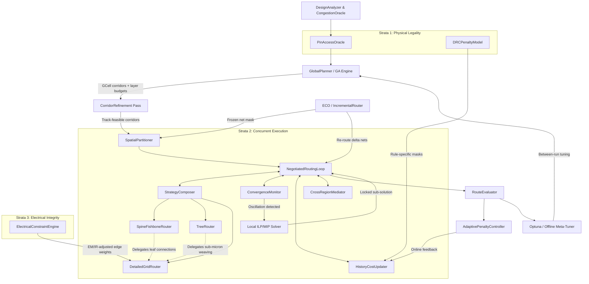
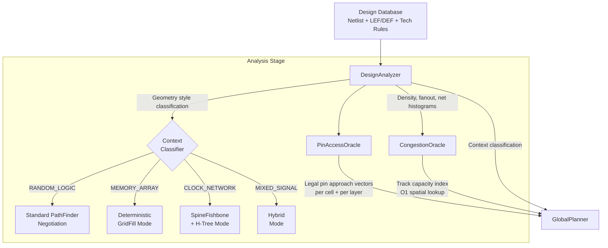
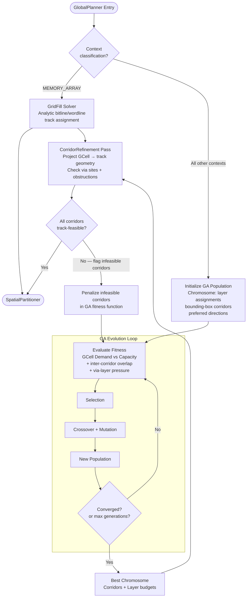
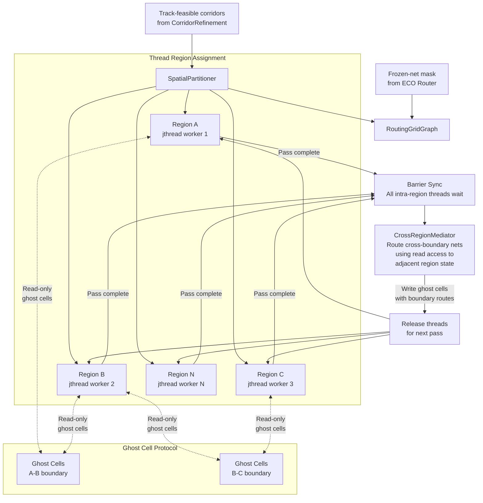
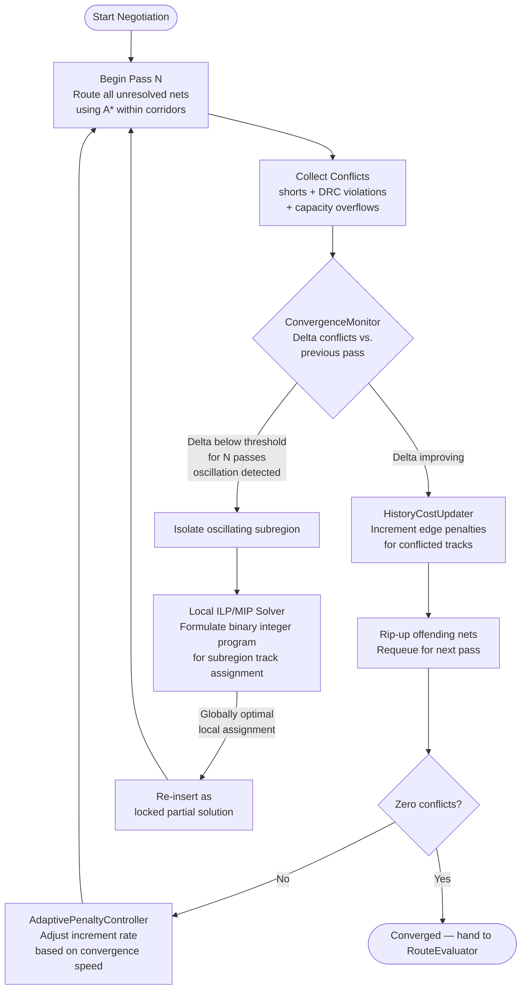
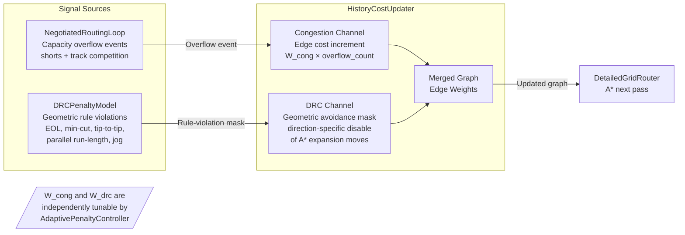
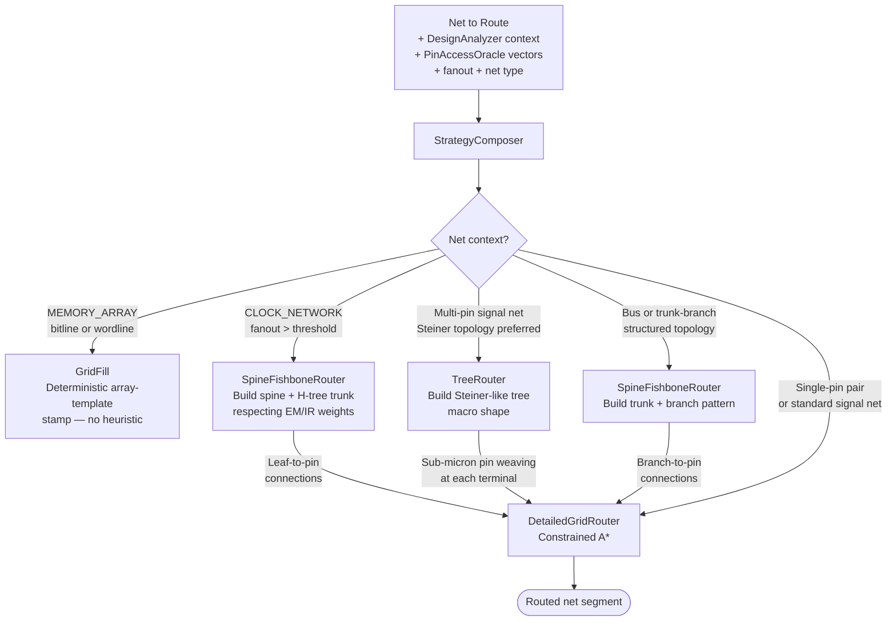
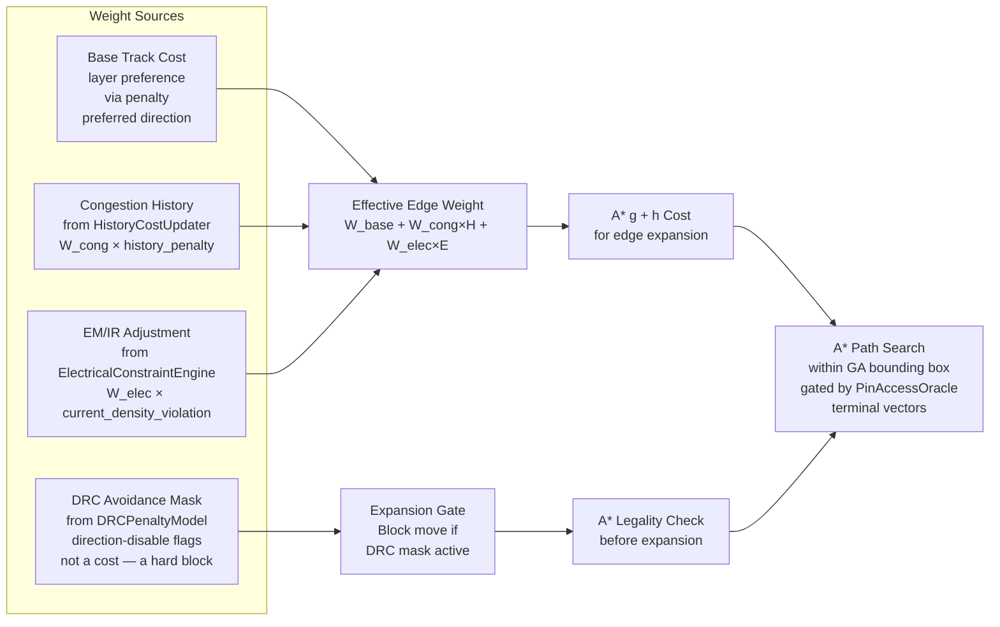
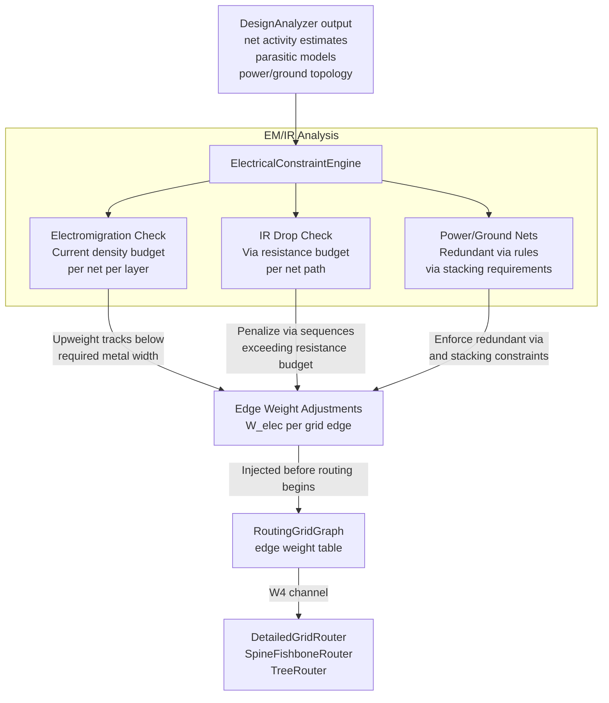

# Architecture: `routing_genetic_astar` (v3: Stratified Concurrent)

This document captures the v3 architecture for the C++23 universal VLSI routing framework,
covering both mature nodes (180nm–28nm) and advanced nodes (16nm–2nm), for device and memory
routing contexts. It supersedes v2 (Concurrent Hierarchical) by introducing three additional
cross-cutting strata — **Physical Legality**, **Resolution Bridging**, and **Electrical
Integrity** — while preserving the General/Sergeant hierarchy proven in v2.

---

## 1. Core Philosophy: Jurisdiction + Legality + Integrity

Routing at production quality requires more than hierarchy and concurrency. Three orthogonal
concerns must be addressed from the start, not patched in post-route:

1. **Macro-Planning (The General):** A Genetic Algorithm (GA) analyzes coarse global capacity,
   assigning GCell-corridor bounding boxes and layer restrictions to nets to mathematically
   prevent unresolvable congestion before a single track is touched.

2. **Micro-Execution (The Sergeant):** A Negotiated Routing Loop (PathFinder-style) accepts
   those corridors and executes rapid, localized A* pathfinding. It resolves micro-collisions
   dynamically by penalizing congested tracks and forcing rip-up-and-reroute cycles.

3. **Physical Legality (The Law):** Pin access constraints and technology-rule-specific DRC
   penalties are injected from day one into both the macro plan and the micro execution loop.
   A post-route DRC check is a report card; legal routing constraints must be graph weights.

4. **Resolution Bridging (The Translator):** A CorridorRefinement pass projects GCell-level
   macro assignments into track-level feasibility before threads are launched. The gap between
   GCell granularity and actual track geometry is a known source of mid-route surprises.

5. **Electrical Integrity (The Inspector):** Electromigration and IR-drop constraints are
   first-class graph edge weights during routing, not post-route evaluations. High-current
   nets route to correct-by-construction width and via targets.

---

## 2. Easy Analogy

The city now has three layers of governance on top of the v2 General/Sergeant model:

- **The General (GlobalPlanner/GA)** zones the city, but now consults the Building Code
  (PinAccessOracle) before drawing any zone boundary. Zones are only drawn around legally
  accessible parcels.
- **The Surveyor (CorridorRefinement)** walks every zone boundary before the trucks are
  dispatched, verifying that the roads promised on the map actually exist at street level.
- **The Sergeant (NegotiatedRoutingLoop)** dispatches trucks into their surveyed zones.
  When trucks conflict, historical tolls rise. A ConvergenceMonitor watches — if two trucks
  keep swapping the same intersection, it calls in the city planner (ILP Solver) to resolve
  that block definitively.
- **The Building Inspector (DRCPenaltyModel)** posts geometric restriction signs at
  specific intersections. These are not priced higher — they are structurally off-limits for
  certain approach angles.
- **The Power Grid Engineer (ElectricalConstraintEngine)** pre-marks which roads must be
  widened and which vias need redundant pilings before trucks choose their routes.

---

## 3. C++ Architecture Flow



---

## 4. Subsystem Flowcharts

The top-level diagram in Section 3 shows the full pipeline. The following diagrams zoom into
each subsystem to show internal logic, decision branches, feedback loops, and data contracts
between components.

---

### 4.1 Analysis & Input Pipeline

How the design is ingested, classified, and made ready for planning. `PinAccessOracle` is
promoted here because it must complete before the `GlobalPlanner` draws a single corridor.



---

### 4.2 GA Macro-Planning Loop

How the `GlobalPlanner` evolves corridor assignments and handles the memory-array special case.
The CorridorRefinement feedback is the key addition in v3 — failed projections loop back to
the GA before any thread is launched.



---

### 4.3 Concurrency Model: Partitioning & Thread Boundaries

How `SpatialPartitioner` creates thread-safe regions, how ghost cells guard boundaries, and
how `CrossRegionMediator` synchronizes cross-boundary nets at each iteration barrier.



---

### 4.4 NegotiatedRoutingLoop — Per-Pass Iteration

The internal state machine of the `NegotiatedRoutingLoop`. Each pass routes all unresolved
nets, collects conflicts, updates costs, and either iterates or exits. The `ConvergenceMonitor`
intercepts oscillation before it becomes unbounded.



---

### 4.5 HistoryCostUpdater — Dual-Signal Model

The key v3 distinction: congestion overflow and DRC rule violations arrive as separate signal
channels with independent weights. Conflating them was a correctness bug in v2.



---

### 4.6 StrategyComposer — Topology Decision Tree

How the `StrategyComposer` selects a routing strategy per net and how hierarchical delegation
flows from macro-topology builders down to `DetailedGridRouter`.



---

### 4.7 DetailedGridRouter — A\* Edge Weight Composition

The four independent sources that compose the effective edge weight seen by A\* during routing.
Each source is independently scaled so tuning one does not perturb others.



---

### 4.8 ElectricalConstraintEngine — EM/IR Weight Injection

Pre-routing computation that converts electrical requirements into graph weights before
any net touches a track. The output is consumed as `W4` in the A\* weight composition above.



---

### 4.9 Evaluation & Tuning Feedback Loops

Two separate feedback loops operate on different timescales: the `AdaptivePenaltyController`
adjusts penalty rates *online* within a single routing run; `Optuna` tunes GA and global
parameters *offline* between runs.

```mermaid
flowchart TD
    NRL[NegotiatedRoutingLoop\nper-pass metrics:\nconflict delta, pass count,\nsubregion density] --> APC

    subgraph Online Loop — within one routing run
        APC[AdaptivePenaltyController\nP-controller on convergence rate]
        APC -->|Ramp increment rate\nif converging slowly| HIST[HistoryCostUpdater\nW_cong increment rate]
        APC -->|Back off increment rate\nif oscillating| HIST
        APC -->|Adjust oscillation\nwindow N| CM[ConvergenceMonitor\noscillation threshold]
    end

    F[RouteEvaluator\nwirelength, via count\nDRC cleanliness\nEM/IR margin\ntiming slack] --> APC
    F --> OPTUNA

    subgraph Offline Loop — between routing experiments
        OPTUNA[Optuna Meta-Tuner]
        OPTUNA -->|GA mutation rates\ninitial penalty schedules\ncongestion thresholds| GP[GlobalPlanner\nGA parameters]
        OPTUNA -->|Context-classification\nboundaries| SC[StrategyComposer\nthresholds]
        OPTUNA -->|Initial W_cong, W_elec\nscaling factors| HIST2[HistoryCostUpdater\ninitial weights]
    end
```

---

## 5. Component Responsibilities

### `RoutingGridGraph`

- **Macro Level:** Stores the GCell grid with abstract demand/capacity limits per layer and
  direction. Each GCell tracks current demand as nets are committed.
- **Micro Level:** Stores the full 3D track-and-via lattice at manufacturing resolution.
- Manages thread-safe read/write states. Net ownership flags on grid edges use atomic CAS
  operations to avoid mutex overhead in the hot routing path.
- Carries a **frozen-net mask** layer used by ECO flows: frozen edges contribute their
  capacity consumption but are ineligible for rip-up.

### `DesignAnalyzer` & `CongestionOracle`

- Inspects design density, fanout distribution, net length histograms, and geometry style
  (memory array vs. random logic vs. mixed-signal).
- Classifies routing context to guide downstream strategy selection: `RANDOM_LOGIC`,
  `MEMORY_ARRAY`, `CLOCK_NETWORK`, `MIXED_SIGNAL`.
- Provides O(1) track-capacity lookups during active routing via a pre-built spatial index.

### `PinAccessOracle` *(restored from v1, promoted)*

- Enumerates legal and effective entry vectors for every pin in the design.
- For advanced nodes, this includes: legal metal cut orientations on M0/M1, via enclosure
  rule compliance, EOL spacing clearance, and preferred access direction per cell type.
- Feeds into **GlobalPlanner**: corridors are anchored only at legally accessible pin entry
  points, so macro plans are grounded in physical reality.
- Feeds into **DetailedGridRouter**: A* terminal expansion is constrained to legal approach
  vectors, preventing approach-angle DRC violations at the pin.
- This component is the single most impactful addition for advanced-node correctness.

### `GlobalPlanner` (The GA Engine)

- Evolves **macroscopic plans**, not detailed routes.
- **Chromosome:** Layer assignments, preferred routing directions, and bounding-box
  corridors for every net. Pin access points from PinAccessOracle anchor corridor endpoints.
- **Fitness Function:** Evaluates purely on GCell Demand vs. Capacity. Heavily penalizes
  overflow (demand > capacity). Secondary terms include inter-corridor overlap and
  via-layer pressure imbalance.
- **Memory Array Mode:** When DesignAnalyzer returns `MEMORY_ARRAY`, the GA skips
  population evolution and instead invokes a deterministic GridFill solver that analytically
  assigns bitline/wordline tracks. Regular arrays are a solved combinatorial structure;
  heuristic search on them is wasteful.

### `CorridorRefinement Pass` *(new in v3)*

- Bridges the GCell-to-track resolution gap before any thread is launched.
- For each GA-assigned corridor, projects the bounding box down to actual track-level
  geometry: checks that promised via stacks land on legal via sites, that local obstructions
  don't block the implied routing path, and that the net count fits within actual track
  capacity (not just the GCell demand model).
- Corridors that fail projection are flagged back to the GlobalPlanner for re-evaluation.
  This is a synchronous feedback loop — it runs before SpatialPartitioner fires.
- Prevents the canonical failure mode: threads discover mid-routing that their assigned
  corridor is geometrically infeasible, triggering expensive rip-up cascades.

### `SpatialPartitioner`

- Takes track-feasible corridor assignments from CorridorRefinement and carves the physical
  chip into thread-safe geographic regions.
- Assigns specific bounding boxes to isolated C++23 `jthread` workers to prevent mutex
  contention in the hot path.
- Marks inter-region boundary cells as **ghost cells** — readable by adjacent threads,
  writable only by the CrossRegionMediator after intra-region passes complete.

### `NegotiatedRoutingLoop`

- Core detailed routing driver. Forces all nets to route simultaneously within their
  assigned corridors across multiple negotiation passes.
- Each pass: route all unresolved nets → collect conflicts → update HistoryCostUpdater →
  rip-up offending nets → repeat.
- Terminates when zero conflicts remain, or when ConvergenceMonitor triggers ILP fallback
  for a persistent subregion.

### `HistoryCostUpdater` / Rip-up Engine

- Increments a permanent historical penalty on grid edges where collisions occurred.
- Receives two distinct signal types:
  - **Congestion signals** from the NegotiatedRoutingLoop (capacity overflow).
  - **Rule-violation masks** from DRCPenaltyModel (geometric illegality).
- These are weighted independently so DRC avoidance does not get diluted by congestion
  dynamics, and vice versa.
- Rips up only the offending nets and requeues them for the next negotiation pass.

### `DRCPenaltyModel` *(new in v3)*

- Encodes technology-rule-specific geometric constraints as routing graph modifications.
- Rule types handled: min-cut, EOL spacing, parallel run-length, metal tip-to-tip, via
  enclosure, corner rounding, jog length.
- Does **not** simply raise edge costs (that is congestion modeling). Instead, it applies
  **geometric avoidance masks**: direction-specific disabling of A* expansion moves that
  would create a rule violation regardless of cost.
- Rule tables are node-parameterized: a 28nm ruleset is lightweight; a 3nm/2nm ruleset
  carries full BEOL geometric constraints. The same interface serves both.
- Feeds masks into HistoryCostUpdater as a distinct channel so they persist across
  rip-up iterations.

### `ConvergenceMonitor` *(new in v3)*

- Monitors the delta in unresolved conflict count between NegotiatedRoutingLoop iterations.
- If delta falls below threshold for N consecutive iterations (oscillation detected), it
  isolates the oscillating subregion and hands it to the Local ILP/MIP Solver.
- After the solver returns a valid local assignment, those nets are re-inserted as locked
  into the negotiation loop and execution resumes.
- This bounds worst-case runtime for extremely dense regions (memory bitcell arrays, GPU
  register files) where PathFinder is known to oscillate rather than converge.
- Convergence threshold and oscillation window N are tunable by the AdaptivePenaltyController.

### `Local ILP/MIP Solver`

- Invoked only by ConvergenceMonitor for isolated subregions where negotiation oscillates.
- Formulates the local track assignment problem as a binary integer program: nets are
  variables, track occupancy and spacing rules are constraints.
- Returns a globally optimal assignment for the subregion, which is re-inserted as a
  locked partial solution.
- Also available to SolverBackedPlanner for corridor assignment and resource budgeting
  during the macro-planning phase.

### `CrossRegionMediator` *(new in v3)*

- Handles nets that span SpatialPartitioner region boundaries.
- Protocol: after all intra-region threads complete a negotiation pass (barrier sync), the
  mediator serializes cross-boundary nets, routes them with read access to both adjacent
  regions' current state, then writes results to ghost cells.
- Threads then resume for the next pass with updated boundary state.
- This is a barrier-based model — marginally less parallel than fully concurrent, but
  correct, predictable, and avoids the ghost-cell coherence bugs that plague lock-free
  boundary approaches.

### `StrategyComposer`

- Replaces StrategySelector. Recognizes that routing topology is **fractal**: a clock trunk
  is a spine, its sub-branches are trees, and each leaf-to-pin connection is a detail route.
- Determines topology strategy dynamically per net based on design context classification
  from DesignAnalyzer.
- Hierarchical delegation is explicit: `SpineFishboneRouter` builds the macro shape, then
  delegates leaf connections to `DetailedGridRouter`. `TreeRouter` builds the Steiner
  structure, then delegates sub-micron weaving to `DetailedGridRouter`.
- For `MEMORY_ARRAY` context: routes bitlines/wordlines via deterministic GridFill rather
  than heuristic composition.

### `DetailedGridRouter`

- Executes constrained A*, Dijkstra, or maze-routing strictly within GA-provided bounding
  boxes.
- Terminal expansion is gated by PinAccessOracle's legal approach vectors.
- Edge weights incorporate: base track cost, congestion history, DRC avoidance masks,
  and ElectricalConstraintEngine EM/IR adjustments.

### `SpineFishboneRouter` & `TreeRouter`

- Handle topology-first routing patterns (bus, trunk-branch, Steiner trees, clock H-trees).
- Operate hierarchically: build the macro shape first, then delegate micro-connections.
- Both respect the EM/IR-adjusted edge weights from ElectricalConstraintEngine for
  high-fanout clock and power nets.

### `ElectricalConstraintEngine` *(new in v3)*

- Pre-computes current density budgets per net from parasitics and activity estimates
  provided by DesignAnalyzer.
- Adjusts A* graph edge weights before routing begins:
  - High-current nets: upweight tracks that cannot support the required metal width;
    preferred tracks are those satisfying EM current density rules.
  - Via-sensitive nets: penalize via sequences whose cumulative resistance causes
    unacceptable IR drop.
  - Power/ground nets: enforce redundant via insertion and via stacking rules.
- Turns electrical correctness into a first-class routing objective rather than a
  post-route repair task.

### `RouteEvaluator`

- Scores the final converged route set: total wirelength, via count, DRC cleanliness,
  EM/IR margin, timing slack (when timing data is available), and congestion residual.
- Feeds scores to both AdaptivePenaltyController (online) and Optuna (offline).

### `AdaptivePenaltyController` *(replaces purely offline Optuna for penalty schedule)*

- Monitors convergence rate in real time during the NegotiatedRoutingLoop.
- Controls the historical penalty increment rate as a proportional feedback loop:
  slow convergence → ramp increment rate; oscillation detected → back off and allow
  more exploration before ConvergenceMonitor triggers ILP.
- Also adjusts the ConvergenceMonitor's oscillation threshold N based on observed
  subregion density.

### `OptunaTuner` & `SolverBackedPlanner`

- **Optuna:** Offline meta-optimizer tuning GA mutation rates, initial penalty schedules,
  congestion thresholds, and StrategyComposer context-classification boundaries.
  Runs between full routing experiments to accumulate empirical tuning data.
- **SolverBackedPlanner:** Invokes ILP/MIP/CP solvers for macro-level constrained planning:
  corridor assignment, layer budgeting, trunk placement, net priority ordering.
  Complements graph search and metaheuristics rather than replacing them.

### `ECO / IncrementalRouter` *(new in v3)*

- Entry point for Engineering Change Order flows: re-routing a small delta of changed nets
  while holding all others frozen.
- Writes a frozen-net mask into RoutingGridGraph before handing off to SpatialPartitioner.
  Frozen nets contribute their capacity consumption as permanent obstructions but are
  not eligible for rip-up by the NegotiatedRoutingLoop.
- Makes ECO runs practical: only delta nets are re-routed against the locked background,
  without triggering a full re-route.
- Critical for production design flow integration.

---

## 6. Why This Architecture Scales

**1. Eliminates Thrashing at Source**
The GA enforces GCell capacity globally, and CorridorRefinement verifies track-level
feasibility before threading begins. The detailed router is guaranteed never to encounter
a physically impossible traffic jam.

**2. Bounds the A* Search Volume**
GA-provided bounding boxes + PinAccessOracle terminal constraints reduce A* search
from an exponential global sphere to a tight, geometrically legal tube.

**3. True C++23 Concurrency with Correct Boundaries**
SpatialPartitioner's pre-planned macro-corridor regions enable parallel jthread workers
with minimal locking. CrossRegionMediator handles boundary nets correctly without
lock-free coherence bugs.

**4. Guaranteed Convergence Bound**
ConvergenceMonitor + ILP fallback ensures PathFinder oscillation never causes an
unbounded runtime. Worst-case runtime is bounded by ILP solve time on the oscillating
subregion, which is small by construction.

**5. Advanced-Node Correctness by Construction**
PinAccessOracle and DRCPenaltyModel inject physical legality as graph weights, not
post-route checks. Electrical constraints are routing objectives, not repair tasks.
This is the difference between a benchmark router and a tapeout-quality router.

**6. Production Flow Integration**
ECO/IncrementalRouter support makes the framework usable in real design flows where
full re-routes after late-stage changes are impractical.

---

## 7. Node Coverage Matrix

| Concern                        | Mature (180nm–28nm) | Advanced (16nm–7nm) | Leading Edge (5nm–2nm) |
|-------------------------------|---------------------|---------------------|------------------------|
| GCell macro-planning (GA)      | ✅ Full              | ✅ Full              | ✅ Full                 |
| PathFinder negotiation         | ✅ Full              | ✅ Full              | ✅ Full                 |
| PinAccessOracle                | ⚡ Lightweight       | ✅ Full              | ✅ Critical             |
| DRCPenaltyModel ruleset        | ⚡ Simplified        | ✅ Standard          | ✅ Full BEOL rules      |
| CorridorRefinement             | ⚡ Optional          | ✅ Recommended       | ✅ Required             |
| ElectricalConstraintEngine     | ⚡ Power nets only   | ✅ Standard          | ✅ Full EM/IR           |
| ConvergenceMonitor + ILP       | ⚡ Rarely triggered  | ✅ Active            | ✅ Frequently needed    |
| ECO / IncrementalRouter        | ✅ Full              | ✅ Full              | ✅ Full                 |
| Memory Array GridFill mode     | ✅ Full              | ✅ Full              | ✅ Full                 |

---

## 8. Implementation Priority Order

For the first production-quality milestone, implement in this sequence to maximize
correctness per engineering hour:

1. `RoutingGridGraph` + `DesignAnalyzer` + `CongestionOracle` — the foundation
2. `PinAccessOracle` — highest correctness leverage, especially at advanced nodes
3. `GlobalPlanner` (GA) + `CorridorRefinement` — the macro-planning backbone
4. `SpatialPartitioner` + `NegotiatedRoutingLoop` + `HistoryCostUpdater` — the core engine
5. `CrossRegionMediator` — required for correctness before any multi-thread testing
6. `DetailedGridRouter` with PinAccessOracle gating — the hot path
7. `DRCPenaltyModel` — rule table can start simple (28nm) and expand
8. `StrategyComposer` + `SpineFishboneRouter` + `TreeRouter` — topology coverage
9. `ConvergenceMonitor` + Local ILP Solver — convergence guarantee
10. `ElectricalConstraintEngine` — advanced node electrical correctness
11. `ECO / IncrementalRouter` — production flow integration
12. `RouteEvaluator` + `AdaptivePenaltyController` + `OptunaTuner` — tuning and scoring

---

## 9. Version History

| Version | Key Change |
|---------|-----------|
| v1      | GA as pin/net order optimizer; SA refinement; sequential strategy selection |
| v2      | GA as macro-corridor planner; PathFinder negotiation; SpatialPartitioner concurrency; StrategyComposer hierarchy |
| v3      | PinAccessOracle restored; CorridorRefinement gap-bridging; DRCPenaltyModel separated from congestion; ConvergenceMonitor + ILP fallback; CrossRegionMediator; ElectricalConstraintEngine; AdaptivePenaltyController; ECO/IncrementalRouter |
